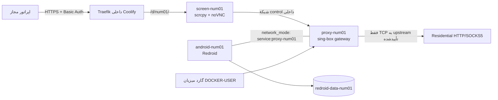

# Android Farm — فارم Redroid برای QA داخلی

این مخزن یک فارم کنترل‌شدهٔ Android/Redroid برای آزمون داخلی است: کاتالوگ ۷۰ دستگاه (`num01` تا `num70`) دارد و admission controller در هر زمان حداکثر ۱۰ Android روشن را می‌پذیرد. هر دستگاه داده، شبکهٔ خروجی و مسیر کنترل تصویری مستقل دارد.

این پروژه ثبت‌نام، OTP، ورود به سرویس ثالث، ارسال پیام، جعل مدل تجاری/IMEI/Android ID، پنهان‌سازی روت یا دورزدن Play Integrity را خودکار نمی‌کند. برای هر محصول ثالث، ورود و تأیید مالکیت باید توسط اپراتور مجاز و مطابق سیاست همان محصول انجام شود.

> وضعیت تحویل: Compose و کد در محیط محلی اعتبارسنجی شده‌اند. استقرار واقعی، build imageها، بوت Redroid، صحت مسیر شبکه و کنترل مرورگر باید روی سرور Ubuntu مقصد پذیرفته شود.

## معماری



هر سه سرویس device در profile `manual` هستند؛ deploy عادی Coolify فقط `farm-anchor` را روشن می‌کند. `android-numXX`، `proxy-numXX` و `screen-numXX` فقط با `device-provisioner` شروع می‌شوند.

| لایه | تصمیم عملیاتی |
|---|---|
| نام‌گذاری | `num01` … `num70`، کانتینرهای `proxy-num01`، `android-num01` و `screen-num01` |
| labels | `farm.device`، `farm.role` و `farm.stack` برای log/filter؛ شمارهٔ تلفن هرگز Docker label نیست و فقط HMAC/mask در inventory خصوصی دارد |
| داده | یک named volume خارجی `redroid-data-numXX` در `/data` که با local bind driver به `/opt/farm/data/instances/numXX/data` متصل است؛ هرگز clone یا reset خودکار نمی‌شود |
| شبکه | Android فقط namespace پراکسی را شریک است؛ پراکسی به Coolify وصل نیست؛ screen فقط به `coolify` و شبکهٔ کنترل داخلی وصل است |
| ADB | `127.0.0.1:5551` برای `num01` تا `127.0.0.1:5620` برای `num70`؛ هرگز public نیست |
| صفحه | `https://farm.example.com/d/num01/` پشت Traefik و `farm-auth@file` |
| ظرفیت | بودجهٔ هر device: ۶ vCPU و ۵٫۲۵ GiB سقف container؛ ظرفیت زنده از CPU/RAM/cgroup/disk/inode محاسبه و با سقف ۱۰ محدود می‌شود |

ورودی HTTP/SOCKS5 residential به gateway سفارشی sing-box می‌رود، چون Gluetun برای tunnelهای OpenVPN/WireGuard مناسب است و جایگزین عمومی یک upstream HTTP/SOCKS5 نیست. اگر فروشنده برای هر دستگاه tunnel اختصاصی WireGuard/OpenVPN بدهد، می‌توان sidecar را با Gluetun جایگزین کرد؛ sticky بودن از سیاست و session فروشنده می‌آید، نه نام کانتینر.

## استقرار با Coolify

در Coolify یک Project با نام `android-farm` بسازید و دو Compose Application تعریف کنید:

1. **farm-core** با [docker-compose.console.yml](docker-compose.console.yml): کنسول طراحی/عملیات، روی `console.farm.example.com`.
2. **farm-devices** با [docker-compose.farm.yml](docker-compose.farm.yml): کاتالوگ ۷۰ دستگاه و `farm-anchor`.

در farm-devices، deploy معمول نباید `COMPOSE_PROFILES=manual` داشته باشد. برای routing فقط labelهای Compose را نگه دارید؛ برای سرویس‌ها Domain خودکار Coolify نسازید.

ENVهای غیرحساس در UI Coolify:

```dotenv
FARM_DOMAIN=farm.example.com
CONSOLE_DOMAIN=console.farm.example.com
COOLIFY_NETWORK=coolify
FARM_SECRETS_DIR=/etc/android-farm/secrets
# قبل از pilot production tagها را با digest تأییدشده جایگزین کنید.
REDROID_IMAGE=redroid/redroid:12.0.0-latest
PROXY_IMAGE=android-farm/proxy:1
SCREEN_IMAGE=android-farm/screen:1
```

رمز پراکسی، فایل درخواست دستگاه، `apk-trust.json`، کلید inventory و فایل `farm-users.htpasswd` در ENV یا Git قرار نمی‌گیرند. آن‌ها فقط روی میزبان در مسیرهای root-owned با mode `0700/0600` قرار می‌گیرند. راهنمای گام‌به‌گام [استقرار Coolify](docs/DEPLOYMENT_COOLIFY.fa.md) است.

## راه‌اندازی میزبان و CLI واحد

روی Ubuntu 22.04/24.04، یک release directory مستقل از checkout قابل‌نوشتن Coolify بسازید. چون Compose در نهایت با Docker root اجرا می‌شود، این tree باید root-owned و برای group/other غیرقابل‌نوشتن باشد.

```bash
sudo install -d -m 0755 /opt/android-farm
sudo git clone https://github.com/mjpouladi/AndroidFarm.git /opt/android-farm/release
sudo chown -R root:root /opt/android-farm/release
sudo chmod -R go-w /opt/android-farm/release
cd /opt/android-farm/release

sudo python3 installer/bootstrap.py --apply
sudo bash setup_host.sh --apply
sudo install -m 0755 provisioner.py /usr/local/sbin/device-provisioner
sudo install -m 0600 installer/provisioner.example.json /etc/android-farm/provisioner.json
sudo install -m 0600 installer/apk-trust.example.json /etc/android-farm/apk-trust.json
sudoedit /etc/android-farm/provisioner.json
sudoedit /etc/android-farm/apk-trust.json
```

`compose_file` در `provisioner.json` باید به نسخهٔ root-owned همین release اشاره کند، نه checkout موقت Coolify. `compose_project` را پس از deploy از label کانتینر `farm-anchor` بخوانید.

```bash
docker inspect farm-anchor --format '{{ index .Config.Labels "com.docker.compose.project" }}'
sudo device-provisioner resources
sudo device-provisioner status
```

## تخصیص ترتیبی و lifecycle

برای نخستین دستگاه، request و secret را خارج از مخزن بسازید. نمونه‌ها در `installer/` و `proxy.example.json` هستند. APK باید package/signature/hash تأییدشده در `apk-trust.json` داشته باشد.

```bash
sudo install -d -m 0700 /root/farm-input
sudo install -m 0600 installer/device-request.example.json /root/farm-input/num01.json
sudo install -m 0600 proxy.example.json /root/farm-input/num01-proxy.json
sudoedit /root/farm-input/num01.json
sudoedit /root/farm-input/num01-proxy.json

sudo device-provisioner up --request /root/farm-input/num01.json
sudo device-provisioner check --id num01
sudo device-provisioner check-ip --id num01 --json
sudo device-provisioner down --id num01
```

`up --request` در یک تراکنش checkpointدار شمارهٔ بعدی را رزرو، volume را با label مالکیت می‌سازد، پراکسی را به IP خروجی تأییدشده مقید می‌کند، baseline واقعی محیط را ثبت، APK QA تأییدشده را نصب و آن را باز می‌کند. ورود به vendor و هر تعامل حساب کاملاً دستی باقی می‌ماند.

در هر start، گارد میزبان فقط TCP به endpoint IPv4:port مورد تأیید را می‌پذیرد. ابتدا gateway در حالی‌که Android خاموش است آزموده می‌شود؛ سپس Android در حالت قطع شبکه boot می‌شود تا baseline بررسی شود؛ پس از آن IP پراکسی و IP مشاهده‌شده از Android shell باید با IP تأییدشده برابر باشند. هر mismatch start را متوقف می‌کند؛ `check-ip` نیز device را روی hold قرار داده و خاموش می‌کند.

## کنترل صفحه، backup و نگهداری

```bash
# کنترل صفحه: https://farm.example.com/d/num01/
sudo device-provisioner hold --id num01 --reason maintenance
sudo device-provisioner release --id num01 --review-completed
sudo device-provisioner backup --id num01
sudo device-provisioner status --json
```

backup ابتدا خروجی device را قطع و containerها را خاموش می‌کند، سپس archive `0600`، SHA-256 و manifest می‌سازد. برای backup off-site از restic یا borg رمزنگاری‌شده استفاده کنید و restore را در volume جدا و در حالی‌که نمونهٔ اصلی خاموش است تمرین کنید.

برای اضافه‌کردن `num71`:

```bash
python3 generate_farm.py --count 71 --output docker-compose.farm.yml
```

تغییر تولیدشده را بازبینی و به release/Coolify redeploy کنید؛ سپس request خصوصی جدید را با `device-provisioner up --request` اجرا کنید. سقف روشن همزمان همچنان ۱۰ است.

## فایل‌های اصلی

| فایل | کاربرد |
|---|---|
| [generate_farm.py](generate_farm.py) | تولید کاتالوگ Compose برای ۱ تا ۲۰۰ دستگاه |
| [docker-compose.template.yml](docker-compose.template.yml) | template تک‌دستگاه برای بررسی topology، نه lifecycle اصلی |
| [provisioner.py](provisioner.py) | CLI واحد و امن lifecycle |
| [ops/app_installer.py](ops/app_installer.py) | نصب APK QA با hash، signer allowlist، ABI و permission allowlist |
| [ops/farmctl.py](ops/farmctl.py) | implementation داخلی egress guard، admission و backup |
| [docs/DEVICE_PROVISIONER.fa.md](docs/DEVICE_PROVISIONER.fa.md) | runbook کامل CLI |
| [docs/UX.fa.md](docs/UX.fa.md) | طراحی UI/UX و مرز demo فعلی |

## اعتبارسنجی محلی

```bash
python -m compileall -q ops installer provisioner.py
python -m unittest discover -s tests -v
"$TMPDIR/android-farm-compose" --profile manual -f docker-compose.yml config --quiet
cd web && npm test -- --run && npm run build
```

نتیجهٔ این آزمون‌ها به‌تنهایی نشان‌دهندهٔ deploy واقعی یا سازگاری یک اپ ثالث با Redroid نیست.
