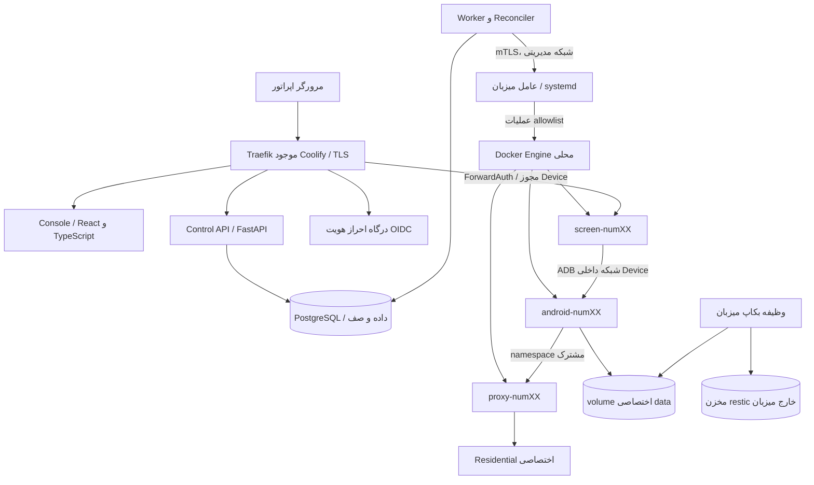
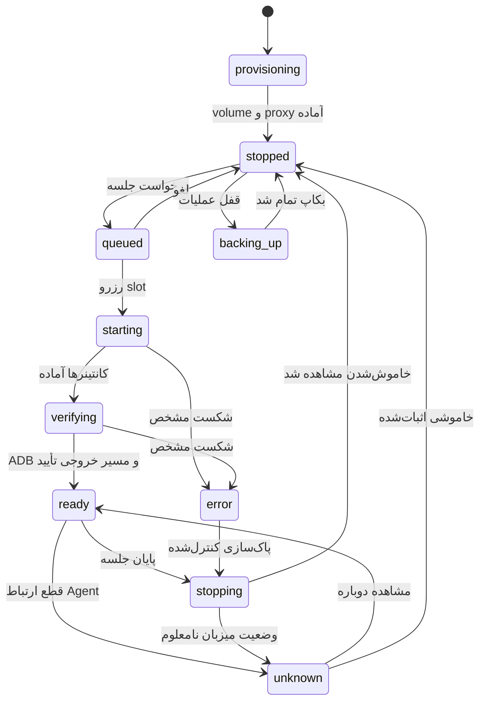

# طراحی معماری محصول Android Farm

این سند طرح اجرایی محصول کامل است. وضعیت فعلی: زیرساخت Compose و ابزار میزبان در ریشهٔ مخزن، UI تعاملی با دادهٔ نمونه در `web/`. API، صف پایدار، OIDC و اتصال Agent در این مرحله **طراحی شده‌اند و اجرا نشده‌اند**. جابه‌جایی منبع دادهٔ UI از نمونه به API به‌تنهایی استقرار production نیست.

## ۱. دامنهٔ محصول

اپراتور دستگاه مرتبط با یک شماره را پیدا می‌کند، یک جلسهٔ انحصاری می‌گیرد، صفحه را کنترل و پس از پایان، دستگاه را خاموش می‌کند. داده و هویت ثابت می‌مانند. مدیر نگاشت شماره، پراکسی، دسترسی تیم، نگهداری و بازیابی را مدیریت می‌کند. چت، هوش مصنوعی، ارسال پیام انبوه و رجیستری خودکار خارج از دامنه‌اند.

واحد طراحی `Device` است، نه کانتینر. سه کانتینر و volume جزئیات اجرایی همان Device هستند. «روشن‌شدن Docker» با «آمادهٔ کنترل بودن Android» یکی نیست. وضعیت API از مشاهدهٔ میزبان به‌دست می‌آید، نه حدس فرانت‌اند.

## ۲. اجزای سیستم هدف

| جزء | انتخاب پیشنهادی | مسئولیت و مرز |
|---|---|---|
| Console | React + TypeScript، خروجی static | نمایش، فرم‌ها، وضعیت و درخواست فرمان؛ بدون اختیار Docker |
| Control API | FastAPI، مدل‌های typed و OpenAPI | هویت، RBAC، validation، شماره↔Device، idempotency و ثبت job |
| PostgreSQL | نسخهٔ پشتیبانی‌شده و pin‌شده | منبع حقیقت دستگاه‌ها، جلسات، صف، slot و audit؛ بدون پورت عمومی |
| Worker | process جدا از image API | رزرو slot، اجرای job، retry و reconcile؛ در ابتدا یک replica |
| Agent | daemon کوچک systemd روی میزبان | رابط محدود start/stop/inspect/backup؛ wrapper ابزار فعلی، بدون shell آزاد |
| Auth | OIDC با provider موجود یا سرویس مستقل مانند Authentik | MFA، session و logout؛ نقش‌ها در DB نگاشت می‌شوند |
| screen gateway | middleware/API ForwardAuth | بررسی کاربر، Device و session پیش از handshake وب‌سوکت |
| Monitoring | metrics داخلی + لاگ ساختاریافته | alert بر مبنای ظرفیت، سلامت، disk و job؛ شماره و secret حذف می‌شوند |

PostgreSQL در این مقیاس هم queue و هم state را نگه می‌دارد؛ Redis/RabbitMQ و Kubernetes به نسخهٔ اول اضافه نمی‌شوند. اگر توزیع میزبان/بار بعداً نیاز واقعی ایجاد کرد، تصمیم جداگانه گرفته شود.

Agent در فاز اول باید فقط `device-provisioner` یا یک API داخلی محدود را فراخوانی کند، نه `farmctl.py` خام. نام پروژه، مسیر Compose، secret directory و allowlist دستگاه‌ها از فایل root-owned ثابت خوانده شوند. API فعلی میزبان اسکریپت است؛ daemon mTLS هنوز نوشته نشده است.

## ۳. استقرار Coolify

Project: `android-farm`، environment: `production`.

* `farm-core`: UI، API، Worker و PostgreSQL؛ DB فقط در شبکه داخلی core. API و UI از طریق Traefik. در نسخهٔ فعلی فقط Compose مستقل UI در `docker-compose.console.yml` آماده است.
* `farm-devices`: Compose تولیدشدهٔ ۷۰ دستگاه؛ Deploy معمولی فقط anchor را اجرا می‌کند. Agent مالک شروع/توقف runtime است. redeploy زیرساخت نیازمند drain و پنجرهٔ نگهداری است.
* Auth provider مشترک، در صورت وجود، دوباره نصب نمی‌شود.
* Agent روی host است و تنها استثنای سرویس host-level؛ نیازی به mount Docker socket در core ندارد. چرخهٔ انتشار، package/version و health آن باید در Runbook مدیریت شود. کانتینرکردن یک agent دارای socket مزیت sandbox امنیتی ایجاد نمی‌کند.

نشانی پیشنهادی production: `https://farm.example.com/` برای UI، `/api/v1/` برای API و `/d/numXX/` برای صفحه. routerهای `/api/` و `/d/` priority بالاتر از UI catch-all دارند. نسخهٔ مستقل demo برای جلوگیری از تداخل از `console.farm.example.com` استفاده می‌کند.

در محصول چندکاربره Basic Auth مشترک نمونه جایگزین RBAC نیست. middleware قبلی باید به ForwardAuth برای هر device ارتقا یابد؛ اپراتوری که اجازهٔ num01 دارد نباید فقط با تغییر URL به num02 دسترسی بگیرد. stream session هنگام پایان/لغو مجوز باید در gateway قطع شود، چون یک بار بررسی handshake برای سلب دسترسی فوری کافی نیست.

## ۴. مدل دامنه و محدودیت‌های داده

* `devices`: شناسهٔ ثابت، alias، volume، serial، state، generation، host و proxy. حذف منطقی مجاز است؛ حذف volume از حذف رکورد جداست.
* `device_phones`: یک Device یک شماره و یک شماره یک Device؛ شماره E.164 رمزگذاری‌شده، HMAC قابل جست‌وجو با کلید جدا، چهار رقم آخر برای نمایش. hash بدون کلید برای شماره‌های کم‌entropy کافی نیست.
* `proxies`: endpoint metadata، sticky session identifier غیرمحرمانه و `secret_ref`؛ password در DB/API/log به‌صورت plaintext قرار نمی‌گیرد. endpoint IP و IP خروجی جدا ذخیره شوند.
* `sessions`: درخواست، مالک، مقصد، حالت، زمان lease، job و نتیجه. فقط یک جلسهٔ باز برای هر Device.
* `slots`: ده ردیف به‌ازای میزبان؛ هر session حداکثر یک slot می‌گیرد. رزرو مستقل از container count است و startup نیز ظرفیت می‌گیرد.
* `jobs`: صف پایدار، payload محدود، attempt، زمان retry، lease کارگر و idempotency fingerprint.
* `backups`: manifest، checksum، image digest، serial، storage ref، زمان و نتیجهٔ verify؛ secret یا URI امضاشده دائمی در audit قرار نگیرد.
* `audit_events`: actor، action، target، نتیجه، request ID و زمان؛ append-only در سطح مجوز DB.

طرح SQL در `schema.sql` است. قیود داده جای authorization را نمی‌گیرند. key rotation برای HMAC نیاز به برنامهٔ index دوکلیدی/مهاجرت دارد تا یکتایی شماره در حین rotation از دست نرود. encryption key خارج DB نگهداری شود.

## ۵. ماشین حالت دستگاه

UI نمونه حالت‌های ساده‌شده دارد و انتقال‌ها را با timer نشان می‌دهد؛ در production timer مرورگر هرگز state را تغییر نمی‌دهد. `unknown` با «خاموش» یکسان نیست. قطع SSE فقط برچسب «داده قدیمی» ایجاد می‌کند و مجوز start اضافه نمی‌دهد.

## ۶. شروع جلسه و جلوگیری از race

۱. `POST /sessions` با `Idempotency-Key`، Device و مدت lease؛ API احراز هویت، سطح دسترسی، نسخهٔ Device و وجود proxy را بررسی می‌کند.
۲. در transaction، device row قفل و جلسه/job ایجاد می‌شوند؛ unique index از دو جلسهٔ باز جلوگیری می‌کند. تکرار همان کلید و همان body همان نتیجه را می‌دهد؛ body متفاوت با همان کلید خطای ۴۰۹ است.
۳. Worker به ترتیب زمان درخواست، row صف را با `FOR UPDATE SKIP LOCKED` claim می‌کند. تحت قفل تراکنشی سطح host، یک slot آزاد را reserve می‌کند. بدون slot، job queued می‌ماند و وعدهٔ زمان دقیق داده نمی‌شود.
۴. Worker بعد از commit فرمانی شامل device ID، operation ID، generation/fencing token و deadline به Agent می‌دهد. Agent فقط token جدید/همان operation idempotent را قبول می‌کند.
۵. Agent زیر lock میزبان count واقعی + رزروهای در حال اجرا را بررسی، host egress guard را نصب، proxy را healthy، سپس Android و screen را اجرا می‌کند. سلامت باید شامل ADB boot و egress واقعی باشد.
۶. ready با evidence Agent ثبت و از SSE به UI اعلام می‌شود. Operator مالک session و فقط او/مدیر مجاز به کنترل است.

**مرز تراکنش:** Docker و DB تراکنش مشترک ندارند. از outbox/jobs پایدار، idempotent command و reconcile استفاده می‌شود؛ تضمین «دقیقاً یک بار» ادعا نمی‌شود. پاسخ گم‌شده start قبل از retry از Agent inspect می‌شود.

**آزادسازی:** slot صرفاً با expire شدن lease کارگر یا timeout خالی نمی‌شود؛ ابتدا state واقعی host مشخص و خاموشی تأیید شود. در unknown ظرفیت قرنطینه می‌ماند. این انتخاب availability را برای جلوگیری از overbooking کاهش می‌دهد. شروع دستی خارج Agent ممنوع عملیاتی و توسط reconcile شناسایی می‌شود؛ مدیر root همچنان قادر به bypass است.

## ۷. پایان جلسه، خرابی و بازیابی

Stop idempotent است: revoke screen grant → بستن stream → توقف screen → توقف Android با grace → توقف proxy → inspect خاموشی → release slot → بستن session. اگر Android متوقف نشد، status unknown/error و slot رزروشده می‌ماند. forced stop فقط با policy مدیر و audit انجام شود.

Agent journal آخرین operation/generation را روی میزبان پایدار نگه می‌دارد. Worker crash با lease reclaim و reconciliation مدیریت می‌شود. Docker daemon restart باعث start خودکار دستگاه‌ها نمی‌شود. API unavailable مانع start جدید است؛ Agent می‌تواند پایان lease/stop اضطراری مجاز را طبق policy محلی اجرا کند و بعداً گزارش دهد. خاموش‌کردن خودکار جلسه فقط با lease اعلام‌شده به اپراتور؛ countdown و تمدید صریح لازم است.

تغییر proxy، image یا restore فقط برای دستگاه خاموش و بدون job باز. خطای credential با retry بی‌پایان حل نمی‌شود؛ نیازمند اقدام مدیر است. image pinned و داده backupشده پیش‌شرط upgrade هستند. هویت Device در همهٔ restartها ثابت می‌ماند.

## ۸. احراز هویت و مجوزها

| عملیات | مشاهده‌گر | اپراتور | مدیر |
|---|---|---|---|
| وضعیت و شمارهٔ پوشانده‌شده | مجاز طبق گروه | مجاز طبق گروه | همه |
| start / session | خیر | دستگاه مجاز | همه |
| کنترل صفحه | خیر | جلسهٔ متعلق به خود | با ثبت takeover |
| پایان جلسه | خیر | جلسهٔ خود | همه |
| افزودن/تخصیص شماره/پراکسی | خیر | خیر | مجاز |
| بکاپ | خیر | طبق policy | مجاز |
| restore / حذف volume | خیر | خیر | تأیید دومرحله‌ای، ثبت audit |
| مشاهدهٔ secret | خیر | خیر | در پنل نمایش داده نمی‌شود |

Session cookie با `HttpOnly; Secure; SameSite=Lax` و عمر محدود؛ CSRF token برای mutation و validate Origin. OIDC state، nonce و PKCE در backend. نقش ادعاشده از client پذیرفته نمی‌شود. محدودیت نرخ start، تعداد session، تلاش login و enumeration شماره در API اعمال می‌شود. headerهای هویت کاربر از ورودی اینترنت پاک و فقط توسط gateway معتبر تولید شوند.

Screen grant کوتاه‌عمر، مقید به کاربر/device/session، ترجیحاً cookie؛ token در query URL/لاگ/referrer قرار نگیرد. CSP و `frame-ancestors` فقط مبدا مجاز؛ websocket Origin allowlist. خروج کاربر و پایان session علاوه بر cookie، connection فعال را revoke کنند.

## ۹. سلامت، بکاپ و اندازه‌گذاری

Target اولیهٔ ۷۰/۱۰ باقی است؛ Android 4 CPU/4 GiB، screen 1.5 CPU/1 GiB و proxy 0.5 CPU/256 MiB سقف‌اند. بودجهٔ ابتدایی core: API 1CPU/512MiB، Worker 1CPU/512MiB، DB 2CPU/2GiB، UI 0.5CPU/128MiB. مصرف واقعی با ۱۰ دستگاه و رندر نرم‌افزاری اندازه‌گیری شود؛ تضمین ظرفیت نیست.

Metrics: active/reserved/unknown/queued، boot duration p50/p95، job age، proxy failures، OOM، disk/inode، زمان آخرین backup/restore drill، stream disconnect. هدف‌های پیشنهادی (نه نتایج اندازه‌گیری): dispatch آماده زیر ۵ ثانیه و state update زیر ۳ ثانیه؛ boot SLO بعد از پایلوت تعیین شود. heartbeat Agent هر ۱۰ ثانیه و stale بعد از ۳۰ ثانیه نقطهٔ شروع قابل تنظیم است.

Backup قفل همان Device را می‌گیرد، stopped را verify، snapshot/آرشیو سازگار را تهیه و restic off-site را verify می‌کند؛ job موفق بدون checksum و ذخیرهٔ manifest اعلام نمی‌شود. restore همیشه به volume جدید و فقط پس از verify identity و digest. session اصلی و بازیابی‌شده هرگز همزمان روشن نمی‌شوند. حذف volume با نام دقیق و تأیید مجدد، جدا از حذف منطقی device است.

## ۱۰. مراحل اتصال واقعی

۱. ساخت API/DB و OIDC؛ پیاده‌سازی قیود `schema.sql`، قرارداد `openapi.yml`، RBAC و audit با تست integration.
۲. Agent محدود و Worker/reconciler؛ concurrency با ۲۰ درخواست همزمان و crash/reboot آزموده شود.
۳. اتصال adapter UI به API/SSE، auth gate و صفحهٔ ورود/خروج واقعی؛ هیچ دادهٔ demo در production fallback نشود.
۴. ForwardAuth و اتصال screen یک دستگاه؛ اثبات عدم دسترسی cross-device، نشت IP/DNS و revocation stream.
۵. backup/restore واقعی، پایلوت ۱→۳→۱۰، سپس تعریف ۷۰ دستگاه و تحویل عملیات.

## مبنای فنی

* [React: ساخت اپ از پایه](https://react.dev/learn/build-a-react-app-from-scratch)
* [PostgreSQL: قفل‌های تراکنشی و advisory](https://www.postgresql.org/docs/current/explicit-locking.html)
* [Coolify: Compose و Raw deployment](https://coolify.io/docs/applications/builds/docker-compose)

انتخاب اجزا، بودجه‌ها و مراحل بالا تصمیم طراحی این پروژه هستند؛ مستندات مرجع تضمین کارایی یا امنیت این استقرار خاص نیستند.
