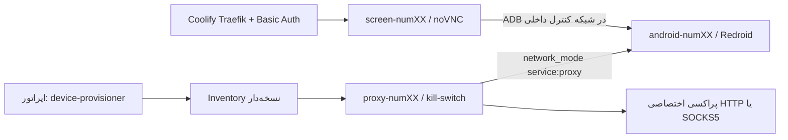

# device-provisioner — راهنمای عملیاتی واحد

این ابزار نقطهٔ ورود عملیاتی فارم است. تمام lifecycle از این مسیر انجام می‌شود؛ اجرای مستقیم `docker compose up` یا `ops/farmctl.py` برای عملیات روزمره توصیه نمی‌شود. فرمان قدیمی ساخت گروهی volumeها حذف شده است: هر دستگاه به‌ترتیب از `num01` تخصیص می‌یابد و دادهٔ دستگاه ثبت‌شده هرگز خودکار بازسازی نمی‌شود.

شناسهٔ اصلی فارم `num01…num200` است. برای تطابق با نام‌گذاری QA، CLI ورودی `dev01` را به `num01` نگاشت می‌کند. این دو دستگاه جدا نیستند.

## معماری egress



پراکسی HTTP/SOCKS5 upstream با gateway سفارشی sing-box پیاده شده است؛ این همان sidecar و kill-switch موردنیاز است. Gluetun یک کلاینت VPN برای OpenVPN/WireGuard است و HTTP proxy داخلی آن برای سرویس‌دادن به clientهاست، نه جایگزین عمومی یک upstream residential HTTP/SOCKS5. اگر فروشنده tunnel WireGuard/OpenVPN اختصاصی می‌دهد، می‌توان gateway را در یک تغییر جداگانه با Gluetun جایگزین کرد. [مستندات Gluetun](https://github.com/qdm12/gluetun) و [راهنمای proxy آن](https://github.com/qdm12/gluetun-wiki/blob/main/setup/options/http-proxy.md) این تفاوت را نشان می‌دهند.

## نصب روی میزبان Ubuntu

مسیر مرجع release روی سرور `/opt/android-farm/release` است. برای سرور Coolify موجود، نصب مجدد Coolify یا Docker انجام ندهید. این release باید root-owned و برای group/other غیرقابل‌نوشتن باشد.

```bash
cd /opt/android-farm/release
sudo bash setup_host.sh --check
sudo bash setup_host.sh --apply
sudo python3 installer/bootstrap.py
sudo python3 installer/bootstrap.py --apply
sudo install -d -m 0700 /etc/android-farm
sudo install -m 0600 installer/provisioner.example.json /etc/android-farm/provisioner.json
sudo install -m 0600 installer/apk-trust.example.json /etc/android-farm/apk-trust.json
sudo install -m 0755 provisioner.py /usr/local/sbin/device-provisioner
```

`setup_host.sh --apply` ماژول `binder_linux` را با deviceهای لازم بارگذاری می‌کند. اگر `ashmem_linux` روی کرنل موجود نباشد، Compose با `androidboot.use_memfd=true` اجرا می‌شود؛ Redroid این گزینه را برای جایگزینی ashmem مستند کرده است. [Redroid](https://github.com/remote-android/redroid-doc/blob/master/README.md) هشدار می‌دهد که ADB نباید روی شبکهٔ عمومی publish شود؛ Compose این مخزن ADB را فقط روی `127.0.0.1` منتشر می‌کند.

در `/etc/android-farm/provisioner.json` مقدارهای واقعی `compose_file`، `compose_project` و `console_url` را از deployment ساخته‌شده در Coolify وارد کنید. فایل باید `root:root` و mode `0600` داشته باشد. برای کشف deployment واقعی از anchor استفاده کنید:

```bash
docker inspect farm-anchor --format '{{index .Config.Labels "com.docker.compose.project"}}'
docker inspect farm-anchor --format '{{index .Config.Labels "com.docker.compose.project.config_files"}}'
```

Coolify باید همان commit را با `Raw Compose`، `Preserve Repository` و بدون `COMPOSE_PROFILES=manual` deploy کند. در config CLI، `compose_file` به `/opt/android-farm/release/docker-compose.farm.yml` اشاره می‌کند، نه checkout موقت Coolify؛ deploy عادی فقط `farm-anchor` را اجرا می‌کند.

## ظرفیت و readiness

```bash
sudo device-provisioner resources --json
sudo device-provisioner status --json
```

قبل از هر `up`، CPU مؤثر، cgroup، RAM آزاد، disk/inode و load بررسی می‌شود. سقف hard همزمان ۱۰ است؛ یک دستگاه در حال boot هم slot می‌گیرد. UI فقط snapshot گزارش منابع را نمایش می‌دهد و منبع مجوز اجرای واقعی نیست.

## تخصیص ترتیبی دستگاه

هر شماره/حساب فقط پس از مجوز مالک و با یک secret پراکسی اختصاصی وارد می‌شود. شمارهٔ کامل و password در خط فرمان، Git یا log قرار نمی‌گیرند.

```bash
sudo install -d -m 0700 /root/farm-input
sudo install -m 0600 installer/device-request.example.json /root/farm-input/num01.json
sudo install -m 0600 proxy.example.json /root/farm-input/num01-proxy.json
sudoedit /root/farm-input/num01.json
sudoedit /root/farm-input/num01-proxy.json

sudo device-provisioner up --request /root/farm-input/num01.json
```

مراحل ایجاد دستگاه checkpointدار است: `reserved → volume_created → secret_installed → identity_baselining → installing_apk → ready_for_operator`. inventory schema نسخه‌دار و شناسهٔ بعدی monotonic است؛ حذف رکورد شمارهٔ قبلی باعث استفادهٔ دوباره از شناسه نمی‌شود. اگر مرحله‌ای پس از ایجاد volume شکست بخورد، همان request را تکرار کنید. اگر volume یا baseline گم شده باشد، ابزار fail-closed می‌شود و به‌جای ساخت identity خالی، restore را الزامی می‌کند.

هنگام start، gateway ابتدا در حالی‌که Android خاموش است به upstream اجازه می‌گیرد و IP آن با `expected_egress_ip` مقایسه می‌شود. سپس مسیر egress بسته می‌شود، Android در quarantine boot می‌شود و baseline هویت واقعی بررسی می‌گردد. Android freeze می‌شود، gateway دوباره بررسی می‌شود و فقط در صورت تطابق IP، Android آزاد می‌گردد. هر خطا مسیر egress را در میزبان می‌بندد و کانتینرها را متوقف می‌کند.

```bash
sudo device-provisioner up --id dev01
sudo device-provisioner check --id num01
sudo device-provisioner check-ip --id num01 --json
sudo device-provisioner down --id num01
```

خروجی `check-ip` هم IP namespace پراکسی و هم درخواست از Android shell را با IP تأییدشده مقایسه می‌کند. هیچ fallback خاموشی ندارد؛ اگر ابزار probe داخل image Android در دسترس نباشد، check ناموفق است.

## APK داخلی QA و مجوزها

برای برنامهٔ QA عمومی، chain of trust از خود request جدا نگه داشته می‌شود. اول policy امضا را با اثرانگشت گواهی‌ای که مستقل تأیید کرده‌اید بسازید:

```bash
sudo install -m 0600 installer/apk-trust.example.json /etc/android-farm/apk-trust.json
sudoedit /etc/android-farm/apk-trust.json

sudo device-provisioner up --id dev01 \
  --apk /opt/apks/app.apk \
  --apk-sha256 YOUR_APPROVED_APK_SHA256 \
  --package com.example.qaapp \
  --activity .MainActivity \
  --grant android.permission.CAMERA \
  --grant android.permission.RECORD_AUDIO \
  --grant android.permission.READ_CONTACTS
```

APK باید root-owned، mode 0600، کوچکتر از ۵۰۰ MiB و زیر یک directory محافظت‌شده باشد. ابزار hash، certificate، package name، SDK، ABI و hash فایل کپی‌شده به container را بررسی می‌کند. سه grant بالا تنها مجوزهای قابل‌اعطای خودکارند؛ سایر مجوزها و هر APK بدون policy امضای مستقل رد می‌شوند.

## صفحه، hold و backup

پس از `up`، CLI مسیر `https://farm.example.com/d/num01/` را نمایش می‌دهد. مسیر فقط با HTTPS و middleware `farm-auth@file` Traefik باز می‌شود. شبکهٔ Coolify باید فقط شامل workloadهای مورداعتماد مدیر باشد؛ Basic Auth Traefik مرز authorization بین workloadهای همان شبکه نیست.

```bash
sudo device-provisioner hold --id num01 --reason ip-change
sudo device-provisioner release --id num01 --review-completed
sudo device-provisioner backup --id num01
```

Hold قبل از stop روی دیسک ثبت می‌شود؛ به‌صورت خودکار release نمی‌شود. backup دستگاه را خاموش می‌کند و volume را حفظ می‌کند. برای بازیابی واقعی، خود volume به‌علاوه `/var/lib/android-farm`، `/etc/android-farm` و metadata Compose/image digest را با یک مخزن رمزنگاری‌شدهٔ خارج از سرور نگه دارید.

## پروفایل نمایش QA و Compose تک‌دستگاه

`docker-compose.template.yml` یک template قابل‌resolve برای یک دستگاه است. `render` نیز Compose JSON استاندارد فقط برای review/interface تولید می‌کند:

```bash
sudo device-provisioner render --id dev01 --profile phone_fhd \
  --data-root /opt/farm/data --output /opt/farm/rendered/dev01.compose.json
```

پروفایل‌های `phone_hd`، `phone_fhd` و `tablet_landscape` فقط resolution/DPI/FPS و نام صادقانهٔ `Redroid QA` را تغییر می‌دهند. این‌ها هیچ IMEI، Android ID، مدل تجاری، root cloaking یا mechanism دورزدن integrity را ایجاد نمی‌کنند.

خروجی `render` bind mount دارد و برای lifecycle managed قابل‌استفاده نیست؛ آن را در `provisioner.json` به‌عنوان `compose_file` ثبت نکنید. lifecycle اصلی فقط named volumeهای `redroid-data-numXX` را می‌پذیرد.
