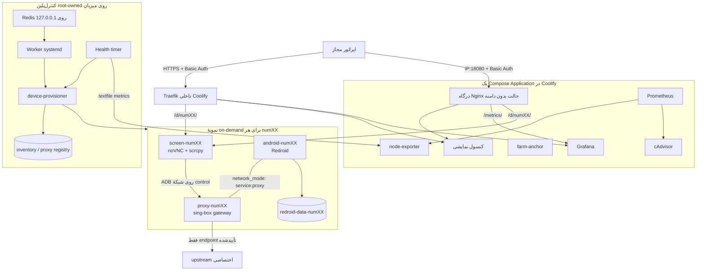

# راهنمای واحد معماری، نصب و عملیات Android Farm

این سند مرجع واحد پلتفرم است. موضوع آن ساخت و نگهداری یک فارم Android/Redroid برای **QA و آزمون داخلیِ مجاز** روی Ubuntu 22.04/24.04 و Coolify است. تعداد دستگاه‌های پایدار از پیش روی ۷۰ قفل نشده است؛ installer با CPU، RAM، فضای دیسک و inodeهای همان میزبان، ظرفیت کاتالوگ و ظرفیت همزمان را محاسبه می‌کند و دستگاه‌ها را به‌ترتیب `num01`، `num02` و ... تخصیص می‌دهد.

## شروع سریع روی سرور شما

1. در DNS دامنهٔ `commex-box.com` دو رکورد **A با DNS only** بسازید/اصلاح کنید: `@ → 185.208.172.141` و `metrics → 185.208.172.141`. رکورد موجود `coolify` را نگه دارید و TCP `80/443` را در فایروال سرور قابل دسترس کنید.
2. در [پنل Coolify شما](https://coolify.commex-box.com)، **Settings → Configuration → Advanced → API Access** را فعال کنید؛ سپس از **Keys & Tokens → API Tokens** توکن موقت `root` برای تیم پروژه بسازید.
3. از SSH روی سرور `185.208.172.141` دو فرمان زیر را اجرا و توکن را فقط در ورودی مخفی راه‌انداز وارد کنید:

```bash
curl -fsSL https://raw.githubusercontent.com/mjpouladi/AndroidFarm/main/install.sh -o install-android-farm.sh
sudo bash install-android-farm.sh --domain commex-box.com
```

4. پس از پایان پنج مرحله، **[پلتفرم](https://commex-box.com)** و **[مانیتورینگ](https://metrics.commex-box.com)** را با اطلاعات ورود چاپ‌شده باز کنید؛ `sudo device-provisioner status` وضعیت واقعی را نشان می‌دهد. صفحهٔ دستگاه پس از تخصیص/روشن‌شدن در `https://commex-box.com/d/num01/` است.

نصب تازه کنسول را روی خود دامنه و API Coolify را روی `http://127.0.0.1:8000` تنظیم می‌کند. اگر هر مرحله مبهم بود، **بخش ۵ همین سند** تمام مراحل DNS، توکن، نصب، آزمون و نخستین دستگاه را با جزئیات دارد. کنسول فعلی دموی UX است؛ عملیات واقعی از CLI انجام می‌شود.

این پروژه دورزدن محدودیت‌های Meta، Play Integrity یا سامانه‌های ضدسوءاستفاده را انجام نمی‌دهد و احتمال مسدودشدن هیچ حسابی را تضمین نمی‌کند. تولید/تغییر IMEI، جا زدن کانتینر به‌عنوان گوشی تجاری، جعل شناسهٔ سخت‌افزاری، پنهان‌کردن root/container، خودکارسازی OTP یا ثبت‌نام انبوه و نصب خودکار WhatsApp در محدودهٔ این پیاده‌سازی نیست. نصب برنامه فقط برای APK عمومی/داخلیِ تأییدشده، با hash و signer از پیش مجاز، انجام می‌شود.

## ۱. وضعیت واقعی قابلیت‌ها

| بخش | وضعیت | توضیح دقیق |
|---|---|---|
| نصب هدایت‌شده | پیاده‌سازی و آزمون واحد با API شبیه‌سازی‌شده | `install.sh`، حالت پیش‌فرض دامنه و HTTPS، IP/پورت اختیاری، ساخت و deploy برنامه در Coolify، ادامه پس از قطع، فعال‌سازی خودکار Worker و health؛ پذیرش روی Coolify واقعی لازم است |
| installer میزبان | پیاده‌سازی و آزمون واحد | `plan/apply/doctor`، release تغییرناپذیر مبتنی بر محتوا، نصب Docker و ابزارهای لازم، Binder و تنظیم Basic Auth؛ دو مرحله را راه‌انداز ساده هماهنگ می‌کند |
| کاتالوگ و ظرفیت | پیاده‌سازی و آزمون واحد | ظرفیت فعال بر اساس منابع زنده و ظرفیت کاتالوگ بر اساس دیسک؛ کاتالوگ نصب‌شده خودکار کوچک نمی‌شود |
| lifecycle دستگاه | پیاده‌سازی و آزمون واحد | start/stop/check/check-ip/status/hold/release/backup با حفظ `/data` و کنترل topology Compose |
| شبکه و پراکسی | پیاده‌سازی و آزمون واحد | یک upstream اختصاصی HTTP CONNECT یا SOCKS5 برای هر دستگاه، gateway مبتنی بر sing-box، namespace مشترک Android و proxy و guard مستقل میزبان |
| پروفایل QA | پیاده‌سازی و آزمون واحد | Android 11/12، resolution، DPI، FPS، locale و نام شفاف QA؛ جعل مدل تجاری یا شناسهٔ سخت‌افزاری رد می‌شود |
| صف Redis Worker | پیاده‌سازی و آزمون واحد | صف قابل‌بازیابی، idempotency، lease، retry/backoff، dead-letter و lock مجزای هر دستگاه؛ فقط فرمان‌های allowlist |
| بازیابی سلامت ADB | پیاده‌سازی و آزمون واحد | مشاهدهٔ ADB/boot/screen/proxy، restart محدود، boot grace و cooldown نمایی؛ دستگاه خاموش را روشن نمی‌کند |
| Prometheus/Grafana | پیکربندی آماده | CPU، uptime، سلامت ADB، latency و سلامت proxy و تعداد recovery؛ باید روی سرور مقصد scrape و dashboard تأیید شود |
| Ansible | پیکربندی آماده | Redis محلی، worker، timer سلامت، پروفایل‌های دستگاه و تشخیص drift؛ اجرا به‌صورت `serial: 1` و بدون حذف data |
| کنسول وب | **دموی تعاملی** | ظاهر و جریان UX را نشان می‌دهد؛ به Docker/API/Redis وصل نیست و دکمه‌های آن عملیات واقعی انجام نمی‌دهند |
| پذیرش production | نیازمند اجرای Ubuntu | بوت Redroid، Binder، proxy واقعی، HTTP/Nginx یا TLS/Traefik، noVNC/WebSocket، kill-switch و restore باید روی میزبان واقعی با pilot تأیید شوند |

وجود تست واحد یا parse شدن Compose جای آزمون پذیرش روی سرور مقصد را نمی‌گیرد.

## ۲. معماری نهایی



در Coolify فقط فایل ریشهٔ `docker-compose.yml` به‌عنوان یک Application وارد می‌شود. این stack شامل `farm-anchor`، کنسول، درگاه Nginx، Prometheus، node-exporter، cAdvisor، آماده‌سازهای یک‌بارهٔ secret و Grafana است. در حالت IP درگاه فقط یک پورت منتشر می‌کند و نیازی به تغییر proxy سراسری Coolify نیست؛ در حالت دامنه، دسترسی اصلی با Traefik است و درگاه HTTP فقط روی loopback می‌ماند. کاتالوگ `docker-compose.farm.yml` را agent میزبان با project ثابت `android-farm-runtime` مدیریت می‌کند؛ Coolify آن را deploy نمی‌کند تا redeploy هسته دستگاه‌های on-demand را orphan یا حذف نکند.

برای هر دستگاه این اجزا ساخته می‌شود:

- `proxy-numXX`: gateway خروجی و تنها دارندهٔ مسیر اینترنت؛ `restart: "no"`.
- `android-numXX`: Redroid privileged با `network_mode: service:proxy-numXX` و `restart: "no"`.
- `screen-numXX`: scrcpy/Xvfb/noVNC، پشت درگاه احراز هویت‌شدهٔ IP یا Traefik و `farm-auth@file`؛ `restart: "no"`.
- `redroid-data-numXX`: volume خارجی با bind کنترل‌شده به `/opt/farm/data/instances/numXX/data`.

ADB با فرمول `5550 + index` فقط روی loopback منتشر می‌شود؛ `num01` برابر `127.0.0.1:5551` است. route صفحه در حالت بدون دامنه `http://185.208.172.141:18080/d/num01/` و در حالت دامنه `https://commex-box.com/d/num01/` است. شمارهٔ تلفن در Docker label ذخیره نمی‌شود؛ inventory خصوصی فقط مقدار mask/HMAC را نگه می‌دارد.

Android و proxy شبکهٔ یکسان دارند. guard در chainهای اختصاصی `DOCKER-USER` فقط TCP به IPv4 و port تأییدشدهٔ upstream را عبور می‌دهد و بقیهٔ خروجی bridge را drop می‌کند. قطع proxy نباید باعث fallback به IP دیتاسنتر شود. شبکهٔ `coolify` یک شبکهٔ اشتراکی مورداعتماد است؛ workload غیرمورداعتماد را به آن وصل نکنید.

بازه‌های `10.231.0.0/16` و `10.232.0.0/16` برای شبکه‌های دستگاه رزرو شده‌اند. نصب‌کننده تمام شبکه‌های Docker را بررسی می‌کند و در صورت هم‌پوشانی یا ناتوانی در خواندن inventory شبکه، نصب را متوقف می‌کند. شبکهٔ موجود فارم فقط با تطابق نام، project، subnet، bridge و وضعیت isolation پذیرفته می‌شود. در میزبان دارای VPN یا route سازمانی، نبود هم‌پوشانی با routeهای بیرون Docker را نیز پیش از استقرار بررسی کنید.

## ۳. مدل ظرفیت پویا

بودجهٔ محافظه‌کارانهٔ هر نمونهٔ فعال ۶ vCPU و ۵٫۲۵ GiB RAM است: Android چهار CPU/چهار GiB، screen یک‌ونیم CPU/یک GiB و proxy نیم CPU/۲۵۶ MiB. reserve میزبان بزرگ‌ترِ ۲ CPU یا ۱۰٪ کل CPU و بزرگ‌ترِ ۸ GiB یا ۲۰٪ RAM است. ظرفیت همزمان برابر کمینهٔ ظرفیت CPU و RAM است و هنگام هر start دوباره با RAM آزاد و load بررسی می‌شود. فضای آزاد و inode فایل‌سیستم داده و مسیر واقعی `DockerRootDir` جداگانه سنجیده می‌شوند؛ پُرشدن هرکدام پذیرش start را متوقف می‌کند.

روی میزبان ۷۲ vCPU و ۹۶ GiB، محاسبهٔ پایه معمولاً ۱۰ دستگاه همزمان می‌دهد؛ این عدد policy ثابت نیست و فشار واقعی میزبان ممکن است آن را پایین بیاورد. ظرفیت کاتالوگ از فضای `/opt/farm/data/instances` با بودجهٔ ۱۲ GiB برای هر دستگاه و reserve بزرگ‌ترِ ۴۰ GiB یا ۲۰٪ فایل‌سیستم محاسبه می‌شود.

```bash
sudo device-provisioner resources
sudo device-provisioner resources --json
sudo device-provisioner status --json
```

`--catalog-count auto` تعداد slotهای پایدار را از storage تعیین می‌کند، ولی هیچ device تخصیص‌یافته یا کاتالوگ موجود را خودکار حذف/کوچک نمی‌کند. برای reserve قراردادی کمتر از ظرفیت فیزیکی، عدد صریح بدهید؛ برای افزایش بعدی همان installer را با عدد بزرگ‌تر اجرا کنید.

## ۴. پیش‌نیازهای میزبان

- Ubuntu Server 22.04 یا 24.04 روی خود host، نه داخل کانتینر.
- Coolify و Traefik داخلی آن از قبل فعال باشند.
- برای مسیر اصلی، دامنهٔ `commex-box.com`، سرور `185.208.172.141` و TCP `80/443` قابل دسترس باشند. DNSهای `commex-box.com` و `metrics.commex-box.com` را مطابق بخش بعد به این سرور وصل کنید.
- حالت اختیاری بدون دامنه به TCP `18080` از شبکهٔ مطمئن/VPN نیاز دارد. قواعد انتشار پورت Docker می‌توانند از قواعد معمول UFW عبور کنند؛ فایروال شبکه/ارائه‌دهنده را هم تنظیم کنید ([مستندات Docker](https://docs.docker.com/engine/network/packet-filtering-firewalls/#docker-and-ufw)). ADB عمومی نباشد.
- کرنل میزبان BinderFS را ارائه کند؛ cgroup v2 و Docker rootful محلی لازم است. وجود `/dev/binder` روی خود میزبان پیش‌نیاز این معماری نیست.
- `/dev/kmsg` باید به‌صورت character device موجود باشد؛ Compose فعلی آن را برای cAdvisor mount می‌کند و روی VPS فاقد آن deploy هسته fail می‌شود.
- `DOCKER_HOST` و `DOCKER_CONTEXT` نباید به daemon راه‌دور اشاره کنند.
- دسترسی root فقط برای تیم زیرساخت؛ Docker socket هرگز در UI، worker یا شبکه publish نمی‌شود.

installer در صورت نیاز Docker CE، Compose plugin و ابزارهای `iptables`، `htpasswd`، `apksigner`، `aapt`، `rsync` و `restic` را نصب می‌کند، `binder_linux` را load و persistent می‌کند و Compose نسخهٔ 2.33.1 یا بالاتر را الزام می‌کند. اگر Binder برای کرنل در حال اجرا موجود نباشد، نصب بستهٔ رسمی `linux-modules-extra-$(uname -r)` همان کرنل را امتحان می‌کند؛ در صورت نیاز به بوت کرنل دیگری، با راهنمای مشخص متوقف می‌شود و **سرور را خودکار reboot نمی‌کند**. نصب/پارتیشن‌بندی خود Ubuntu و نصب خود Coolify خارج از installer است.

تشخیص Binder براساس ثبت فایل‌سیستم `binder` در `/proc/filesystems` است. هنگام آماده‌سازی میزبان، نصب‌کننده یک mount موقت BinderFS در mount namespace خصوصی می‌سازد، character device بودن `binder-control` را بررسی و آن را پاک‌سازی می‌کند. Redroid 11/12 هنگام بوت، BinderFS و دستگاه‌های Binder خود را داخل کانتینر می‌سازد؛ `/dev/binder`، `/dev/hwbinder` و `/dev/vndbinder` میزبان نه ساخته می‌شوند و نه به کانتینرها bind می‌شوند. موفقیت این بررسی هنوز جای آزمون بوت واقعی `num01` را نمی‌گیرد. جزئیات و رفع خطای نسخهٔ قبلی در بخش عیب‌یابی همین راهنما آمده است.

## ۵. نصب قدم‌به‌قدم با دامنه و HTTPS

این مسیر اصلی نصب است؛ مراحل این بخش را به‌ترتیب انجام دهید. فقط **DNS، دسترسی API Coolify و اجرای راه‌انداز** بر عهدهٔ شماست؛ راه‌انداز Project، Application، ENV، Deploy و سرویس‌های میزبان را ایجاد می‌کند. بخش دستی انتهای همین فصل برای نصب سفارشی است و در مسیر ساده لازم نیست.

این راهنما با اطلاعات سرور شما تنظیم شده است: **IPv4 برابر `185.208.172.141`، دامنهٔ اصلی پلتفرم `https://commex-box.com` و پنل موجود `https://coolify.commex-box.com`**. کنسول روی ریشهٔ دامنه، دستگاه‌ها زیر `/d/numXX/` و Grafana روی `https://metrics.commex-box.com` قرار می‌گیرند. راه‌انداز را روی **همین سرور Ubuntu که Docker/Coolify دارد** اجرا کنید. تنظیم DNS یا Deploy روی سرور هنوز از طرف این راهنما انجام نشده است.

### گام ۱ — DNS دامنه را وصل کنید

در پنل DNS دامنهٔ خود، zone مربوط به `commex-box.com` را باز کنید. این دو رکورد **صریح** را بسازید؛ اگر رکورد A/CNAME قدیمی با همین نام‌ها وجود دارد، آن را اصلاح کنید تا مقصد متناقض باقی نماند. رکورد موجود `coolify` را تغییر ندهید:

| Type | Name در zone `commex-box.com` | IPv4 / Content | نتیجه |
|---|---|---|---|
| A | `@` | `185.208.172.141` | `commex-box.com` برای کنسول و دستگاه‌ها |
| A | `metrics` | `185.208.172.141` | `metrics.commex-box.com` برای Grafana |

TTL را روی `Auto` یا `300` بگذارید. بعضی پنل‌ها به‌جای `@` نام کامل `commex-box.com` می‌خواهند؛ ستون نتیجه نام نهایی است و نباید دوبار `commex-box.com` به آن اضافه شود. این انتخاب ریشهٔ دامنه را به پلتفرم منتقل می‌کند؛ اگر قبلاً سایتی روی آن بوده، محتوای ریشه پس از انتقال مربوط به این پلتفرم خواهد بود. در Coolify نیز App دیگری نباید router فعال برای همین دامنه داشته باشد.

اگر DNS در Cloudflare است، برای شروع هر دو رکورد را **DNS only، ابر خاکستری** قرار دهید. DNS-only آدرس خود سرور را برمی‌گرداند؛ رکورد Proxied آدرس‌های Cloudflare را برمی‌گرداند. انتخاب DNS-only در مرحلهٔ نصب، بررسی DNS و صدور گواهی مستقیم را ساده می‌کند؛ این انتخاب توصیهٔ این راهنماست، نه الزام همیشگی Cloudflare ([توضیح رسمی Proxy status](https://developers.cloudflare.com/dns/proxy-status/)).

اگر wildcard مانند `*` از قبل به‌صورت Proxied دارید، رکورد صریح `metrics` را اضافه کنید تا تنظیم مستقل داشته باشد؛ wildcard و رکورد پنل فعلی را صرفاً برای این نصب حذف نکنید. پس از DNS-only شدن، برای هر دو نام پلتفرم باید خود `185.208.172.141` را ببینید، نه IPهای لبهٔ Cloudflare.

اگر IPv6 این سرور را واقعاً تنظیم نکرده‌اید، برای این دو نام رکورد **AAAA نسازید**؛ AAAA قدیمی به سرور دیگر را اصلاح یا حذف کنید. در صورت استفاده از IPv6، مقصد و دسترسی 80/443 آن هم باید درست باشد. اگر nameserverهای دامنه هنوز به DNS provider انتخاب‌شده وصل نیستند، ابتدا آن اتصال را در ثبت‌کنندهٔ دامنه کامل کنید.

روی سرور، پس از انتشار DNS بررسی کنید:

```bash
getent ahostsv4 commex-box.com
getent ahostsv4 metrics.commex-box.com
```

IPv4های خروجی باید همان `185.208.172.141` باشند. نبود خروجی یا IP قدیمی یعنی هنوز DNS درست/منتشر نشده است. دامنهٔ خود پنل Coolify مستقل است: اگر از قبل با `https://coolify.commex-box.com` وارد آن می‌شوید همان را نگه دارید؛ ساخت رکورد `coolify` برای نصب فارم اجباری نیست.

### گام ۲ — سرور و ورودی وب را آماده کنید

Ubuntu 22.04/24.04 و Coolify باید از قبل نصب و پنل قابل ورود باشد. در Coolify، **Servers → سرور مقصد** را باز کنید؛ اتصال سرور باید معتبر و proxy از نوع **Traefik** فعال باشد. در فایروال ارائه‌دهنده یا Security Group همان سرور، TCP `80` و `443` را برای وب عمومی باز کنید. پورت SSH فعلی خود را حفظ کنید. Coolify از 80 برای HTTP و صدور گواهی و از 443 برای HTTPS استفاده می‌کند ([راهنمای رسمی فایروال](https://coolify.io/docs/core/infrastructure/servers/firewall)).

برای این حالت، پورت `18080` را عمومی نکنید؛ درگاه آن فقط روی loopback می‌ماند. Redis، Docker API و ADB نیز پورت عمومی لازم ندارند. راه‌انداز فایروال ارائه‌دهنده را تغییر نمی‌دهد و proxy دوم روی 80/443 نصب نمی‌کند؛ از همان Traefik و resolver گواهی Coolify استفاده می‌شود ([معماری Traefik در Coolify](https://coolify.io/docs/core/networking/proxy/traefik/overview)).

### گام ۳ — API Coolify و توکن نصب

با کاربر مدیر/مالک تیمی وارد Coolify شوید که قرار است پروژه در آن ساخته شود:

1. از **Settings → Configuration → Advanced**، گزینهٔ **API Access** را روشن و Save کنید.
2. اگر **Allowed IPs for API Access** تنظیم شده است، مبدأ واقعی درخواست‌های این سرور باید مجاز باشد. این گزینه حتی با توکن معتبر می‌تواند 403 بدهد؛ پشت NAT یا شبکهٔ Docker، مبدأیی را مجاز کنید که Coolify دریافت می‌کند ([مستندات API Allowlist](https://coolify.io/docs/api/ip-allowlist)).
3. از **Keys & Tokens → API Tokens** توکنی با نام مثلاً `android-farm-installer` و زمان انقضای کوتاه بسازید.
4. برای این نصب‌کننده که پروژه/برنامه را می‌سازد، ENV را می‌خواند/می‌نویسد و Deploy می‌کند، در UI فعلی Coolify مجوز **root** را انتخاب کنید. توکن فقط متعلق به همان تیم است. گزینهٔ `deploy` در UI فعلی توکن deploy-only می‌سازد و برای ساخت پروژه کافی نیست ([مجوزهای رسمی Coolify](https://coolify.io/docs/api/permissions)).
5. Create را بزنید و **کل توکن** را در محل خصوصی نگه دارید؛ فقط یک‌بار نمایش داده می‌شود. پس از پایان نصب می‌توانید آن را Revoke کنید و برای ارتقای بعدی توکن تازه بسازید ([راهنمای ساخت و لغو توکن](https://coolify.io/docs/core/security/credentials/api-tokens)).

توکن را داخل Git، Compose، فرمان shell یا گفتگو وارد نکنید؛ راه‌انداز آن را با ورودی مخفی می‌پرسد و در argv، state یا ENV ذخیره نمی‌کند.

### گام ۴ — دو فرمان نصب را روی سرور اجرا کنید

با SSH به سرور `185.208.172.141` وصل شوید و این دو فرمان را اجرا کنید. API را از loopback همان میزبان صدا می‌زنیم تا سیاست‌های Cloudflare جلوی نصب‌کننده را نگیرند؛ آدرس مرورگری پنل همان `https://coolify.commex-box.com` باقی می‌ماند:

```bash
curl -fsSL https://raw.githubusercontent.com/mjpouladi/AndroidFarm/main/install.sh -o install-android-farm.sh
sudo bash install-android-farm.sh --domain commex-box.com
```

در نصب تازه، کنسول به‌صورت پیش‌فرض روی همان دامنه قرار می‌گیرد و API از `http://127.0.0.1:8000` استفاده می‌کند. بدون گزینهٔ `--domain` نیز راه‌انداز دامنه را می‌پرسد. نصب قبلی تنظیم‌های ذخیره‌شدهٔ خودش را حفظ می‌کند؛ برای تبدیل آن به این طرح، فرمان صریح انتهای همین بخش با `--console-domain commex-box.com` را اجرا کنید. پیش از تغییر نصب موجود، دستگاه‌های روشن را با `device-provisioner down --id numXX` خاموش کنید.

در سؤال‌های راه‌انداز:

| سؤال | مقدار مناسب |
|---|---|
| دامنه، اگر در فرمان نداده‌اید | `commex-box.com` |
| آدرس Coolify، اگر در فرمان نداده‌اید | روی همین سرور، `http://127.0.0.1:8000`؛ HTTPS پنل فقط وقتی API آن از مبدأ شما قابل دسترس باشد |
| API token | کل توکن گام قبل؛ ورودی آن پنهان است |
| Server UUID، فقط اگر تشخیص خودکار مبهم باشد | UUID همین میزبان از صفحهٔ Servers در Coolify |

توکن HTTP فقط برای آدرس loopback محلی پذیرفته می‌شود؛ URL راه‌دور Coolify باید HTTPS معتبر داشته باشد. لازم نیست فایل ENV بسازید یا از قبل App جدیدی در Coolify ایجاد کنید.

راه‌انداز در terminal پنج مرحله نشان می‌دهد:

1. `۱/۵`: بررسی منابع، Binder، شبکه، پورت‌ها و آماده‌سازی میزبان/release؛
2. `۲/۵`: ساخت یا بازیابی Project `android-farm` و Application `farm-core`؛
3. `۳/۵`: انتقال ENV و Deploy از commit دقیق source؛ ساخت نخستین imageها ممکن است چند دقیقه طول بکشد؛
4. `۴/۵`: فعال‌سازی CLI، Redis محلی، Worker و timer سلامت؛
5. `۵/۵`: doctor، وضعیت سرویس‌ها، TLS و پاسخ 401 وب بدون credential.

source موجود با تغییر محلی بازنویسی نمی‌شود؛ راه‌انداز در تعارض متوقف می‌شود. اگر Redis متعلق به سرویس دیگری روی میزبان باشد نیز آن را تصاحب نمی‌کند؛ برای آن نصب سفارشی از بخش ۱۴ استفاده کنید.

### گام ۵ — نتیجهٔ Deploy را در همان برنامهٔ Coolify ببینید

در پنل، **Projects → android-farm → محیط ایجادشده → farm-core** را باز کنید؛ UUID برنامه در خروجی راه‌انداز چاپ می‌شود. **برنامهٔ دوم نسازید.** در Deployments باید Deploy همان commit به حالت `finished` رسیده باشد و Logs خطای تکرارشونده نداشته باشند.

راه‌انداز این تنظیم‌ها را انجام داده است؛ فقط آن‌ها را بازبینی کنید:

| تنظیم | مقدار |
|---|---|
| مخزن / branch | `mjpouladi/AndroidFarm` / `main` با Deploy متصل به commit مشخص |
| Build Pack | `Docker Compose` |
| Base Directory / Compose Location | `/` و `/docker-compose.yml` |
| Raw Compose Deployment | فعال؛ routeها و شبکه در Compose این مخزن تعریف شده‌اند |
| Environment Variables | مقدارهای تولیدشده از `/etc/android-farm/coolify.env` |
| Service Domains خودکار | خالی؛ دامنهٔ اضافه یا دامنهٔ تصادفی برای serviceها نسازید |

در حالت Raw، مسئولیت proxy labels و networking با Compose است؛ راه‌انداز این موارد را تنظیم می‌کند ([راهنمای رسمی Docker Compose و Raw Deployment](https://coolify.io/docs/applications/builds/docker-compose#raw-compose-deployment-for-an-application)). Domainهای این پروژه از `FARM_DOMAIN`، `CONSOLE_DOMAIN` و `GRAFANA_DOMAIN` می‌آیند. `docker-compose.farm.yml` برنامهٔ جداگانهٔ Coolify نیست.

آماده‌سازهای secret، سرویس یک‌باره‌اند و باید با exit code صفر تمام شوند؛ «Exited (0)» برای آن‌ها طبیعی است. `farm-anchor`، `farm-console`، gateway، Prometheus، node-exporter، cAdvisor و Grafana باید در حال اجرا باشند. پس از نصب هسته هنوز Androidی روشن نشده است.

### گام ۶ — ورود و آزمون اولیهٔ HTTPS

خروجی راه‌انداز لینک‌ها و کاربر `operator` را نشان می‌دهد. رمز وب در terminal تعاملی یک‌بار نمایش داده و در `/etc/android-farm/web-login-password` با دسترسی خصوصی نگه داشته می‌شود. رمز اولیهٔ داخلی Grafana جداست و در `/etc/android-farm/monitoring/grafana-admin-password` قرار دارد. فقط روی terminal خصوصی خود، در صورت نیاز آن‌ها را بخوانید؛ محتوا را در تیکت یا log اشتراکی قرار ندهید:

```bash
sudo cat /etc/android-farm/web-login-password
sudo cat /etc/android-farm/monitoring/grafana-admin-password
```

| مقصد | نشانی شما | ورود |
|---|---|---|
| کنسول نمایشی | `https://commex-box.com/` | Basic Auth با `operator` |
| Grafana | `https://metrics.commex-box.com/` | ابتدا Basic Auth، سپس `admin` و رمز اولیهٔ Grafana |
| صفحهٔ دستگاه، پس از ساخت و روشن‌کردن | `https://commex-box.com/d/num01/` | Basic Auth با `operator` |

از رایانهٔ اپراتور یا ترمینال سرور، TLS و محافظت دو سرویس آماده را بررسی کنید:

```bash
curl -sS -o /dev/null -w '%{http_code}\n' https://commex-box.com/
curl -sS -o /dev/null -w '%{http_code}\n' https://metrics.commex-box.com/
curl -u operator -sS -o /dev/null -w '%{http_code}\n' https://commex-box.com/
```

دو فرمان اول باید `401` بدهند؛ فرمان سوم رمز وب را تعاملی می‌پرسد و باید `200` بدهد. از `-k` برای نادیده‌گرفتن خطای گواهی استفاده نکنید؛ خطای TLS را با DNS، 80/443 و log proxy رفع کنید. در مرورگر گواهی معتبر، بازشدن کنسول و login داخلی Grafana را هم تأیید کنید.

**کنسول فعلی دموی UX است:** دکمه‌های آن به سرور وصل نیستند. مدیریت واقعی با `sudo device-provisioner ...` انجام می‌شود. ریشهٔ `https://commex-box.com/` کنسول را نشان می‌دهد و گواهی همین دامنه همراه Deploy هسته ایجاد می‌شود. مسیر `/d/num01/` تا پیش از ایجاد و روشن‌شدن دستگاه می‌تواند 404 بدهد؛ صفحه و WebSocket دستگاه را پس از گام بعد آزمایش کنید.

### گام ۷ — نخستین دستگاه QA را به‌ترتیب آماده کنید

ابتدا ظرفیت و خالی‌بودن نصب تازه را ببینید:

```bash
sudo device-provisioner resources
sudo device-provisioner status
```

سپس فقط یک pilot بسازید:

1. مطابق **بخش ۷**، یک upstream HTTP CONNECT/SOCKS5 مجاز را با `proxy add` ثبت و با `proxy test` تأیید کنید. IP عمومی endpoint، port، username/password و IP خروجی sticky واقعی لازم‌اند؛ نصب‌کننده اشتراک پراکسی نمی‌خرد.
2. مطابق **بخش ۸**، پیش از اولین provisioning پروفایل `/etc/android-farm/device-profiles/num01.json` را نصب کنید. از مدل شفاف QA، Android 11/12، resolution، DPI و locale همان سناریوی آزمایش استفاده کنید.
3. مطابق **بخش ۹**، APK مورداعتماد خود و policy signer را آماده و request خصوصی را با `proxy_id` همین پراکسی تکمیل کنید. نمونهٔ JSON آن بخش schema واقعی CLI است؛ مقدارهای نمونه را به‌جای اطلاعات واقعی استفاده نکنید.
4. `sudo device-provisioner up --request /root/farm-input/device-request.json` را اجرا کنید. این فرمان نخستین ID آزاد را می‌گیرد؛ روی نصب تازه `num01` است. برای دستگاه تخصیص‌نیافته مستقیماً `up --id num01` نزنید.

پس از موفقیت، لینک چاپ‌شدهٔ screen را باز کنید؛ سپس روی میزبان:

```bash
sudo device-provisioner check --id num01
sudo device-provisioner check-ip --id num01 --json
sudo device-provisioner down --id num01
```

باید بوت/ADB سالم، IP خروجی مطابق پراکسی و حفظ `/data` پس از توقف تأیید شود. در Grafana metricهای میزبان را ببینید؛ metricهای دستگاه پس از نخستین اجرای آن معنا دارند. پذیرش کامل Ubuntu، WebSocket، kill-switch و بازیابی backup در بخش ۱۸ آمده است. عبور تست‌های واحد یا پایان نصب به‌تنهایی عملکرد Redroid روی kernel شما را ثابت نمی‌کند.

### ادامهٔ نصب قطع‌شده، ارتقا و حالت اختیاری IP

اگر نصب یا SSH قطع شد، همان راه‌انداز را تکرار کنید؛ دامنه و UUIDهای ذخیره‌شده حفظ می‌شوند:

```bash
sudo bash /opt/android-farm/source/install.sh
```

state در `/var/lib/android-farm/quickstart.json` با mode `0600` است. برنامه با marker نصب شناخته می‌شود، برنامهٔ تکراری ساخته نمی‌شود و Deploy ناقص با UUID خودش پیگیری می‌شود. source جدید Deploy تازه می‌خواهد؛ پیش از ارتقا تمام دستگاه‌های فعال را متوقف کنید. اگر نصب قبلی با مسیر دستی ساخته شده است، UUID همان Application را با `--app-uuid YOUR_EXISTING_APPLICATION_UUID` بدهید؛ راه‌انداز مالکیت و تنظیم‌های آن را بررسی می‌کند.

برای تبدیل نصب IP موجود به دامنه، ابتدا DNS و مراحل ۱ تا ۳ را کامل کنید و سپس:

```bash
sudo bash /opt/android-farm/source/install.sh --domain commex-box.com --console-domain commex-box.com --coolify-url http://127.0.0.1:8000
```

حالت بدون دامنه همچنان اختیاری است؛ با IPv4 واقعی و پورت آزاد اجرا کنید:

```bash
sudo bash /opt/android-farm/source/install.sh --ip 185.208.172.141 --port 18080
```

در این حالت کنسول `http://185.208.172.141:18080/`، Grafana در `/metrics/` و screen در `/d/num01/` هستند. HTTP رمزگذاری نشده است؛ دسترسی را در شبکهٔ مطمئن/VPN نگه دارید. installer تداخل پورت و بازهٔ رزروشدهٔ ADB یعنی `5551..13742` را کنترل می‌کند و فایروال را خودکار باز نمی‌کند. حالت ذخیره‌شده در اجرای مجدد خودکار عوض نمی‌شود؛ برای تغییر آن گزینهٔ `--domain` یا `--ip` را صریح بدهید. دادهٔ دستگاه با تغییر حالت حذف نمی‌شود.

### مسیر دستی برای نصب‌های سفارشی

جزئیات زیر فقط برای اپراتوری است که API Coolify در اختیار ندارد یا می‌خواهد مراحل را جداگانه کنترل کند. در مسیر ساده نیازی به اجرای دوبارهٔ آن‌ها نیست.

### مسیر دستی ۱ — دریافت source بازبینی‌شده

```bash
sudo install -d -m 0755 /opt/android-farm
sudo git clone https://github.com/mjpouladi/AndroidFarm.git /opt/android-farm/source
cd /opt/android-farm/source
sudo git checkout main
sudo chown -R root:root /opt/android-farm/source
sudo chmod -R go-w /opt/android-farm/source
```

در production بهتر است به‌جای یک branch متحرک، commit بازبینی‌شده را checkout کنید و همان commit را در Coolify deploy کنید.

### مسیر دستی ۲ — ساخت secret ورودی Basic Auth

رمز Basic Auth را بدون قراردادن در history بسازید:

```bash
sudo bash -c 'umask 077; read -rsp "Farm Basic Auth password: " p; printf "\n"; printf "%s\n" "$p" > /root/android-farm-basic-auth.pass'
sudo test "$(stat -c %a /root/android-farm-basic-auth.pass)" = 600
```

دایرکتوری textfile collector را برای metricهای health آماده کنید:

```bash
sudo install -d -m 0755 /var/lib/node_exporter/textfile_collector
```

installer در نخستین `apply` رمز تصادفی Grafana را به‌صورت root-owned و `0600` در `/etc/android-farm/monitoring/grafana-admin-password` می‌سازد و در اجرای بعدی آن را حفظ می‌کند. این رمز را در Git، log، history یا Coolify ENV ذخیره نکنید.

### مسیر دستی ۳ — Plan و apply اول

مثال زیر حالت دارای دامنه است. برای حالت بدون دامنه در تمام فرمان‌های دستی `plan/apply/doctor`، دو گزینهٔ `--farm-domain` و `--console-domain` را با `--ip 185.208.172.141 --port 18080` جایگزین کنید.

```bash
cd /opt/android-farm/source

sudo python3 installer/install.py plan \
  --farm-domain commex-box.com \
  --console-domain commex-box.com \
  --catalog-count auto \
  --auth-user operator \
  --auth-password-file /root/android-farm-basic-auth.pass

sudo python3 installer/install.py apply \
  --farm-domain commex-box.com \
  --console-domain commex-box.com \
  --catalog-count auto \
  --auth-user operator \
  --auth-password-file /root/android-farm-basic-auth.pass
```

`apply` یک release فقط‌خواندنی در `/opt/android-farm/releases/<release-id>` می‌سازد، فایل‌های خصوصی را در `/etc/android-farm` و `/var/lib/android-farm` آماده می‌کند و middleware احراز هویت را در dynamic directory Traefik نصب می‌کند. در اجرای اول، خروجی عادی `status: waiting_for_coolify` است؛ این خطا نیست. فایل `/etc/android-farm/coolify.env` handoff مرحلهٔ بعد است.

اگر نام network یا project خودکار تشخیص داده نشد، همان فرمان را با `--coolify-network NAME` یا `--compose-project NAME` تکرار کنید. مسیر dynamic پیش‌فرض `/data/coolify/proxy/dynamic` است و فقط در نصب سفارشی با `--traefik-dynamic-dir` تغییر می‌کند. مسیر سفارشی باید واقعاً داخل کانتینر Traefik روی `/traefik/dynamic` mount/watch شود، چون `usersFile` middleware همین مسیر داخلی را دارد؛ وجود فایل روی host به‌تنهایی کافی نیست.

### مسیر دستی ۴ — ساخت یک Application در Coolify

در Coolify:

1. Project با نام `android-farm` بسازید.
2. یک Application از نوع Docker Compose از همین repository/commit بسازید.
3. Base Directory را `/` و Compose file را `/docker-compose.yml` قرار دهید؛ **Raw Compose Deployment** را فعال کنید تا routeها و شبکهٔ تعریف‌شدهٔ این مخزن اعمال شوند.
4. همهٔ مقدارهای `/etc/android-farm/coolify.env` را در Environment Variables وارد کنید. این فایل متغیرهای monitoring زیر را نیز تولید می‌کند؛ مقادیر دامنه و retention را بازبینی کنید:

```dotenv
GRAFANA_DOMAIN=metrics.commex-box.com
GRAFANA_ADMIN_USER=admin
GRAFANA_PASSWORD_FILE=/etc/android-farm/monitoring/grafana-admin-password
PROMETHEUS_RETENTION=30d
```

5. هیچ password پراکسی، محتوای password Grafana، APK، شمارهٔ کامل یا فایل inventory را در Coolify ENV/Git قرار ندهید. `GRAFANA_PASSWORD_FILE` فقط path فایل میزبان است.
6. هیچ Domain خودکار دیگری روی serviceها نسازید؛ در حالت IP درگاه Nginx مسیرها را مدیریت می‌کند و در حالت دامنه Traefik labels داخل Compose routeها را می‌سازند.
7. Deploy کنید و صبر کنید آماده‌سازهای secret با موفقیت تمام شوند و `farm-anchor`، `farm-console`، `android-farm-gateway`، Prometheus، node-exporter، cAdvisor و Grafana بالا بیایند.

`farm-anchor` label مربوط به release را از `FARM_RELEASE_ID` می‌گیرد. installer تنها وقتی release میزبان و deploy Coolify یکسان باشند کنترل‌پلین را فعال می‌کند.

متغیر `FARM_MONITORING_DIR` در `coolify.env` مسیر مطلق فایل‌های مانیتورینگ همان release روی میزبان است؛ معمولاً `/opt/android-farm/releases/<release-id>/monitoring`. راه‌انداز این مسیر را هنگام هر ارتقا به‌روز می‌کند. در مسیر دستی، مقدار تولیدشده را همراه `FARM_RELEASE_ID` وارد Coolify کنید؛ مقدار `./monitoring` در `env.example` فقط برای اجرای محلی توسعه است. این روش مانع وابستگی مانیتورینگ به نگهداری checkout موقت Coolify و ساخته‌شدن پوشه به‌جای فایل‌های YAML توسط Raw Compose می‌شود. mountها فقط‌خواندنی هستند و فایل رمز Grafana جداگانه در مسیر خصوصی خود می‌ماند.

در `docker-compose.yml` هسته، labelها را به‌صورت فهرست رشته‌های `"key=value"` نگه دارید. پردازشگر Raw Compose در Coolify برچسب‌های مدیریتی خودش را به این فهرست اضافه می‌کند؛ قالب نگاشتی `key: value` در این مسیر می‌تواند به خطای `non-string key` منجر شود. Raw Compose باید فعال بماند تا شبکه‌ها و مسیرهای تعریف‌شده حفظ شوند.

### مسیر دستی ۵ — Apply دوم و doctor

پس از deploy، **دقیقاً همان فرمان apply** را دوباره اجرا کنید:

```bash
cd /opt/android-farm/source
sudo python3 installer/install.py apply \
  --farm-domain commex-box.com \
  --console-domain commex-box.com \
  --catalog-count auto \
  --auth-user operator \
  --auth-password-file /root/android-farm-basic-auth.pass

sudo python3 installer/install.py doctor \
  --farm-domain commex-box.com \
  --console-domain commex-box.com \
  --catalog-count auto \
  --auth-user operator \
  --auth-password-file /root/android-farm-basic-auth.pass
```

در مرحلهٔ دوم، installer وجود `farm-anchor` و برابری release را می‌سنجد، `/etc/android-farm/provisioner.json` و `/etc/android-farm/compose.env` را نهایی و wrapper `/usr/local/sbin/device-provisioner` را فعال می‌کند. وضعیت مطلوب doctor برابر `ready` است؛ `blocked` را پیش از pilot رفع کنید و `action_required` را آگاهانه بررسی کنید.

## ۶. مسیرهای وب، HTTPS و احراز هویت

در این حالت `FARM_HTTP_BIND=127.0.0.1` و `FARM_TRAEFIK_ENABLED=true` است؛ Grafana به ریشهٔ دامنهٔ خودش برمی‌گردد و `GRAFANA_SERVE_FROM_SUB_PATH=false` می‌شود.

بررسی تداخل پورت در هر دو حالت انجام می‌شود. اگر پورت محلی درگاه اشغال باشد، `--port` را با پورت آزاد دیگری بدهید؛ در حالت دامنه این گزینه فقط پورت loopback را تغییر می‌دهد و دسترسی HTTPS همچنان روی 443 است.

installer فایل `traefik/farm-auth.yml` و bcrypt user را در dynamic directory Coolify نصب می‌کند. routeهای اصلی:

| مقصد | URL | لایه‌های ورود |
|---|---|---|
| کنترل دستگاه | `https://commex-box.com/d/numXX/` | Basic Auth؛ prefix سپس برای noVNC حذف می‌شود |
| کنسول نمایشی | `https://commex-box.com/` | Basic Auth |
| Grafana | `https://metrics.commex-box.com/` | Basic Auth بیرونی + login خود Grafana |

نمونهٔ label دستگاه:

```yaml
traefik.http.routers.farm-num01.rule: "Host(`${FARM_DOMAIN}`) && PathPrefix(`/d/num01/`)"
traefik.http.routers.farm-num01.entrypoints: https
traefik.http.routers.farm-num01.tls: "true"
traefik.http.routers.farm-num01.middlewares: farm-auth@file,farm-num01-strip
traefik.http.middlewares.farm-num01-strip.stripprefix.prefixes: /d/num01
traefik.http.services.farm-num01.loadbalancer.server.port: "6080"
```

این release از یک credential مشترک Basic Auth استفاده می‌کند و RBAC جداگانهٔ per-device یا MFA ندارد. اگر سطح دسترسی چندتیمی لازم است، middleware را با ForwardAuth/Authelia/OIDC و policyهای مسیرمحور جایگزین کنید؛ تا آن زمان credential را محدود و دوره‌ای rotate کنید.

### حالت اختیاری IP و پورت

حالت IP از Nginx در همان Compose تحت مدیریت Coolify استفاده می‌کند؛ پورت/entrypointهای proxy سراسری Coolify تغییر نمی‌کنند. تنظیم‌های زیر را installer خودکار برای سرور شما در ENV قرار می‌دهد؛ خروجی `/etc/android-farm/coolify.env` مرجع است و نیازی به ورود دستی این موارد در مسیر ساده نیست:

```dotenv
FARM_HTTP_BIND=0.0.0.0
FARM_HTTP_PORT=18080
FARM_HTTP_AUTH_FILE=/data/coolify/proxy/dynamic/farm-users.htpasswd
FARM_TRAEFIK_ENABLED=false
GRAFANA_ROOT_URL=http://185.208.172.141:18080/metrics/
GRAFANA_SERVE_FROM_SUB_PATH=true
```

در این حالت Traefik labels وب غیرفعال‌اند. Nginx پس از Basic Auth، `/` را به کنسول، `/metrics/` را با همان prefix به Grafana و `/d/numXX/` را پس از حذف prefix به screen می‌رساند. اتصال WebSocket پشتیبانی می‌شود؛ نام backend فقط از ID معتبر دستگاه ساخته می‌شود و DNS داخلی Docker برای دستگاه‌هایی که بعداً روشن می‌شوند دوباره resolve می‌شود. درخواست برای دستگاه خاموش معمولاً `502` می‌گیرد؛ از `device-provisioner status` وضعیت را بررسی کنید. هدر Basic Auth به برنامه‌های داخلی منتقل نمی‌شود.

تنظیم `root_url` همراه `serve_from_sub_path=true` مطابق [راهنمای رسمی Grafana برای مسیر فرعی](https://grafana.com/tutorials/run-grafana-behind-a-proxy/#alternative-for-serving-grafana-under-a-sub-path) است. هدرهای Upgrade و Connection در درگاه مطابق [مستندات WebSocket در Nginx](https://nginx.org/en/docs/http/websocket.html) ارسال می‌شوند.

فایل bcrypt میزبان با مالک root و مجوز `0600` ساخته می‌شود؛ اگر Coolify بعداً مالک آن را به UID `9999` تغییر دهد، فقط همین فایل با حفظ مجوز خصوصی پذیرفته می‌شود. آماده‌ساز یک‌باره آن را در volume خصوصی با UID `101` و mode `0400` کپی می‌کند. Nginx بدون root، بدون capability و بدون Docker socket اجرا می‌شود. پس از تغییر فایل خصوصی رمز، راه‌انداز را دوباره اجرا کنید: اثرانگشت غیرمحرمانهٔ `FARM_HTTP_AUTH_REVISION` به‌روزرسانی و درگاه برای دریافت رمز جدید redeploy می‌شود. در مسیر دستی، پس از apply باید ENV جدید را به Coolify منتقل و redeploy کنید. برای تغییر دسترسی/ارتقا نیز از راه‌انداز استفاده کنید تا ENV هسته و runtime دستگاه‌ها هماهنگ بمانند.

## ۷. انتخاب و مدیریت پراکسی

برای QA پایدار، upstream پیشنهادی یک **IPv4 residential یا ISP/static اختصاصی و sticky** با احراز هویت username/password است. هر device یک endpoint/session مجزا با IP خروجی موردانتظار ثابت داشته باشد. HTTP proxy باید CONNECT به HTTPS را پشتیبانی کند؛ SOCKS5 نیز پشتیبانی می‌شود. endpoint باید IPv4 عمومی pin‌شده باشد؛ hostname متغیر در registry پذیرفته نمی‌شود.

از proxy مشترک بین چند device، rotation دوره‌ای، endpoint با کشور متغیر، credential داخل URL/CLI و proxy رایگان استفاده نکنید. این توصیه برای تکرارپذیری و جداسازی آزمون است و تضمین پذیرش حساب توسط سرویس ثالث نیست. اگر فروشنده tunnel اختصاصی WireGuard/OpenVPN می‌دهد می‌توان طراحی Gluetun را جداگانه ارزیابی کرد؛ پیاده‌سازی فعلی برای upstream HTTP/SOCKS5 از sing-box استفاده می‌کند.

پلتفرم حساب proxy نزد ISP ایجاد نمی‌کند؛ connectionهای خریداری/مدیریت‌شدهٔ شما را به‌صورت private ثبت، آزمون و یک‌به‌یک تخصیص می‌دهد.

```bash
sudo install -d -m 0700 /root/farm-input
sudo bash -c 'umask 077; read -rsp "Proxy password: " p; printf "\n"; printf "%s\n" "$p" > /root/farm-input/proxy-01.pass'
read -rp "Pinned public IPv4 of proxy endpoint: " PROXY_185.208.172.141
read -rp "Expected sticky public egress IPv4: " PROXY_EGRESS_IPV4

sudo device-provisioner proxy add \
  --id isp-frankfurt-01 \
  --label "ISP Frankfurt 01" \
  --type socks5 \
  --server "$PROXY_185.208.172.141" \
  --port 1080 \
  --username qa-num01 \
  --password-file /root/farm-input/proxy-01.pass \
  --expected-ip "$PROXY_EGRESS_IPV4"

sudo device-provisioner proxy test --id isp-frankfurt-01
sudo device-provisioner proxy show --id isp-frankfurt-01
sudo device-provisioner proxy list --enabled-only
unset PROXY_185.208.172.141 PROXY_EGRESS_IPV4
```

هر دو مقدار تعاملی باید IPv4 عمومی واقعی باشند. `test` درخواست HTTPS را با credential از stdin داخلی curl می‌فرستد، IP مشاهده‌شده را با `expected-ip` مقایسه و secret را در log چاپ نمی‌کند. در مسیر معمول، `up --request` با `proxy_id` همین record را به ID تازه تخصیص می‌دهد؛ `proxy assign` را برای پیش‌تخصیص دستی device جدید استفاده نکنید.

عملیات نگهداری:

```bash
sudo device-provisioner proxy rotate-password \
  --id isp-frankfurt-01 \
  --password-file /root/farm-input/proxy-01-new.pass

# disable برای device تخصیص‌یافته hold نگهداری می‌سازد و آن را stop می‌کند
sudo device-provisioner proxy disable --id isp-frankfurt-01

# بازفعال‌سازی ابتدا IP را health-check می‌کند؛ hold عمداً باقی می‌ماند
sudo device-provisioner proxy enable --id isp-frankfurt-01
sudo device-provisioner release --id num01 --review-completed
sudo device-provisioner up --id num01
```

rotation برای proxy تخصیص‌یافته ابتدا device را متوقف، secret نصب‌شده را sync و health را بررسی می‌کند؛ در failure تا حد ممکن rollback می‌شود و device عمداً خاموش می‌ماند. `disable` یک hold با reason نگهداری ثبت و device را stop می‌کند. `enable` فقط پس از تطبیق IP خروجی موفق می‌شود و در failure proxy را دوباره disabled می‌گذارد. hold بعد از enable خودکار آزاد نمی‌شود؛ review انسانی و فرمان `release` بالا الزامی است.

در هر start، registry دوباره بررسی می‌شود: proxy باید enabled، به همان device تخصیص‌یافته و credential نصب‌شده دقیقاً با registry یکسان باشد. `unassign` و `delete` برای proxy متعلق به device پایدار رد می‌شوند. مهاجرت device به proxy دیگر هنوز نیازمند workflow بازبینی‌شدهٔ جداگانه است؛ `delete` فقط برای proxy هرگز تخصیص‌نیافته مناسب است.

## ۸. پروفایل شفاف QA برای هر دستگاه

پروفایل خصوصی `/etc/android-farm/device-profiles/numXX.json` می‌تواند نسخهٔ Android، display و locale را تعیین کند:

```json
{
  "schema_version": 1,
  "android_version": 12,
  "resolution": {"width": 720, "height": 1280},
  "dpi": 240,
  "fps": 20,
  "device_model": "Android Farm QA Phone HD",
  "locale": "fa-IR"
}
```

```bash
sudo install -d -m 0700 /etc/android-farm/device-profiles
sudo install -m 0600 /opt/android-farm/source/installer/device-profile.example.json \
  /etc/android-farm/device-profiles/num01.json
sudoedit /etc/android-farm/device-profiles/num01.json
```

Android 11 و 12 پشتیبانی می‌شوند. validator محدودهٔ resolution/DPI/FPS و locale را کنترل می‌کند و نام مدل باید آشکارا شامل QA/Test/Redroid/Virtual/Emulator/Lab باشد؛ نام‌های تجاری و فیلدهای IMEI/serial/android_id پذیرفته نمی‌شوند. هنگام start، profile به override خصوصی Compose تبدیل، digest آن label و screen نیز با همان هندسه تنظیم می‌شود. profile را پیش از نخستین provisioning دستگاه نصب کنید. پس از ساخته‌شدن baseline، تغییر `device_model` یا نسخهٔ Android می‌تواند به‌درستی به‌عنوان drift هویت رد شود؛ resolution/DPI/FPS/locale را نیز فقط در maintenance window و پس از backup و review تغییر دهید. Ansible drift نمونهٔ فعال را گزارش می‌کند و خودکار recreate نمی‌کند.

برای review یک نمونهٔ مستقل بسازید؛ این خروجی جای Compose مدیریت‌شده را نمی‌گیرد:

```bash
sudo device-provisioner render \
  --id num01 \
  --profile-file /etc/android-farm/device-profiles/num01.json \
  --output /root/farm-input/num01.review.json
```

## ۹. APK عمومی/داخلیِ تأییدشده و تخصیص دستگاه

ابتدا نمونهٔ policy را به مسیر خصوصی نصب و سپس `/etc/android-farm/apk-trust.json` را با package و SHA-256 گواهی signer که از کانال مستقل بررسی کرده‌اید تنظیم کنید:

```bash
sudo install -m 0600 /opt/android-farm/source/installer/apk-trust.example.json /etc/android-farm/apk-trust.json
sudoedit /etc/android-farm/apk-trust.json
```

```json
{
  "packages": {
    "com.example.qaapp": {
      "signers": ["64_HEX_CERTIFICATE_SHA256"]
    }
  }
}
```

فایل باید root-owned و `0600` بماند. APK حداکثر 500 MiB، content SHA-256، signer، package، minimum SDK و ABI بررسی می‌شود. grant خودکار فقط برای CAMERA، READ_CONTACTS و RECORD_AUDIO و فقط در صورت درخواست صریح مجاز است.

برای تخصیص ترتیبی، یک request خصوصی از نمونه بسازید، `owner_authorized` را فقط پس از ثبت مجوز واقعی مالک `true` کنید و hash APK را با مقدار واقعی جایگزین کنید:

```bash
sudo install -m 0600 /opt/android-farm/source/installer/device-request.example.json /root/farm-input/device-request.json
sudoedit /root/farm-input/device-request.json
sha256sum /root/farm-input/approved-qa-app.apk
sudo device-provisioner up --request /root/farm-input/device-request.json
```

schema فایل request دقیقاً به این شکل است؛ شماره، package، activity، APK و hash زیر نمونه‌اند و باید با ورودی مجاز واقعی جایگزین شوند. `owner_authorized: false` عمداً درخواست آماده‌نشده را متوقف می‌کند؛ فقط پس از احراز مجوز واقعی آن را `true` کنید. اگر برنامه برای سناریوی QA به یک permission نیاز ندارد، آن مورد را از آرایه حذف کنید:

```json
{
  "phone": "+989000000001",
  "owner_authorized": false,
  "proxy_id": "isp-frankfurt-01",
  "apk_path": "/root/farm-input/approved-qa-app.apk",
  "apk_sha256": "REPLACE_WITH_APPROVED_APK_SHA256",
  "apk_package": "com.example.qaapp",
  "apk_permissions": [
    "android.permission.CAMERA",
    "android.permission.READ_CONTACTS",
    "android.permission.RECORD_AUDIO"
  ],
  "apk_activity": ".MainActivity"
}
```

hash فایل APK در request با hash گواهی signer در policy فرق دارد: اولی محتوای همین APK را تأیید می‌کند و دومی امضاکنندهٔ مجاز برنامه را. SHA-256 هر دو باید ۶۴ کاراکتر هگز واقعی باشد.

این مسیر نخستین ID آزاد را به‌ترتیب رزرو می‌کند، volume و secret را ایجاد، proxy registry را به device متصل، شبکه و هویت پایهٔ واقعی محیط را بررسی، APK مجاز را نصب و لینک screen را چاپ می‌کند. اگر مرحله‌ای fail شود، device متوقف می‌شود و checkpoint برای بررسی باقی می‌ماند.

## ۱۰. Runbook روزمرهٔ lifecycle

```bash
# شروع device تخصیص‌یافته
sudo device-provisioner up --id num01

# سلامت boot، ADB و proxy
sudo device-provisioner check --id num01
sudo device-provisioner check-ip --id num01 --json

# وضعیت کل فارم و منابع هر کانتینر
sudo device-provisioner status
sudo device-provisioner status --json
sudo docker stats android-num01 proxy-num01 screen-num01

# پایان کار؛ /data و inventory حفظ می‌شود
sudo device-provisioner down --id num01
```

ترتیب start عمداً fail-closed است: proxy بدون Android بالا می‌آید و IP آن بررسی می‌شود؛ guard بسته می‌شود؛ Android و screen boot و baseline بررسی می‌شوند؛ Android موقت pause، proxy دوباره آزمون و سپس IP shell Android با IP مصوب مقایسه می‌شود. هر mismatch باعث stop می‌شود. `check-ip` هنگام تغییر IP یک hold پایدار ثبت و device را متوقف می‌کند.

پیش از هر start محافظت‌شده، imageهای محلی `proxy` و `screen` صریحاً از Dockerfileهای release immutable فعال build می‌شوند تا tag محلی قدیمی پس از upgrade بی‌صدا reuse نشود. در start اول یا پس از upgrade این مرحله می‌تواند تا چند دقیقه طول بکشد؛ failure در build پیش از روشن‌شدن Android عملیات را متوقف می‌کند.

برای رخداد امنیتی یا نگهداری:

```bash
sudo device-provisioner hold --id num01 --reason maintenance
sudo device-provisioner release --id num01 --review-completed
```

release زمان‌بندی‌شده یا خودکار نیست و نیازمند ثبت review انسانی است. برای صفحه پس از start از `https://commex-box.com/d/num01/` استفاده کنید. ADB فقط از خود host و مسیر loopback مجاز است.

## ۱۱. Worker مبتنی بر Redis

Worker یک صف host-only برای عملیات تکرارپذیر است. schema هر task versioned است و تنها actionهای `up`، `down`، `check`، `status` و `health` را می‌پذیرد. دادهٔ صف نمی‌تواند executable، shell fragment، path، environment یا آرگومان APK تعریف کند. هر task دارای UUID، idempotency key، lease، heartbeat، retry با backoff، سقف attempt و dead-letter است؛ lock مجزای device از اجرای همزمان دو task روی یک نمونه جلوگیری می‌کند.

برای build سرد، مهلت فرمان Worker برابر ۳۵۴۰ ثانیه و lease برابر ۳۶۰۰ ثانیه است؛ heartbeat هر ۳۰ ثانیه lease را تمدید می‌کند. در crash کامل Worker، بازپس‌گیری task می‌تواند تا انقضای lease طول بکشد. این صف semantics حداقل یک‌بار دارد؛ idempotency از enqueue تکراری جلوگیری می‌کند، اما عملیات باید replay-safe باقی بمانند.

Ansible در حالت پیش‌فرض Redis را فقط روی `127.0.0.1` با ACL، AOF، `appendfsync everysec`، `noeviction` و password ذخیره‌شده در Vault راه‌اندازی می‌کند و worker را با systemd اجرا می‌کند. Redis یا Docker socket را publish نکنید.

پس از اجرای Ansible، وضعیت worker:

```bash
sudo systemctl status android-farm-worker.service
sudo journalctl -u android-farm-worker.service -n 100 --no-pager
```

برای استفاده از CLI صف، در یک shell ریشه متغیر خصوصی worker را load کنید. مقدار URL چاپ نمی‌شود:

```bash
sudo -i
set -a
. /etc/android-farm/worker.env
set +a
cd "$(python3 -c 'import json; print(json.load(open("/var/lib/android-farm/install-state.json"))["release_dir"])')"

/opt/android-farm/venv/bin/python -m services.worker.worker enqueue \
  --action up \
  --device num01 \
  --idempotency-key start-num01-change-1042
```

خروجی JSON شامل `task_id` و `created` است. همان idempotency key را برای retry همان درخواست نگه دارید؛ تکرار آن task جدید نمی‌سازد. نتیجه را با UUID چاپ‌شده بخوانید:

```bash
/opt/android-farm/venv/bin/python -m services.worker.worker result \
  --task-id 00000000-0000-4000-8000-000000000000
```

UUID بالا فقط شکل ورودی را نشان می‌دهد؛ UUID واقعی خروجی enqueue را استفاده کنید. برای وضعیت کل فارم، action `status` به device نیاز ندارد:

```bash
/opt/android-farm/venv/bin/python -m services.worker.worker enqueue \
  --action status \
  --idempotency-key status-shift-20260919-01

# عمق صف‌ها بدون نمایش payload یا credential
/opt/android-farm/venv/bin/python -m services.worker.worker stats
exit
```

صف `up` فقط device از قبل تخصیص‌یافته را شروع می‌کند؛ provisioning از request خصوصی و نصب APK عمداً از صف عمومی worker قابل فراخوانی نیست.

نتیجه، idempotency mapping و payload مربوط به taskهای terminal، شامل dead-letter، به‌صورت هماهنگ هفت روز نگهداری می‌شوند. worker در هر loop حداکثر ۲۰۰ مورد منقضی را prune می‌کند؛ taskهای queued/running/retrying تا تعیین تکلیف حذف نمی‌شوند. پس از انقضا، `result` برای UUID قدیمی `unknown` برمی‌گرداند. Redis با `maxmemory 768mb` و `noeviction` تنظیم شده است؛ مصرف process و خطاها را همچنان دوره‌ای بررسی کنید:

```bash
sudo systemctl show redis-server.service -p ActiveState -p MemoryCurrent
sudo journalctl -u redis-server.service -n 100 --no-pager
```

`FLUSHDB` یا حذف مستقل یکی از keyها مجاز نیست، چون نگاشت idempotency/result را ناسازگار می‌کند. برای retention طولانی‌تر، نتیجه را پیش از هفت روز به سامانهٔ audit سازمان منتقل کنید. TTL از متغیر خصوصی `ANDROID_FARM_RESULT_TTL_SECONDS` می‌آید؛ در Ansible متغیر `farm_worker_result_ttl_seconds` را فقط با change review و تست recovery عوض کنید.

## ۱۲. تشخیص stall و بازیابی محدود ADB

`ops/healthcheck.py` برای هر Android در حال اجرا این موارد را می‌سنجد:

- running بودن proxy، Android و screen؛
- اجرای shell ساده با ADB از داخل screen؛
- `sys.boot_completed=1` پس از boot grace؛
- healthcheck و latency gateway proxy.

دستگاه متوقف‌شده intentional است و health controller آن را روشن نمی‌کند. proxy ناسالم باعث bypass یا direct egress نمی‌شود. تصمیم نهایی بازیابی زیر قفل مشترک چرخهٔ عمر دوباره بررسی می‌شود تا خاموشی همزمان اپراتور محترم بماند. اگر container موجود screen فقط stopped باشد، همان container بدون بازسازی شروع می‌شود. اگر screen اصلاً وجود نداشته باشد، controller آن را recreate نمی‌کند چون ممکن است override محافظت‌شدهٔ profile حذف شود؛ metric/alert صادر می‌شود و اپراتور باید یک `down --id numXX` و سپس `up --id numXX` بازبینی‌شده اجرا کند.

ADB stall پس از failure threshold مسیر کنترل‌شدهٔ `farmctl recover` را اجرا می‌کند: توقف، بررسی assignment و secret پراکسی، guard شبکه، profile، هویت پایدار و IP خروجی Android مجدداً ارزیابی می‌شوند. این مسیر `docker restart` مستقیم نیست. پیش‌فرض هر اجرای timer حداکثر یک recovery دارد و cooldown از ۳۰۰ ثانیه تا ۳۶۰۰ ثانیه نمایی افزایش می‌یابد.

timeout یک probe ADB یا proxy به‌عنوان failure همان نمونه ثبت می‌شود و sweep را قطع نمی‌کند. اگر وضعیت Docker خوانده نشود، metric مستقل `android_farm_probe_failed` صادر می‌شود و بازیابی آن نمونه انجام نمی‌شود. مهلت هر بازیابی ۳۳۰۰ ثانیه است تا build سرد و boot فرصت تکمیل داشته باشند. مشاهده‌های سلامت پیش از بازیابی منتشر می‌شوند و metric مهلت اجرای فعال، هشدار stale را فقط تا همان مهلت محدود به تعویق می‌اندازد؛ سلامت تازه پس از sweep بعدی سنجیده می‌شود.

```bash
# بدون recovery و بدون تغییر health-state؛ فایل metrics همچنان تازه می‌شود
sudo python3 "$(python3 -c 'import json; print(json.load(open("/var/lib/android-farm/install-state.json"))["release_dir"])')/ops/healthcheck.py" \
  --config /etc/android-farm/provisioner.json \
  --dry-run

# یک device مشخص
sudo python3 "$(python3 -c 'import json; print(json.load(open("/var/lib/android-farm/install-state.json"))["release_dir"])')/ops/healthcheck.py" \
  --config /etc/android-farm/provisioner.json \
  --device num01 \
  --dry-run

systemctl list-timers android-farm-health.timer
sudo journalctl -u android-farm-health.service -n 100 --no-pager
```

state در `/var/lib/android-farm/health-state.json` و metricها به‌صورت atomic در `/var/lib/node_exporter/textfile_collector/android_farm_health.prom` نوشته می‌شوند. افزایش بی‌رویهٔ `--restart-limit` درمان stall نیست؛ علت Binder، فشار منابع، proxy و logهای Android را بررسی کنید.

## ۱۳. Prometheus، Grafana و هشدارها

Compose اصلی این زنجیره را راه‌اندازی می‌کند:

- node-exporter: منابع میزبان و textfile metric سلامت فارم؛
- cAdvisor: CPU و uptime کانتینرها همراه labelهای `farm.device` و `farm.role`؛
- Prometheus: scrape هر ۱۵ ثانیه با retention پیش‌فرض ۳۰ روز؛
- Grafana: datasource و dashboard provisioned؛
- ruleهای هشدار: ADB stalled، screen غایب/stopped، proxy unhealthy، proxy latency بالا، recovery ناموفق، CPU پایدار بالا و metric stale.

Prometheus route عمومی ندارد و فقط در شبکهٔ داخلی monitoring است. cAdvisor برای خواندن وضعیت host به mountهای read-only و `privileged` نیاز دارد؛ آن را public نکنید. Grafana هم پشت Basic Auth Traefik و هم login داخلی خودش است.

فایل secret میزبان با مالکیت `root:root 0600` باقی می‌ماند. سرویس یک‌بارهٔ `grafana-secret-init` بدون شبکه، آن را در volume خصوصی با مالکیت UID 472 و mode `0400` آماده می‌کند؛ همچنین مالکیت volume دادهٔ Grafana را برای ارتقای نصب‌های قبلی به UID 472 منتقل می‌کند. سپس خود Grafana با `472:0`، بدون capability و با filesystem فقط‌خواندنی اجرا می‌شود. پایان موفق آماده‌ساز پیش‌شرط شروع Grafana است.

```bash
sudo docker ps --filter label=farm.stack=core
sudo docker logs --tail 100 android-farm-prometheus
sudo docker logs --tail 100 android-farm-grafana
sudo test -s /var/lib/node_exporter/textfile_collector/android_farm_health.prom
```

در Grafana dashboard «Android Farm» این panelها را بررسی کنید:

- `ADB health` برای هر device؛
- `Proxy health latency`؛
- `Android CPU`؛
- `Container uptime`؛
- `Bounded recovery restarts`.

ruleها در Prometheus ارزیابی می‌شوند، اما Alertmanager و ارسال email/Slack در این release تعریف نشده است. برای اعلان production، Alertmanager را با secret و receiver سازمانی جداگانه اضافه کنید و از public کردن Prometheus پرهیز کنید.

password تصادفی فایل فقط bootstrap نخستین دیتابیس Grafana است. آن را یک‌بار در terminal امن بخوانید، وارد Grafana شوید و از UI خود Grafana به password ذخیره‌شده در password manager سازمان تغییر دهید:

```bash
sudo cat /etc/android-farm/monitoring/grafana-admin-password
```

پس از initialize شدن `grafana-data`، عوض‌کردن فایل host لزوماً password داخل دیتابیس را rotate نمی‌کند؛ rotation بعدی را از UI یا رویهٔ رسمی admin Grafana انجام دهید.

## ۱۴. اعمال desired state با Ansible

Ansible برای کنترل‌پلین میزبان است، نه جایگزین lifecycle on-demand. play با `serial: 1` اجرا می‌شود، Redis/worker/timer را نگه می‌دارد، profileهای QA را نصب و drift دستگاه‌های فعال را گزارش می‌کند. role کانتینرهای فارم را دسته‌جمعی recreate و `/data` را حذف نمی‌کند.

روی یک controller مجزای user-owned یک checkout بازبینی‌شده داشته باشید. inventory، Vault و vars خصوصی را داخل `/opt/android-farm/source` سرور نسازید؛ آن tree root-owned است و محتویات زیر `ansible/` آن در release digest وارد می‌شود. نمونه:

```bash
sudo apt-get update
sudo apt-get install -y ansible-core
git clone https://github.com/mjpouladi/AndroidFarm.git "$HOME/android-farm-controller"
cd "$HOME/android-farm-controller"
install -d -m 0700 "$HOME/.config/android-farm-ansible"
cp ansible/inventory.example.yml "$HOME/.config/android-farm-ansible/inventory.yml"
editor "$HOME/.config/android-farm-ansible/inventory.yml"
```

secret Redis را با Vault بسازید:

```bash
ansible-vault create "$HOME/.config/android-farm-ansible/vault.yml"
```

محتوای Vault:

```yaml
vault_farm_redis_worker_password: "REPLACE_WITH_32_TO_128_BASE64URL_CHARACTERS"
```

مقدار را با `python3 -c 'import secrets; print(secrets.token_urlsafe(32))'` تولید کنید. validator فقط حروف ASCII، رقم، `_` و `-` را می‌پذیرد.

desired state غیرحساس را در `$HOME/.config/android-farm-ansible/vars.yml` قرار دهید:

```yaml
farm_redis_worker_password: "{{ vault_farm_redis_worker_password }}"
farm_manage_redis: true
farm_worker_enabled: true
farm_health_enabled: true
farm_health_interval: 1min
farm_health_restart_limit: 1
farm_worker_result_ttl_seconds: 604800
farm_fail_on_device_drift: true

farm_devices:
  - id: num01
    android_version: 12
    resolution: {width: 720, height: 1280}
    dpi: 240
    fps: 20
    device_model: Android Farm QA Phone HD
    locale: fa-IR
    network_isolation: proxy_namespace
```

role release نصب‌شده را از state installer می‌خواند؛ اگر می‌خواهید آن را صریح pin کنید، `farm_release_dir` را برابر `release_dir` داخل `/var/lib/android-farm/install-state.json` قرار دهید. سپس:

```bash
ansible-playbook ansible/site.yml \
  -i "$HOME/.config/android-farm-ansible/inventory.yml" \
  -e @"$HOME/.config/android-farm-ansible/vars.yml" \
  -e @"$HOME/.config/android-farm-ansible/vault.yml" \
  --ask-vault-pass --check --diff

ansible-playbook ansible/site.yml \
  -i "$HOME/.config/android-farm-ansible/inventory.yml" \
  -e @"$HOME/.config/android-farm-ansible/vars.yml" \
  -e @"$HOME/.config/android-farm-ansible/vault.yml" \
  --ask-vault-pass
```

در CI از Vault password file محافظت‌شده یا secret manager استفاده کنید؛ password را با `-e` خط فرمان یا Git منتقل نکنید. اگر Redis مدیریت‌شدهٔ خارجی دارید، `farm_manage_redis: false` و `farm_redis_url` از نوع `rediss://` بدهید و ACL/TLS آن را مستقل مدیریت کنید.

اگر drift روی device فعال دیده شد، play fail می‌شود ولی data/runtime را تغییر نمی‌دهد. device را در maintenance window متوقف، profile را بازبینی و start کنترل‌شده اجرا کنید.

## ۱۵. Backup و restore

```bash
sudo device-provisioner backup --id num01
```

backup ابتدا device را stop می‌کند، volume و ownership label را اعتبارسنجی و یک tar با owner عددی، xattr، ACL و sparse support می‌سازد. نتیجه در `/var/backups/android-farm/num01/` با mode خصوصی و manifest شامل SHA-256 و size قرار می‌گیرد. device پس از backup خاموش می‌ماند. فایل `.partial` نشانهٔ اجرای ناقص است و restore candidate نیست.

همراه data این مسیرها و اطلاعات را با restic/borg رمزنگاری‌شده به storage خارج میزبان بفرستید:

- `/var/backups/android-farm`؛
- `/var/lib/android-farm`؛
- `/etc/android-farm`؛
- commit و release ID؛
- digest imageهای استفاده‌شده.

این release فرمان خودکار restore ندارد. restore را ابتدا روی دایرکتوری/volume جدا و host ایزوله انجام دهید، SHA-256 manifest را پیش از extract بررسی کنید و هرگز instance اصلی و clone restore را همزمان روشن نکنید. overwrite کردن `/data` فعال ممنوع است. پس از آزمون بوت، ADB، proxy، app state و screen، جابه‌جایی production را در maintenance window و با backup تازه انجام دهید.

حداقل ماهی یک restore آزمایشی انجام دهید؛ backup تأییدنشده یک برنامهٔ بازیابی محسوب نمی‌شود.

## ۱۶. افزودن ظرفیت و device جدید

برای حالت معمول، storage را افزایش دهید و installer را دوباره با `--catalog-count auto` اجرا کنید. برای افزایش صریح، مثلاً تا ۱۲۰ slot پایدار:

```bash
sudo python3 installer/install.py plan \
  --farm-domain commex-box.com \
  --console-domain commex-box.com \
  --catalog-count 120 \
  --auth-user operator \
  --auth-password-file /root/android-farm-basic-auth.pass
```

سپس فرآیند upgrade دو مرحله‌ای apply → deploy Coolify → apply را انجام دهید. allocator ID، port، subnet، bridge و chain را به‌صورت قطعی تولید می‌کند؛ با اضافه شدن slotها تخصیص قبلی تغییر نمی‌کند. برای device جدید، proxy جدید را add/test و request جدید را submit کنید؛ inventory نخستین ID آزاد را برمی‌گزیند.

تعداد کاتالوگ با تعداد روشن همزمان یکی نیست. بالا بردن کاتالوگ data slot ایجاد می‌کند و active admission همچنان بر اساس منابع زنده تصمیم می‌گیرد.

## ۱۷. Upgrade و rollback

پیش از upgrade از deviceهای مهم backup بگیرید و همهٔ Androidهای فعال را stop کنید. سپس:

1. commit بازبینی‌شده را در source میزبان checkout کنید.
2. `installer/install.py plan` را با همان گزینه‌ها اجرا و release ID را ثبت کنید.
3. `apply` اول release تغییرناپذیر جدید و `coolify.env` جدید را می‌سازد.
4. در Coolify همان commit و متغیرهای جدید، مخصوصاً `FARM_RELEASE_ID`، را deploy کنید.
5. `apply` دوم را اجرا تا release runtime فعال شود.
6. `doctor` و تمام acceptance testهای مرتبط را اجرا کنید.
7. Ansible را برای worker/health/profileهای release جدید اعمال کنید.

installer هیچ data، proxy secret، APK trust، inventory یا backup موجود را جایگزین نمی‌کند و در صورت وجود Android فعال، سوییچ release را متوقف می‌کند.

برای rollback، همهٔ deviceها را stop، commit و release ID قبلی را در source و Coolify همسان deploy و installer همان نسخه را دوباره apply کنید. releaseهای content-addressed قبلی را تا پایان دورهٔ rollback حذف نکنید. rollback کد جای restore داده را نمی‌گیرد.

## ۱۸. چک‌لیست پذیرش روی Ubuntu واقعی

قبل از production، با `num01` و یک APK QA کم‌خطر این موارد را مستند کنید:

### Host و release

```bash
sudo python3 installer/install.py doctor \
  --farm-domain commex-box.com \
  --console-domain commex-box.com \
  --catalog-count auto \
  --auth-user operator \
  --auth-password-file /root/android-farm-basic-auth.pass

sudo docker compose --env-file /etc/android-farm/compose.env \
  -f "$(python3 -c 'import json; print(json.load(open("/var/lib/android-farm/install-state.json"))["release_dir"])')/docker-compose.yml" \
  config --quiet

sudo docker compose --env-file /etc/android-farm/compose.env \
  -p android-farm-runtime \
  -f "$(python3 -c 'import json; print(json.load(open("/var/lib/android-farm/install-state.json"))["release_dir"])')/docker-compose.farm.yml" \
  --profile manual config --quiet
```

- doctor باید `ready` باشد و release میزبان/anchor برابر باشد.
- فایل‌سیستم `binder` در `/proc/filesystems` ثبت باشد، آزمون mount موقت نصب‌کننده موفق شود و Redroid واقعاً boot شود. نبودن `/dev/binder` روی میزبان خطا نیست؛ دستگاه‌ها داخل کانتینر ساخته می‌شوند.
- `test -c /dev/kmsg` موفق باشد تا cAdvisor بتواند با Compose فعلی شروع شود.
- پس از deploy هسته، هیچ `android-*`، `proxy-*` یا `screen-*` بدون دستور اپراتور روشن نباشد.

### IP/پورت و دسترسی

در حالت اختیاری بدون دامنه، برای سرور شما و پورت پیش‌فرض:

```bash
curl -sS -o /dev/null -w '%{http_code}\n' http://185.208.172.141:18080/
curl -u operator -sS -o /dev/null -w '%{http_code}\n' http://185.208.172.141:18080/
curl -sS -o /dev/null -w '%{http_code}\n' http://185.208.172.141:18080/metrics/
```

درخواست اول و سوم باید `401` با `WWW-Authenticate: Basic` بدهند؛ فرمان دوم رمز را تعاملی می‌پرسد و باید موفق باشد. در مرورگر، login داخلی Grafana و بارگذاری assetها زیر `/metrics/` را تأیید کنید. پس از روشن‌کردن دستگاه، `/d/num01/` و WebSocket آن باید کار کنند. همین آزمون را از شبکهٔ اپراتور انجام دهید؛ راه‌انداز در حالت IP احراز هویت را از `127.0.0.1:18080` بررسی می‌کند تا NAT بدون hairpin مانع نصب نشود. این آزمون محلی عبور از فایروال بیرونی یا کارکرد کامل Grafana/WebSocket را ثابت نمی‌کند.

### HTTPS در حالت دارای دامنه

```bash
curl -sS -o /dev/null -w '%{http_code}\n' https://commex-box.com/
curl -u operator -sS -o /dev/null -w '%{http_code}\n' https://commex-box.com/
```

- درخواست بدون credential باید `401` بگیرد؛ فرمان دوم password را تعاملی می‌پرسد و باید پاسخ موفق بگیرد.
- certificate، chain، SNI و renewal Traefik را بررسی کنید.
- `/d/num01/` و WebSocket noVNC پس از start کار کنند.
- Grafana علاوه بر Basic Auth، login داخلی بخواهد؛ Prometheus/cAdvisor پورت عمومی نداشته باشند.

### Device، ADB و شبکه

```bash
sudo device-provisioner up --id num01
sudo device-provisioner check --id num01
sudo device-provisioner check-ip --id num01 --json
ss -ltnp | grep ':5551'
```

- ADB باید فقط روی `127.0.0.1` باشد.
- proxy namespace و Android shell باید دقیقاً IP مصوب را ببینند.
- در یک window کنترل‌شده upstream را قطع کنید و ثابت کنید direct egress ممکن نیست؛ سپس آن را برگردانید و start را دوباره اجرا کنید.
- stop/start باید app data و profile digest را حفظ کند و reboot میزبان نباید Androidها را خودکار روشن کند.
- start بیشتر از ظرفیت محاسبه‌شده باید رد شود.

### Resilience و مشاهده‌پذیری

- Redis فقط روی loopback باشد و کاربر default خاموش باشد.
- یک task را دو بار با idempotency key یکسان enqueue کنید؛ task ID باید یکسان و `created` بار دوم false باشد.
- یک stall کنترل‌شدهٔ screen را در pilot ایجاد و سقف restart/cooldown را در journal تأیید کنید.
- targetهای Prometheus up، metric textfile تازه و پنج panel Grafana دارای داده باشند.
- alert ruleها parse شوند؛ اگر اعلان لازم است Alertmanager جداگانه را نیز end-to-end آزمون کنید.
- backup بسازید، hash manifest را تطبیق دهید و restore جداگانه را تمرین کنید.

## ۱۹. امنیت و محدودیت‌های عملیاتی

- Redroid privileged است و VM یا مرز multi-tenant امن محسوب نمی‌شود؛ فقط APK مورداعتماد QA اجرا کنید.
- Docker group معادل root است. اپراتور روزمره نباید عضو آن باشد و socket نباید mount/publish شود.
- secretهای فارم در `/etc/android-farm` و state حساس در `/var/lib/android-farm` با مالک root و مجوز محدود نگهداری می‌شوند. استثنا، فایل bcrypt احراز هویت وب در dynamic directory خود Coolify است که فقط با مالک root یا UID `9999` و بدون دسترسی گروه/دیگران پذیرفته می‌شود.
- شماره، password، token، APK و certificate خصوصی را در Git، Docker label، Coolify ENV یا log قرار ندهید.
- `REDROID_IMAGE` در ENV فقط image کاتالوگ پایه را تعیین می‌کند. profile نسخهٔ Android را از نگاشت `REDROID_IMAGES` در `ops/device_profiles.py` انتخاب می‌کند؛ برای pin کردن profile، همان مقدار نسخه‌دار را در source بازبینی‌شده به `tag@sha256:...` تغییر دهید و release جدید بسازید. `PROXY_IMAGE` و `SCREEN_IMAGE` نام build محلی‌اند و باید tag قابل‌نوشتن باقی بمانند. imageهای upstream را پس از pilot با digest تأییدشده ثابت کنید.
- shared Coolify network فقط برای workloadهای مورداعتماد است. Basic Auth فعلی per-device authorization ارائه نمی‌دهد.
- تغییر timezone/locale باید بخشی از سناریوی QA و profile شفاف باشد؛ از IP برای جعل خودکار هویت دستگاه استفاده نمی‌شود.
- ثبات data و egress برای تکرارپذیری آزمون مفید است، اما هیچ «ضدبن» یا تضمین حساب ایجاد نمی‌کند.
- ورود، OTP، ثبت حساب و تعامل سرویس ثالث باید دستی، مجاز و مطابق شرایط همان سرویس انجام شود.

## ۲۰. عیب‌یابی کوتاه

| نشانه | بررسی |
|---|---|
| `Module binder_linux not found` | مراحل «نبودن Binder پس از به‌روزرسانی کرنل» در ادامهٔ همین بخش؛ ابتدا نصب‌کنندهٔ به‌روز را دوباره اجرا کنید |
| Binder بارگذاری شده ولی `/dev/binder`، `/dev/hwbinder` و `/dev/vndbinder` آماده نیستند | خطای تشخیص نسخهٔ قبلی نصب‌کننده؛ بخش «Binder بارگذاری شده ولی دستگاه‌های میزبان وجود ندارند» را ببینید و همان فرمان نصب را تکرار کنید |
| `managed file parent must be root-owned and protected: /data/coolify/proxy/dynamic` | ناسازگاری نسخهٔ قبلی با مالک استاندارد Coolify؛ بخش «مالکیت مسیر dynamic در Coolify» را ببینید |
| `non-string key in services.farm-anchor.labels: 0` | ناسازگاری قالب label با Raw Compose؛ بخش «خطای label هنگام Deploy» را ببینید |
| `doctor: blocked` | remediation همان check را اجرا کنید؛ معمولاً Binder، release mismatch، auth file یا local Docker context است |
| راه‌انداز: نتیجهٔ Deploy نامعلوم | راه‌انداز ابتدا تاریخچهٔ API را بررسی می‌کند. فقط اگر در Coolify مطمئن شدید هیچ Deploy ساخته نشده، همان فرمان را با `--retry-deploy` تکرار کنید؛ درخواست نامعلوم خودکار تکرار نمی‌شود |
| apply در `waiting_for_coolify` | `coolify.env` را در همان یک App وارد، همان release را deploy و apply یکسان را دوباره اجرا کنید |
| start با capacity رد می‌شود | `resources --json`، RAM آزاد، load، disk و inode؛ limitها را دور نزنید |
| proxy test mismatch | expected IP، endpoint pin‌شده، sticky session و credential فروشنده؛ device را روشن نکنید |
| ADB در booting است | تا پایان boot grace صبر کنید؛ سپس log Redroid، Binder و فشار CPU/RAM را بررسی کنید |
| screen پاسخ نمی‌دهد | سلامت `screen-numXX`، route Traefik، middleware و WebSocket را بررسی کنید |
| metricهای سلامت stale هستند | `android-farm-health.timer`، permission مسیر textfile و mount node-exporter را بررسی کنید |
| worker retry می‌کند | journal، result task، lock device و DLQ را بررسی کنید؛ task دلخواه shell به صف نفرستید |
| profile drift | device را stop، فایل profile و digest را بازبینی و start کنترل‌شده اجرا کنید |

### خطای label هنگام Deploy

اگر مرحلهٔ سوم نصب هنگام `docker compose build --pull` با این پیام متوقف شد:

```text
Error: non-string key in services.farm-anchor.labels: 0
```

علت، ترکیب labelهای نگاشتی نسخهٔ قبلی با labelهای فهرستی افزوده‌شده توسط Coolify است. نسخهٔ اصلاح‌شده، labelهای تمام سرویس‌های هسته را به‌صورت رشته‌های `"key=value"` تعریف می‌کند؛ مقدار برچسب‌ها و تنظیمات شبکه و احراز هویت حفظ می‌شوند. [پردازشگر رسمی Raw Compose در Coolify، تابع oldRawParser](https://github.com/coollabsio/coolify/blob/v4.x/app/Models/Application.php)

همان فرمان را اجرا کنید تا اصلاح از `main` دریافت و استقرار همان برنامه دوباره انجام شود:

```bash
sudo bash /opt/android-farm/source/install.sh --domain commex-box.com
```

Raw Compose را فعال نگه دارید. برای رفع این خطا، برنامه یا volumeها را حذف نکنید؛ نیازی به ایجاد دوبارهٔ پروژه، تغییر DNS یا reboot نیست.

### مالکیت مسیر dynamic در Coolify

اگر نصب پس از پیام آماده‌بودن BinderFS با خطای زیر متوقف شد:

```text
managed file parent must be root-owned and protected: /data/coolify/proxy/dynamic
```

این خطا از بررسی بیش از حد محدود نسخهٔ قبلی نصب‌کننده است. Coolify به‌صورت استاندارد مسیر `/data/coolify/proxy/dynamic` را با مالک `9999:root` و مجوز `0700` آماده می‌کند؛ این مالکیت طبیعی است. [نصب‌کنندهٔ رسمی Coolify](https://github.com/coollabsio/coolify/blob/v4.x/scripts/install.sh#L208)

همان فرمان را اجرا کنید تا نسخهٔ اصلاح‌شده از `main` دریافت شود و نصب ادامه یابد:

```bash
sudo bash /opt/android-farm/source/install.sh --domain commex-box.com
```

اصلاح فقط نوشتن دو فایل احراز هویت فارم در مسیر dynamic با مالک root یا UID `9999` را مجاز می‌کند؛ مسیر symlink یا قابل‌نوشتن برای گروه/دیگران پذیرفته نمی‌شود. فایل‌های جدید `farm-auth.yml` و `farm-users.htpasswd` با مالک root و به‌ترتیب مجوزهای `0644` و `0600` ساخته می‌شوند. دیگر مسیرها و secretهای فارم همچنان مالک root می‌خواهند. **مجوز یا مالکیت پوشه‌های مشترک Coolify را با `chmod -R` یا `chown -R` تغییر ندهید**؛ برای این خطا نیازی به reboot هم نیست.

### Binder بارگذاری شده ولی دستگاه‌های میزبان وجود ندارند

اگر پس از نصب موفق `linux-modules-extra` و بارگذاری `binder_linux` این پیام را دیده‌اید:

```text
Binder بارگذاری شد ولی /dev/binder، /dev/hwbinder و /dev/vndbinder آماده نیستند.
```

این پیام از شرط نادرست نسخهٔ قبلی نصب‌کننده می‌آید؛ نبودن این سه مسیر روی میزبان، در حالت BinderFS طبیعی است. در Linux 6.8 با `CONFIG_ANDROID_BINDERFS`، درایور دستگاه‌های عمومی را در `/dev` نمی‌سازد؛ نام‌های پارامتر `devices=` هنگام mount شدن هر BinderFS در همان فایل‌سیستم ساخته می‌شوند. [کد رسمی Linux 6.8 برای بارگذاری Binder](https://github.com/torvalds/linux/blob/v6.8/drivers/android/binder.c#L6229)، [ساخت دستگاه‌ها هنگام mount](https://github.com/torvalds/linux/blob/v6.8/drivers/android/binderfs.c#L673)

Redroid 11 و 12 خودشان `/dev/binderfs` را mount و با `binder_alloc` دستگاه‌های لازم را ایجاد می‌کنند؛ سپس مسیرهای `/dev/binder`، `/dev/hwbinder` و `/dev/vndbinder` را **داخل همان کانتینر** به آن‌ها متصل می‌کنند. در این معماری به ساخت یا bind کردن دستگاه‌های مشترک میزبان نیازی نیست. [راه‌اندازی Redroid 11](https://github.com/remote-android/platform_system_core/blob/redroid-11.0.0/rootdir/init.rc#L159)، [راه‌اندازی Redroid 12](https://github.com/remote-android/platform_system_core/blob/redroid-12.0.0/rootdir/init.rc#L211)، [مستند رسمی Redroid دربارهٔ BinderFS](https://github.com/remote-android/redroid-doc/blob/master/deploy/debian.md)

برای رفع **همین خطای تشخیص**، کافی است نصب‌کنندهٔ اصلاح‌شده را دریافت و ادامه دهید:

```bash
sudo bash /opt/android-farm/source/install.sh --domain commex-box.com
```

reboot یا unload کردن `binder_linux` برای این خطا لازم نیست. نصب‌کنندهٔ جدید پشتیبانی ثبت‌شده و mount موقت BinderFS را بررسی می‌کند؛ اگر آزمون mount خطا بدهد، پیام همان خطا را بررسی کنید. روی میزبان node دستی با `mknod` یا symlink نسازید و `/dev/binder` را بین دستگاه‌ها مشترک نکنید.

برای بررسی فقط‌خواندنی پشتیبانی کرنل:

```bash
uname -r
grep -w binder /proc/filesystems
```

خروجی `nodev binder` یعنی پشتیبانی فایل‌سیستم فعال است؛ سلامت کامل Android پس از روشن‌کردن اولین دستگاه و موفقیت ADB تأیید می‌شود. هشدار `Pending kernel upgrade` را جداگانه در زمان نگهداری رسیدگی کنید؛ آن هشدار علت این توقف نصب نیست.

### نبودن Binder پس از به‌روزرسانی کرنل

خطایی مانند `Module binder_linux not found in directory /lib/modules/6.8.0-111-generic` یعنی ماژول Binder برای **کرنل در حال اجرا** پیدا نشده است. پیام قبلیِ `needrestart` دربارهٔ کرنل جدید به‌تنهایی ثابت نمی‌کند که reboot تنها راه‌حل است؛ ممکن است فقط بستهٔ ماژول‌های اضافی همان کرنل نصب نباشد. `modprobe` ماژول‌ها را برای نسخهٔ جاری کرنل جست‌وجو می‌کند ([راهنمای رسمی Ubuntu](https://manpages.ubuntu.com/manpages/noble/man8/modprobe.8.html)).

**۱. ابتدا همین فرمان را روی سرور اجرا کنید:**

```bash
sudo bash /opt/android-farm/source/install.sh --domain commex-box.com
```

راه‌انداز checkout مدیریت‌شده را از `main` به‌روز می‌کند و از وضعیت ثبت‌شده ادامه می‌دهد. نسخهٔ اصلاح‌شده ابتدا وجود Binder را بررسی می‌کند؛ در صورت نبودن آن، بستهٔ رسمی `linux-modules-extra` دقیقاً مطابق `uname -r` را امتحان می‌کند، فهرست ماژول‌ها را با `depmod` بازسازی و بارگذاری را دوباره بررسی می‌کند. نصب این بسته روش مستند Redroid برای Ubuntu است، اما موجودبودن بسته و پشتیبانی Binder برای هر نسخهٔ کرنل باید روی همان میزبان تأیید شود ([راهنمای رسمی Redroid برای Ubuntu](https://github.com/remote-android/redroid-doc/blob/master/deploy/ubuntu.md)).

**۲. راه مستقیم جایگزین برای رفع همین خطا:**

در Ubuntu، فهرست رسمی بستهٔ `linux-modules-extra-6.8.0-111-generic` برای `amd64` شامل `binder_linux.ko.zst` است ([فهرست فایل‌های بسته](https://packages.ubuntu.com/en/noble-updates/amd64/linux-modules-extra-6.8.0-111-generic/filelist)). فرمان‌ها را به‌ترتیب اجرا کنید؛ اگر یکی ناموفق بود، ابتدا همان خطا را رفع کنید و به مرحلهٔ بعد نروید:

```bash
sudo apt-get update
sudo apt-get install -y "linux-modules-extra-$(uname -r)"
sudo depmod -a "$(uname -r)"
sudo modprobe binder_linux devices=binder,hwbinder,vndbinder
sudo bash /opt/android-farm/source/install.sh --domain commex-box.com
```

اگر Binder با این روش بارگذاری شد و آزمون BinderFS نصب‌کننده موفق بود، برای ادامهٔ نصب فارم نیازی به reboot ندارید؛ رسیدگی به هشدار کرنل جدید می‌تواند جداگانه انجام شود. معیار را وجود سه node روی `/dev` میزبان قرار ندهید؛ توضیح خطای نسخهٔ قبلی در بخش قبل آمده است.

**۳. فقط اگر راه‌انداز نیاز به reboot برای استفاده از کرنل نصب‌شدهٔ دارای Binder را گزارش کرد، زمان مناسب انتخاب کنید:**

reboot اتصال SSH و سرویس‌های همین سرور، از جمله Coolify، را موقتاً قطع می‌کند. ابتدا انتخاب کرنل بوت را بررسی کنید تا همان نسخهٔ دارای Binder که راه‌انداز نام برده اجرا شود؛ صرف وجود آن در `/lib/modules` کافی نیست. کارهای در حال اجرا را متوقف و دسترسی کنسول ارائه‌دهندهٔ سرور را آماده کنید؛ سپس:

```bash
sudo reboot
```

بعد از اتصال دوباره به SSH:

```bash
uname -r
modinfo binder_linux
sudo bash /opt/android-farm/source/install.sh --domain commex-box.com
```

اگر کرنل جاری تغییر نکرده باشد، یا `modinfo` همچنان خطا بدهد، reboot را تکرار نکنید. خروجی این فرمان‌ها را برای بررسی نگه دارید:

```bash
uname -r
ls -1 /lib/modules
apt-cache policy "linux-modules-extra-$(uname -r)"
modinfo -k "$(uname -r)" binder_linux
```

بستهٔ ماژول یک نسخهٔ دیگر را به کرنل جاری تحمیل نکنید و ماژول را از مسیر کرنل دیگر کپی نکنید. اگر مخزن Ubuntu بستهٔ مطابق را ندارد یا کرنل میزبان Binder ارائه نمی‌کند، باید کرنل پشتیبانی‌شدهٔ میزبان با بسته‌های منطبق بررسی شود؛ نصب‌کننده مخزن شخص ثالث یا DKMS دلخواه اضافه نمی‌کند. این پروژه برای Redroid از `androidboot.use_memfd=true` استفاده می‌کند؛ خطای Binder با نصب اجباری `ashmem_linux` رفع نمی‌شود.

## ۲۱. فایل‌های مرجع

| مسیر | کاربرد |
|---|---|
| `docker-compose.yml` | تنها Compose واردشده در Coolify؛ هسته و monitoring |
| `docker-compose.farm.yml` | کاتالوگ runtime تولیدشده برای agent میزبان |
| `installer/install.py` | plan/apply/doctor و release دو مرحله‌ای |
| `install.sh` و `installer/quickstart.py` | شروع نصب هدایت‌شده و ادامه پس از قطع |
| `installer/coolify_api.py` | API محدود Coolify با تشخیص مالکیت و commit ثابت |
| `installer/control_plane.py` | اعمال خودکار role میزبان با secret خصوصی |
| `provisioner.py` | CLI واحد operator |
| `generate_farm.py` | تولید کاتالوگ پویا |
| `ops/farmctl.py` | lifecycle، guard، health و backup |
| `ops/proxy_store.py` | registry و secrets پراکسی |
| `ops/device_profiles.py` | validation پروفایل شفاف QA |
| `ops/healthcheck.py` | self-healing محدود و metricهای Prometheus |
| `services/worker/worker.py` | صف Redis و اجرای allowlist |
| `monitoring/` | Prometheus، alert rules و provisioning Grafana |
| `ansible/` | desired state کنترل‌پلین و profileها |
| `web/` | کنسول UX نمایشی، بدون backend عملیاتی |

منابع رسمی مرتبط: [Docker Compose در Coolify](https://next.coolify.io/docs/applications/builds/docker-compose)، [Traefik در Coolify](https://coolify.io/docs/core/networking/proxy/traefik/overview)، [مستندات Redroid](https://github.com/remote-android/redroid-doc)، [Prometheus](https://github.com/prometheus/prometheus/releases)، [Grafana](https://github.com/grafana/grafana/releases)، [node-exporter](https://github.com/prometheus/node_exporter/releases) و [cAdvisor](https://github.com/google/cadvisor).
