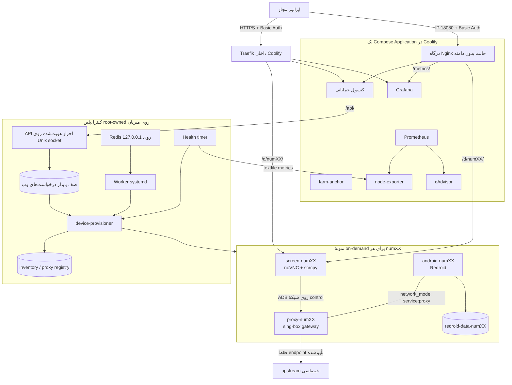

# راهنمای واحد معماری، نصب و عملیات Android Farm

این سند مرجع واحد پلتفرم است. موضوع آن ساخت و نگهداری یک فارم Android/Redroid برای **QA و آزمون داخلیِ مجاز** روی Ubuntu 22.04/24.04 و Coolify است. تعداد دستگاه‌های پایدار از پیش روی ۷۰ قفل نشده است؛ installer با CPU، RAM، فضای دیسک و inodeهای همان میزبان، ظرفیت کاتالوگ و ظرفیت همزمان را محاسبه می‌کند و دستگاه‌ها را به‌ترتیب `num01`، `num02` و ... تخصیص می‌دهد.

## شروع سریع روی سرور شما

1. در DNS دامنهٔ `commex-box.com` دو رکورد **A با DNS only** بسازید/اصلاح کنید: `@ → 185.208.172.141` و `metrics → 185.208.172.141`. رکورد موجود `coolify` را نگه دارید و TCP `80/443` را در فایروال سرور قابل دسترس کنید.
2. در [پنل Coolify شما](https://coolify.commex-box.com)، **Settings → Configuration → Advanced → API Access** را فعال کنید؛ سپس از **Keys & Tokens → API Tokens** توکن موقت `root` برای تیم پروژه بسازید.
3. از SSH روی سرور `185.208.172.141` دو فرمان زیر را اجرا و توکن را فقط در ورودی مخفی راه‌انداز وارد کنید:

```bash
curl -fsSL https://raw.githubusercontent.com/mjpouladi/AndroidFarm/main/install.sh -o install-android-farm.sh
sudo bash install-android-farm.sh --domain commex-box.com --admin-user mjpouladi --set-admin-password
```

4. رمز دلخواه را در دو ورودی مخفی راه‌انداز وارد کنید؛ فرمان بالا ورود فارم و مدیر داخلی Grafana را با کاربر `mjpouladi` هماهنگ می‌کند. پس از پایان پنج مرحله، **[پلتفرم](https://commex-box.com)** و **[مانیتورینگ](https://metrics.commex-box.com)** را باز کنید. `sudo device-provisioner status` وضعیت واقعی را نشان می‌دهد. صفحهٔ دستگاه پس از تخصیص/روشن‌شدن در `https://commex-box.com/d/num01/` است. نصب قبلی بدون گزینه‌های تغییر حساب، اطلاعات ورود قبلی خود را حفظ می‌کند.

نصب تازه کنسول را روی خود دامنه و API Coolify را روی `http://127.0.0.1:8000` تنظیم می‌کند. اگر هر مرحله مبهم بود، **بخش ۵ همین سند** تمام مراحل DNS، توکن، نصب، آزمون و نخستین دستگاه را با جزئیات دارد. کنسول به API عملیاتی میزبان وصل است؛ همان عملیات از CLI نیز قابل انجام است. در نصب تازه فهرست دستگاه و برنامهٔ تأییدشده خالی است؛ آماده‌سازی برنامه در بخش ۹ آمده است.

این پروژه دورزدن محدودیت‌های Meta، Play Integrity یا سامانه‌های ضدسوءاستفاده را انجام نمی‌دهد و احتمال مسدودشدن هیچ حسابی را تضمین نمی‌کند. تولید/تغییر IMEI، جا زدن کانتینر به‌عنوان گوشی تجاری، جعل شناسهٔ سخت‌افزاری، پنهان‌کردن root/container، خودکارسازی OTP یا ثبت‌نام انبوه و نصب خودکار WhatsApp در محدودهٔ این پیاده‌سازی نیست. نصب برنامه فقط برای APK عمومی/داخلیِ تأییدشده، با hash و signer از پیش مجاز، انجام می‌شود.

## ۱. وضعیت واقعی قابلیت‌ها

| بخش | وضعیت | توضیح دقیق |
|---|---|---|
| نصب هدایت‌شده | پیاده‌سازی؛ اتصال API Coolify در تست‌ها شبیه‌سازی می‌شود | `install.sh`، حالت پیش‌فرض دامنه و HTTPS، IP/پورت اختیاری، ساخت و deploy برنامه در Coolify، ادامه پس از قطع، فعال‌سازی خودکار API وب، Worker و health؛ پذیرش روی Coolify واقعی لازم است |
| installer میزبان | پیاده‌سازی و آزمون واحد | `plan/apply/doctor`، release تغییرناپذیر مبتنی بر محتوا، نصب Docker و ابزارهای لازم، Binder و تنظیم Basic Auth؛ دو مرحله را راه‌انداز ساده هماهنگ می‌کند |
| کاتالوگ و ظرفیت | پیاده‌سازی و آزمون واحد | ظرفیت فعال بر اساس منابع زنده و ظرفیت کاتالوگ بر اساس دیسک؛ کاتالوگ نصب‌شده خودکار کوچک نمی‌شود |
| lifecycle دستگاه | پیاده‌سازی و آزمون واحد | start/stop/check/check-ip/status/hold/release/backup با حفظ `/data` و کنترل topology Compose |
| شبکه و پراکسی | پیاده‌سازی و آزمون واحد | یک upstream اختصاصی HTTP CONNECT یا SOCKS5 برای هر دستگاه، gateway مبتنی بر sing-box، namespace مشترک Android و proxy و guard مستقل میزبان؛ پراکسی اختیاری است و حالت «خروجی مستقیم میزبان» همان namespace، ADB و guard را بدون tunnel نگه می‌دارد |
| پروفایل QA | پیاده‌سازی و آزمون واحد | Android 11/12/13، resolution، DPI، FPS، locale، منطقهٔ زمانی (IANA) و سقف CPU/RAM هر دستگاه در محدودهٔ بودجهٔ ممیزی‌شده؛ جعل مدل تجاری یا شناسهٔ سخت‌افزاری رد می‌شود |
| مخزن APK | پیاده‌سازی و آزمون واحد | بارگذاری APK از کنسول یا `apps import`، ذخیرهٔ content-addressed خصوصی، بررسی aapt/apksigner، pin امضاکننده در اولین ثبت و استفادهٔ مجدد در هر نصب بعدی |
| صف Redis Worker | پیاده‌سازی و آزمون واحد | صف قابل‌بازیابی، idempotency، lease، retry/backoff، dead-letter و lock مجزای هر دستگاه؛ فقط فرمان‌های allowlist |
| بازیابی سلامت ADB | پیاده‌سازی و آزمون واحد | مشاهدهٔ ADB/boot/screen/proxy، restart محدود، boot grace و cooldown نمایی؛ کانتینر کرش‌کرده فقط وقتی قصد ثبت‌شدهٔ اپراتور «روشن» باشد بازیابی می‌شود و دستگاه عمداً خاموش‌شده روشن نمی‌شود؛ رویدادها در لاگ پایدار ثبت می‌شوند |
| Prometheus/Grafana | پیکربندی آماده | CPU، uptime، سلامت ADB، latency و سلامت proxy، تعداد recovery و کرش؛ Alertmanager داخلی و Loki/Promtail برای لاگ هر دستگاه؛ باید روی سرور مقصد scrape و dashboard تأیید شود |
| Ansible | پیکربندی آماده | API وب، Redis محلی، worker، timer سلامت، پروفایل‌های دستگاه و تشخیص drift؛ اجرا به‌صورت `serial: 1` و بدون حذف data |
| کنسول وب | متصل به کنترل‌پلین میزبان | وضعیت و منابع واقعی، پراکسی، دستگاه، نصب APK تأییدشده و درخواست‌های پایدار؛ خطای backend آشکار است و با دادهٔ نمونه جایگزین نمی‌شود |
| مدیریت اطلاعات ورود | پیاده‌سازی و آزمون واحد | تغییر حساب وب و مدیر واقعی Grafana، جداگانه یا مشترک، با تأیید رمز فعلی و بازگردانی در خطا؛ رمز اتصال پراکسی بدون تغییر هویت اتصال |
| مدیریت سرویس‌های مرکزی | پیاده‌سازی و آزمون واحد | وضعیت systemd و کانتینرهای مدیریت‌شده، راه‌اندازی اجزای نصب‌شده، تشخیص و تعمیر کنترل‌پلین؛ دستگاه‌ها خودکار روشن نمی‌شوند |
| پذیرش production | نیازمند اجرای Ubuntu | بوت Redroid، Binder، proxy واقعی، HTTP/Nginx یا TLS/Traefik، noVNC/WebSocket، kill-switch و restore باید روی میزبان واقعی با pilot تأیید شوند |

وجود تست واحد یا parse شدن Compose جای آزمون پذیرش روی سرور مقصد را نمی‌گیرد.

برای ارزیابی یک آزمایشگاه سازمانی محدود به APK داخلی، [طرح QA و فاصلهٔ آن با نسخهٔ فعلی](#internal-qa-design) و [ماتریس پذیرش QA](#internal-qa-acceptance) را بخوانید. این دو بخش سند طراحی و معیار آزمون هستند؛ قابلیت برنامه‌ریزی‌شده را به‌عنوان قابلیت نصب‌شده معرفی نمی‌کنند.

طراحی [کتابخانهٔ APK داخلی](#internal-apk-library-design) و [انتخاب شبکهٔ آزمون](#qa-network-choice-design) نیز در همین راهنما آمده است. آپلود فایل از پنل (بخش ۹) و حالت بدون پراکسی (بخش ۷) اکنون پیاده‌سازی شده‌اند؛ آن دو بخش طراحی، معیارهای پذیرش و موارد باقی‌مانده را نگه می‌دارند.

## ۲. معماری نهایی

### معماری پیاده‌سازی فعلی



در Coolify فقط فایل ریشهٔ `docker-compose.yml` به‌عنوان یک Application وارد می‌شود. این stack شامل `farm-anchor`، کنسول، درگاه Nginx، Prometheus، node-exporter، cAdvisor، آماده‌سازهای یک‌بارهٔ secret و Grafana است. در حالت IP درگاه فقط یک پورت منتشر می‌کند و نیازی به تغییر proxy سراسری Coolify نیست؛ در حالت دامنه، دسترسی اصلی با Traefik است و درگاه HTTP فقط روی loopback می‌ماند. کاتالوگ `docker-compose.farm.yml` را agent میزبان با project ثابت `android-farm-runtime` مدیریت می‌کند؛ Coolify آن را deploy نمی‌کند تا redeploy هسته دستگاه‌های on-demand را orphan یا حذف نکند.

کنترل‌پلین وب سرویس systemd روی میزبان است و با همان راه‌انداز نصب می‌شود؛ کانتینر کنسول فقط به socket محدود آن دسترسی دارد. اگر `CONSOLE_DOMAIN` جدا از `FARM_DOMAIN` باشد، Nginx کنسول مسیر `/d/numXX/` را با WebSocket به gateway داخلی می‌رساند تا صفحهٔ دستگاه همچنان داخل همان origin پنل باز شود. gateway فقط ID و مسیر معتبر را قبول می‌کند؛ خطای دستگاه خاموش به صفحهٔ کنسول تبدیل نمی‌شود.

Coolify ابتدا imageهای کنسول و درگاه را از checkout مخزن می‌سازد و سپس هسته را با project ثابت `android-farm-core` اجرا می‌کند. نام imageهای محلی صریح است: `android-farm/console:<FARM_RELEASE_ID>` و `android-farm/gateway:<FARM_RELEASE_ID>`. بنابراین تغییر نام project یا مسیر بین مرحلهٔ build و start، image دیگری را انتخاب نمی‌کند. `pull_policy: never` برای این دو سرویس، دریافت image از registry را غیرفعال می‌کند؛ مرحلهٔ build همچنان اجرا می‌شود و start از image ساخته‌شدهٔ همان release استفاده می‌کند.

برای هر دستگاه این اجزا ساخته می‌شود:

- `proxy-numXX`: gateway خروجی و تنها دارندهٔ مسیر اینترنت؛ `restart: "no"`.
- `android-numXX`: Redroid privileged با `network_mode: service:proxy-numXX` و `restart: "no"`.
- `screen-numXX`: scrcpy/Xvfb/noVNC، پشت درگاه احراز هویت‌شدهٔ IP یا Traefik و `farm-auth@file`؛ `restart: "no"`.
- `redroid-data-numXX`: volume خارجی با bind کنترل‌شده به `/opt/farm/data/instances/numXX/data`.

ADB با فرمول `5550 + index` فقط روی loopback منتشر می‌شود؛ `num01` برابر `127.0.0.1:5551` است. route صفحه در حالت بدون دامنه `http://185.208.172.141:18080/d/num01/` و در حالت دامنه `https://commex-box.com/d/num01/` است. شمارهٔ تلفن در Docker label ذخیره نمی‌شود؛ inventory خصوصی فقط مقدار mask/HMAC را نگه می‌دارد.

Android و proxy شبکهٔ یکسان دارند. guard در chainهای اختصاصی `DOCKER-USER` فقط TCP به IPv4 و port تأییدشدهٔ upstream را عبور می‌دهد و بقیهٔ خروجی bridge را drop می‌کند. قطع proxy نباید باعث fallback به IP دیتاسنتر شود. شبکهٔ `coolify` یک شبکهٔ اشتراکی مورداعتماد است؛ workload غیرمورداعتماد را به آن وصل نکنید.

بازه‌های `10.231.0.0/16` و `10.232.0.0/16` برای شبکه‌های دستگاه رزرو شده‌اند. نصب‌کننده تمام شبکه‌های Docker را بررسی می‌کند و در صورت هم‌پوشانی یا ناتوانی در خواندن inventory شبکه، نصب را متوقف می‌کند. شبکهٔ موجود فارم فقط با تطابق نام، project، subnet، bridge و وضعیت isolation پذیرفته می‌شود. در میزبان دارای VPN یا route سازمانی، نبود هم‌پوشانی با routeهای بیرون Docker را نیز پیش از استقرار بررسی کنید.

<a id="internal-qa-design"></a>

### طرح QA سازمانی برای برنامه‌های داخلی

دامنهٔ این طرح، آزمون یک برنامهٔ داخلی با مالک مشخص، دادهٔ ساختگی آزمون و نسخهٔ تأییدشده است. شناسه‌های سناریو باید `project_id`، `test_asset_id` و `test_run_id` باشند. قرارداد فعلی provisioning هنوز شماره و تأیید مالکیت را اجباری می‌کند؛ تبدیل آن به موجودی مستقل از شماره، به طراحی مهاجرت داده و API نیاز دارد و انجام‌شده محسوب نمی‌شود. تأیید hash و امضای APK، مالکیت سازمان بر برنامه را اثبات نمی‌کند؛ مسئول ثبت کاتالوگ باید مجوز آزمون را نیز بررسی کند.

در سناریوی تفکیک مدیریت و اجرا، مرز مسئولیت‌ها چنین است:

```text
VM مدیریت                              سرور اجرای QA
+--------------------+                 +---------------------------------------+
| Coolify            |-- مدیریت SSH -->| Docker / Compose / کنترل‌پلین محلی    |
| تنظیم استقرار      |                 |                                       |
+--------------------+                 | ورودی HTTPS و احراز هویت              |
                                       |          |                            |
اپراتور مجاز ------------------------->| کنسول -> API -> صف وب -> اجراکننده    |
                                       | Redis -> Worker (مسیر جدا)           |
                                       | محیط آزمون مستقل هر دستگاه           |
                                       | Android + داده + شبکهٔ آزمون + screen |
                                       |                                       |
                                       | metrics -> Prometheus -> Grafana      |
                                       | logs -> ذخیرهٔ محلی محدود             |
                                       +---------------------------------------+
```

Coolify اتصال مدیریتی SSH به سرور مقصد را پشتیبانی می‌کند؛ در این طرح API، Worker، ADB و Unix socket روی **سرور اجرا** می‌مانند. شبکهٔ bridge با نام یکسان روی دو Docker host شبکهٔ مشترک نمی‌سازد. مسیرهای host، داده‌ها و secretهای mountشده نیز باید متعلق به مقصد اجرای کانتینر باشند. این تفکیک باید جداگانه پذیرفته شود؛ نصب فعلیِ گزارش‌شده روی سرور کاربر، تأیید استقرار دو VM نیست. [اتصال سرور در Coolify](https://next.coolify.io/docs/core/infrastructure/servers/add-server)، [محدودهٔ شبکهٔ bridge در Docker](https://docs.docker.com/engine/network/drivers/bridge/)

نصب‌کننده روی **میزبان اجرای Android** اجرا می‌شود و Docker محلی rootful می‌خواهد. مقصد انتخاب‌شده در Coolify باید همان میزبان باشد؛ صرف تعیین `server_uuid` این تطابق را اثبات نمی‌کند. Traefik، شبکهٔ Coolify، مسیر `/data/coolify/proxy/dynamic` و کانتینر کنسول نیز باید روی همین مقصد آماده باشند. انتقال Traefik یا کنسول به VM مدیریت و اتصال مستقیم آن به Unix socket سرور اجرا در معماری فعلی پشتیبانی نمی‌شود.

درخت بخش‌های موجود مخزن:

```text
AndroidFarm/
|-- docker-compose.yml          هسته، کنسول و مانیتورینگ
|-- generate_farm.py            تعریف سرویس‌های مستقل دستگاه
|-- provisioner.py              مدیریت چرخهٔ عمر
|-- ops/
|   |-- device_profiles.py      اعتبارسنجی پروفایل QA
|   |-- app_installer.py        بررسی APK و عملیات ADB
|   |-- healthcheck.py          مشاهده و بازیابی محدود
|   `-- resources.py            اندازه‌گیری و پذیرش ظرفیت
|-- services/
|   |-- api/                    API و صف پایدار درخواست وب
|   `-- worker/                 Worker صف Redis
|-- monitoring/                 Prometheus و داشبوردهای Grafana
|-- ansible/                    تنظیم سرویس‌های میزبان
|-- web/                        کنسول اپراتور
|-- tests/                      آزمون‌های واحد و یکپارچه‌سازی اختیاری
`-- docs/GUIDE.fa.md             همین راهنمای واحد
```

تطبیق خواسته‌های QA با کد فعلی:

| خواسته | وضعیت قابل استناد در مخزن | شرط تکمیل طراحی |
|---|---|---|
| Android 11/12/13 | اعتبارسنج پروفایل هر سه نسخه را می‌پذیرد (`redroid/redroid:13.0.0-latest`) | نسخهٔ 13 هنوز به آزمون image، بوت، ABI و سازگاری داده روی میزبان نیاز دارد |
| DPI، عرض/ارتفاع، FPS، Locale | در پروفایل JSON موجود است و به آرگومان‌های boot در Compose تبدیل می‌شود | صحت مقدار داخل Android نیز در پایلوت بررسی شود؛ ENV دلخواه به‌تنهایی ویژگی Android را تغییر نمی‌دهد |
| Timezone مستقل | فیلد `timezone` پروفایل (IANA) پس از boot با ADB به `persist.sys.timezone` اعمال و با `getprop` تأیید می‌شود | خواندن مقدار واقعی داخل Android در پایلوت بررسی شود؛ ENV میزبان به‌تنهایی معیار نیست |
| CPU/RAM به‌ازای سناریو | `resources` پروفایل سقف Android را در بودجهٔ ممیزی‌شده پایین می‌آورد؛ پذیرش ظرفیت پویاست | افزایش سهم بالاتر از بودجه باید هم‌زمان در generator، اعتبارسنج و محاسبهٔ پذیرش اعمال شود |
| پراکسی شبکهٔ آزمون | پیاده‌سازی فعلی sing-box با HTTP CONNECT/SOCKS5 است؛ IPv6 و UDP عمومی مسدودند | جایگزینی با Gluetun یک تغییر معماری مستقل است؛ آزمون UDP/QUIC به شبکهٔ فعلی تعمیم داده نشود |
| FastAPI و مسیرهای `/devices/...` | API موجود WSGI/Gunicorn و مبتنی بر job است | تغییر framework یا قرارداد API هنوز انجام نشده است |
| Provision از YAML | کاتالوگ، درخواست و پروفایل فعلی JSON هستند | schema نسخه‌دار و تبدیل محدود داده لازم است؛ YAML نباید فرمان shell دلخواه حمل کند |
| رویدادهای Device ready/crashed | لاگ رویداد پایدار (`events.jsonl`) با snapshot و صفحهٔ «رویدادها» ارائه می‌شود | push اختصاصی SSE/WebSocket هنوز موجود نیست؛ کنسول با polling می‌خواند |
| تصویر مرورگر | noVNC به‌همراه scrcpy موجود است | ws-scrcpy و WebRTC پیاده‌سازی نشده‌اند؛ تصویر زنده و ورودی اپراتور باید آزموده شوند |
| Prometheus و Grafana | مصرف CPU، uptime، ADB، restart، کرش و مدت healthcheck پروکسی در داشبورد موجود است؛ Alertmanager داخلی متصل است | مدت بررسی پروکسی معادل RTT خام نیست؛ receiver اعلان (email/Slack) باید در alertmanager.yml تنظیم شود |
| لاگ قابل جست‌وجوی مرکزی | Loki و Promtail با برچسب device/role و نگهداری ۷ روز در هستهٔ Compose موجودند | سطح دسترسی جست‌وجو همان Basic Auth Grafana است؛ حجم و retention در پایلوت تنظیم شود |
| Ansible و drift | پروفایل JSON و سرویس‌ها مدیریت می‌شوند؛ drift دستگاه روشن باعث توقف با خطا می‌شود | اصلاح خودکار دستگاه روشن یا بازسازی بدون مداخله، قابلیت موجود نیست |

قرارداد واقعی API شامل `GET /api/v1/health`، `GET /api/v1/snapshot`، `POST /api/v1/jobs` و لغو درخواست با `POST /api/v1/jobs/{uuid}/cancel` است. صف وب SQLite و صف Workerِ Redis دو مسیر متفاوت‌اند؛ نباید همهٔ درخواست‌های پنل را Redis-backed توصیف کرد. مسیرهای مستقیم REST مانند `/devices/{id}/start` وجود ندارند؛ همان عملیات (از جمله `restart`) به‌صورت action در `POST /api/v1/jobs` و آپلود APK با `POST /api/v1/artifacts/upload` ارائه می‌شوند.

سیاست فعلی بازیابی نیز محدود است: Android غیر `running` فقط وقتی «کرش» محسوب می‌شود که با exit code غیرصفر یا OOM خارج شده و قصد ثبت‌شدهٔ اپراتور «روشن» باشد؛ در غیر این صورت `stopped` است و خودکار روشن نمی‌شود. Android روشن با ADB متوقف‌شده پس از دو مشاهده وارد بازیابی می‌شود؛ هر نوبت بررسی حداکثر یک restart دارد و cooldown با شکست‌های متوالی تا یک ساعت افزایش می‌یابد. این محدودیت، سقف کل دفعات بازیابی یا circuit breaker نیست. Redis به‌طور پیش‌فرض حداکثر چهار تلاش با backoff دارد؛ درخواست‌های ناتمام صف وب پس از restart API، `interrupted` می‌شوند و خودکار تکرار نمی‌شوند.

برای تعریف نمونه‌های دارای داده، شبکه و پروفایل مستقل، generator فعلی سرویس جدا می‌سازد. استفادهٔ مستقیم از `--scale` با `container_name` ثابت موجود سازگار نیست؛ Compose چنین سرویسی را به بیش از یک کانتینر scale نمی‌کند. [محدودیت رسمی container_name](https://docs.docker.com/reference/compose-file/services/#container_name)

قرارداد provisioning برای پذیرش QA باید این موارد را اثبات کند: APK با hash و signer مستقل تأیید شده باشد؛ بوت Android پیش از نصب کامل شود؛ فقط مجوزهای موردنیاز آزمون اعمال شوند؛ نتیجه به نسخهٔ APK و digest پروفایل متصل باشد؛ تکرار درخواست همان دادهٔ آزمون را حفظ کند. نصب دوباره با حفظ داده و idempotency صف، به‌تنهایی اثبات «اجرای دقیقاً یک‌بار همهٔ مراحل» نیست؛ قطع فرایند میان نصب و ثبت نتیجه باید جداگانه آزمایش شود.

روی سرور اعلام‌شدهٔ ۷۲ vCPU، ۹۶GB RAM و ۸۰۰GB SSD، ظرفیت اسمی دیسک تعداد دستگاه مجاز را تعیین نمی‌کند. فضای آزاد واقعی، inode، فضای Docker، اندازهٔ APK، دادهٔ هر آزمون و پشتیبان‌ها باید در همان میزبان اندازه‌گیری شوند. عدد ظرفیتِ گزارش‌شدهٔ نسخهٔ فعلی مبنای آزمون است؛ این طرح ظرفیت بالاتری را تضمین نمی‌کند.

## ۳. مدل ظرفیت پویا

بودجهٔ محافظه‌کارانهٔ هر نمونهٔ فعال ۶ vCPU و ۵٫۲۵ GiB RAM است: Android چهار CPU/چهار GiB، screen یک‌ونیم CPU/یک GiB و proxy نیم CPU/۲۵۶ MiB. reserve میزبان بزرگ‌ترِ ۲ CPU یا ۱۰٪ کل CPU و بزرگ‌ترِ ۸ GiB یا ۲۰٪ RAM است. ظرفیت همزمان برابر کمینهٔ ظرفیت CPU و RAM است و هنگام هر start دوباره با RAM آزاد و load بررسی می‌شود. فضای آزاد و inode فایل‌سیستم داده و مسیر واقعی `DockerRootDir` جداگانه سنجیده می‌شوند؛ پُرشدن هرکدام پذیرش start را متوقف می‌کند.

روی میزبان ۷۲ vCPU و ۹۶ GiB، محاسبهٔ پایه معمولاً ۱۰ دستگاه همزمان می‌دهد؛ این عدد policy ثابت نیست و فشار واقعی میزبان ممکن است آن را پایین بیاورد. ظرفیت کاتالوگ از فضای `/opt/farm/data/instances` با بودجهٔ ۱۲ GiB برای هر دستگاه و reserve بزرگ‌ترِ ۴۰ GiB یا ۲۰٪ فایل‌سیستم محاسبه می‌شود.

```bash
sudo device-provisioner resources
sudo device-provisioner resources --json
sudo device-provisioner status --json
```

`--catalog-count auto` تعداد slotهای پایدار را از storage تعیین می‌کند، ولی هیچ device تخصیص‌یافته یا کاتالوگ موجود را خودکار حذف/کوچک نمی‌کند. برای reserve قراردادی کمتر از ظرفیت فیزیکی، عدد صریح بدهید؛ برای افزایش بعدی همان installer را با عدد بزرگ‌تر اجرا کنید.

## ۴. پیش‌نیازهای میزبان

- Ubuntu Server 22.04 یا 24.04 روی خود host، نه داخل کانتینر.
- Coolify و Traefik داخلی آن از قبل فعال باشند.
- برای مسیر اصلی، دامنهٔ `commex-box.com`، سرور `185.208.172.141` و TCP `80/443` قابل دسترس باشند. DNSهای `commex-box.com` و `metrics.commex-box.com` را مطابق بخش بعد به این سرور وصل کنید.
- حالت اختیاری بدون دامنه به TCP `18080` از شبکهٔ مطمئن/VPN نیاز دارد. قواعد انتشار پورت Docker می‌توانند از قواعد معمول UFW عبور کنند؛ فایروال شبکه/ارائه‌دهنده را هم تنظیم کنید ([مستندات Docker](https://docs.docker.com/engine/network/packet-filtering-firewalls/#docker-and-ufw)). ADB عمومی نباشد.
- کرنل میزبان BinderFS را ارائه کند؛ cgroup v2 و Docker rootful محلی لازم است. وجود `/dev/binder` روی خود میزبان پیش‌نیاز این معماری نیست.
- `/dev/kmsg` باید به‌صورت character device موجود باشد؛ Compose فعلی آن را برای cAdvisor mount می‌کند و روی VPS فاقد آن deploy هسته fail می‌شود.
- `DOCKER_HOST` و `DOCKER_CONTEXT` نباید به daemon راه‌دور اشاره کنند.
- دسترسی root فقط برای تیم زیرساخت؛ Docker socket هرگز در UI، worker یا شبکه publish نمی‌شود.

installer در صورت نیاز Docker CE، Compose plugin و ابزارهای `iptables`، `htpasswd`، `apksigner`، `aapt`، `rsync` و `restic` را نصب می‌کند، `binder_linux` را load و persistent می‌کند و Compose نسخهٔ 2.33.1 یا بالاتر را الزام می‌کند. اگر Binder برای کرنل در حال اجرا موجود نباشد، نصب بستهٔ رسمی `linux-modules-extra-$(uname -r)` همان کرنل را امتحان می‌کند؛ در صورت نیاز به بوت کرنل دیگری، با راهنمای مشخص متوقف می‌شود و **سرور را خودکار reboot نمی‌کند**. نصب/پارتیشن‌بندی خود Ubuntu و نصب خود Coolify خارج از installer است.

تشخیص Binder براساس ثبت فایل‌سیستم `binder` در `/proc/filesystems` است. هنگام آماده‌سازی میزبان، نصب‌کننده یک mount موقت BinderFS در mount namespace خصوصی می‌سازد، character device بودن `binder-control` را بررسی و آن را پاک‌سازی می‌کند. Redroid 11/12 هنگام بوت، BinderFS و دستگاه‌های Binder خود را داخل کانتینر می‌سازد؛ `/dev/binder`، `/dev/hwbinder` و `/dev/vndbinder` میزبان نه ساخته می‌شوند و نه به کانتینرها bind می‌شوند. موفقیت این بررسی هنوز جای آزمون بوت واقعی `num01` را نمی‌گیرد. جزئیات و رفع خطای نسخهٔ قبلی در بخش عیب‌یابی همین راهنما آمده است.

## ۵. نصب قدم‌به‌قدم با دامنه و HTTPS

این مسیر اصلی نصب است؛ مراحل این بخش را به‌ترتیب انجام دهید. فقط **DNS، دسترسی API Coolify و اجرای راه‌انداز** بر عهدهٔ شماست؛ راه‌انداز Project، Application، ENV، Deploy و سرویس‌های میزبان را ایجاد می‌کند. بخش دستی انتهای همین فصل برای نصب سفارشی است و در مسیر ساده لازم نیست.

این راهنما با اطلاعات سرور شما تنظیم شده است: **IPv4 برابر `185.208.172.141`، دامنهٔ اصلی پلتفرم `https://commex-box.com` و پنل موجود `https://coolify.commex-box.com`**. کنسول روی ریشهٔ دامنه، دستگاه‌ها زیر `/d/numXX/` و Grafana روی `https://metrics.commex-box.com` قرار می‌گیرند. راه‌انداز را روی **همین سرور Ubuntu که Docker/Coolify دارد** اجرا کنید. تنظیم DNS یا Deploy روی سرور هنوز از طرف این راهنما انجام نشده است.

### گام ۱ — DNS دامنه را وصل کنید

در پنل DNS دامنهٔ خود، zone مربوط به `commex-box.com` را باز کنید. این دو رکورد **صریح** را بسازید؛ اگر رکورد A/CNAME قدیمی با همین نام‌ها وجود دارد، آن را اصلاح کنید تا مقصد متناقض باقی نماند. رکورد موجود `coolify` را تغییر ندهید:

| Type | Name در zone `commex-box.com` | IPv4 / Content | نتیجه |
|---|---|---|---|
| A | `@` | `185.208.172.141` | `commex-box.com` برای کنسول و دستگاه‌ها |
| A | `metrics` | `185.208.172.141` | `metrics.commex-box.com` برای Grafana |

TTL را روی `Auto` یا `300` بگذارید. بعضی پنل‌ها به‌جای `@` نام کامل `commex-box.com` می‌خواهند؛ ستون نتیجه نام نهایی است و نباید دوبار `commex-box.com` به آن اضافه شود. این انتخاب ریشهٔ دامنه را به پلتفرم منتقل می‌کند؛ اگر قبلاً سایتی روی آن بوده، محتوای ریشه پس از انتقال مربوط به این پلتفرم خواهد بود. در Coolify نیز App دیگری نباید router فعال برای همین دامنه داشته باشد.

اگر DNS در Cloudflare است، برای شروع هر دو رکورد را **DNS only، ابر خاکستری** قرار دهید. DNS-only آدرس خود سرور را برمی‌گرداند؛ رکورد Proxied آدرس‌های Cloudflare را برمی‌گرداند. انتخاب DNS-only در مرحلهٔ نصب، بررسی DNS و صدور گواهی مستقیم را ساده می‌کند؛ این انتخاب توصیهٔ این راهنماست، نه الزام همیشگی Cloudflare ([توضیح رسمی Proxy status](https://developers.cloudflare.com/dns/proxy-status/)).

اگر wildcard مانند `*` از قبل به‌صورت Proxied دارید، رکورد صریح `metrics` را اضافه کنید تا تنظیم مستقل داشته باشد؛ wildcard و رکورد پنل فعلی را صرفاً برای این نصب حذف نکنید. پس از DNS-only شدن، برای هر دو نام پلتفرم باید خود `185.208.172.141` را ببینید، نه IPهای لبهٔ Cloudflare.

اگر IPv6 این سرور را واقعاً تنظیم نکرده‌اید، برای این دو نام رکورد **AAAA نسازید**؛ AAAA قدیمی به سرور دیگر را اصلاح یا حذف کنید. در صورت استفاده از IPv6، مقصد و دسترسی 80/443 آن هم باید درست باشد. اگر nameserverهای دامنه هنوز به DNS provider انتخاب‌شده وصل نیستند، ابتدا آن اتصال را در ثبت‌کنندهٔ دامنه کامل کنید.

روی سرور، پس از انتشار DNS بررسی کنید:

```bash
getent ahostsv4 commex-box.com
getent ahostsv4 metrics.commex-box.com
```

IPv4های خروجی باید همان `185.208.172.141` باشند. نبود خروجی یا IP قدیمی یعنی هنوز DNS درست/منتشر نشده است. دامنهٔ خود پنل Coolify مستقل است: اگر از قبل با `https://coolify.commex-box.com` وارد آن می‌شوید همان را نگه دارید؛ ساخت رکورد `coolify` برای نصب فارم اجباری نیست.

### گام ۲ — سرور و ورودی وب را آماده کنید

Ubuntu 22.04/24.04 و Coolify باید از قبل نصب و پنل قابل ورود باشد. در Coolify، **Servers → سرور مقصد** را باز کنید؛ اتصال سرور باید معتبر و proxy از نوع **Traefik** فعال باشد. در فایروال ارائه‌دهنده یا Security Group همان سرور، TCP `80` و `443` را برای وب عمومی باز کنید. پورت SSH فعلی خود را حفظ کنید. Coolify از 80 برای HTTP و صدور گواهی و از 443 برای HTTPS استفاده می‌کند ([راهنمای رسمی فایروال](https://coolify.io/docs/core/infrastructure/servers/firewall)).

برای این حالت، پورت `18080` را عمومی نکنید؛ درگاه آن فقط روی loopback می‌ماند. Redis، Docker API و ADB نیز پورت عمومی لازم ندارند. راه‌انداز فایروال ارائه‌دهنده را تغییر نمی‌دهد و proxy دوم روی 80/443 نصب نمی‌کند؛ از همان Traefik و resolver گواهی Coolify استفاده می‌شود ([معماری Traefik در Coolify](https://coolify.io/docs/core/networking/proxy/traefik/overview)).

### گام ۳ — API Coolify و توکن نصب

با کاربر مدیر/مالک تیمی وارد Coolify شوید که قرار است پروژه در آن ساخته شود:

1. از **Settings → Configuration → Advanced**، گزینهٔ **API Access** را روشن و Save کنید.
2. اگر **Allowed IPs for API Access** تنظیم شده است، مبدأ واقعی درخواست‌های این سرور باید مجاز باشد. این گزینه حتی با توکن معتبر می‌تواند 403 بدهد؛ پشت NAT یا شبکهٔ Docker، مبدأیی را مجاز کنید که Coolify دریافت می‌کند ([مستندات API Allowlist](https://coolify.io/docs/api/ip-allowlist)).
3. از **Keys & Tokens → API Tokens** توکنی با نام مثلاً `android-farm-installer` و زمان انقضای کوتاه بسازید.
4. برای این نصب‌کننده که پروژه/برنامه را می‌سازد، ENV را می‌خواند/می‌نویسد و Deploy می‌کند، در UI فعلی Coolify مجوز **root** را انتخاب کنید. توکن فقط متعلق به همان تیم است. گزینهٔ `deploy` در UI فعلی توکن deploy-only می‌سازد و برای ساخت پروژه کافی نیست ([مجوزهای رسمی Coolify](https://coolify.io/docs/api/permissions)).
5. Create را بزنید و **کل توکن** را در محل خصوصی نگه دارید؛ فقط یک‌بار نمایش داده می‌شود. پس از پایان نصب می‌توانید آن را Revoke کنید و برای ارتقای بعدی توکن تازه بسازید ([راهنمای ساخت و لغو توکن](https://coolify.io/docs/core/security/credentials/api-tokens)).

توکن را داخل Git، Compose، فرمان shell یا گفتگو وارد نکنید؛ راه‌انداز آن را با ورودی مخفی می‌پرسد و در argv، state یا ENV ذخیره نمی‌کند. نگهداری اختیاری در فایل خصوصی میزبان با `--remember-token` در ادامه توضیح داده شده است.

### نگهداری خصوصی توکن برای نصب‌های بعدی

برای اینکه هر بار توکن را وارد نکنید، یک‌بار این فرمان را روی سرور اجرا کنید و توکن را در ورودی مخفی وارد کنید:

```bash
sudo bash /opt/android-farm/source/install.sh --domain commex-box.com --remember-token
```

پس از موفقیت بررسی دسترسی به سرور در API Coolify، توکن در `/etc/android-farm/coolify-credential.json` با مالک root و مجوز `0600`، داخل پوشهٔ خصوصی `0700` ذخیره می‌شود. این فایل در Git، release، Compose یا وضعیت عمومی نصب قرار نمی‌گیرد. نصب عادی بدون این گزینه، توکن تازه‌ای را ذخیره نمی‌کند؛ اگر فایل ذخیره‌شده موجود باشد آن را خودکار می‌خواند:

```bash
sudo bash /opt/android-farm/source/install.sh
```

توکن ذخیره‌شده به آدرس API همان Coolify متصل است؛ تغییر host، port یا scheme باعث ارسال خودکار آن به مقصد جدید نمی‌شود. `--token-file /مسیر/خصوصی/فایل` بر فایل ذخیره‌شده اولویت دارد و به‌تنهایی آن را جایگزین نمی‌کند. برای ثبت توکن تازه یا تعویض آدرس، همان فرمان را با `--remember-token` و در صورت نیاز `--coolify-url` اجرا کنید؛ توکن جدید فقط پس از بررسی موفق دسترسی جایگزین می‌شود. این بررسی، دسترسی خواندن سرور را تأیید می‌کند و به‌تنهایی موفقیت Deploy بعدی را تضمین نمی‌کند.

اگر توکن منقضی یا در Coolify لغو شد، راه‌انداز بدون حذف توکن قبلی خطای دسترسی می‌دهد و روش جایگزینی را نمایش می‌دهد. حذف فایل خصوصی فقط استفادهٔ خودکار محلی را متوقف می‌کند؛ لغو اعتبار توکن باید در خود Coolify انجام شود. حالت‌های `--diagnose` و `--repair-control-plane` همچنان بدون خواندن یا ذخیرهٔ توکن کار می‌کنند. توکن را در `install.sh` ننویسید؛ به‌روزرسانی source باید بدون secret و بدون تغییر محلی باقی بماند.

### گام ۴ — دو فرمان نصب را روی سرور اجرا کنید

با SSH به سرور `185.208.172.141` وصل شوید و این دو فرمان را اجرا کنید. API را از loopback همان میزبان صدا می‌زنیم تا سیاست‌های Cloudflare جلوی نصب‌کننده را نگیرند؛ آدرس مرورگری پنل همان `https://coolify.commex-box.com` باقی می‌ماند:

```bash
curl -fsSL https://raw.githubusercontent.com/mjpouladi/AndroidFarm/main/install.sh -o install-android-farm.sh
sudo bash install-android-farm.sh --domain commex-box.com --admin-user mjpouladi --set-admin-password
```

در نصب تازه، کنسول به‌صورت پیش‌فرض روی همان دامنه قرار می‌گیرد و API از `http://127.0.0.1:8000` استفاده می‌کند. بدون گزینهٔ `--domain` نیز راه‌انداز دامنه را می‌پرسد. نصب قبلی تنظیم‌های ذخیره‌شدهٔ خودش را حفظ می‌کند؛ برای تبدیل آن به این طرح، فرمان صریح انتهای همین بخش با `--console-domain commex-box.com` را اجرا کنید. پیش از تغییر نصب موجود، دستگاه‌های روشن را با `device-provisioner down --id numXX` خاموش کنید.

در سؤال‌های راه‌انداز:

| سؤال | مقدار مناسب |
|---|---|
| دامنه، اگر در فرمان نداده‌اید | `commex-box.com` |
| آدرس Coolify، اگر در فرمان نداده‌اید | روی همین سرور، `http://127.0.0.1:8000`؛ HTTPS پنل فقط وقتی API آن از مبدأ شما قابل دسترس باشد |
| API token | کل توکن گام قبل؛ ورودی آن پنهان است |
| رمز جدید مدیریت و تکرار آن | رمز دلخواه با ۱۲ تا ۷۲ بایت UTF-8؛ ورودی پنهان، بدون آرگومان رمز در فرمان |
| Server UUID، فقط اگر تشخیص خودکار مبهم باشد | UUID همین میزبان از صفحهٔ Servers در Coolify |

توکن HTTP فقط برای آدرس loopback محلی پذیرفته می‌شود؛ URL راه‌دور Coolify باید HTTPS معتبر داشته باشد. لازم نیست فایل ENV بسازید یا از قبل App جدیدی در Coolify ایجاد کنید.

راه‌انداز در terminal پنج مرحله نشان می‌دهد:

1. `۱/۵`: بررسی منابع، Binder، شبکه، پورت‌ها و آماده‌سازی میزبان/release؛
2. `۲/۵`: ساخت یا بازیابی Project `android-farm` و Application `farm-core`؛
3. `۳/۵`: انتقال ENV و Deploy از commit دقیق source؛ ساخت نخستین imageها ممکن است چند دقیقه طول بکشد؛
4. `۴/۵`: فعال‌سازی API وب، CLI، Redis محلی، Worker و timer سلامت؛
5. `۵/۵`: doctor، وضعیت سرویس‌ها، آمادگی socket خصوصی و مسیر داخلی کنسول با پاسخ 401، TLS، پاسخ 401 وب بدون credential و سلامت واقعی API با ورود معتبر.

source موجود با تغییر محلی بازنویسی نمی‌شود؛ راه‌انداز در تعارض متوقف می‌شود. اگر Redis متعلق به سرویس دیگری روی میزبان باشد نیز آن را تصاحب نمی‌کند؛ برای آن نصب سفارشی از بخش ۱۴ استفاده کنید.

### گام ۵ — نتیجهٔ Deploy را در همان برنامهٔ Coolify ببینید

در پنل، **Projects → android-farm → محیط ایجادشده → farm-core** را باز کنید؛ UUID برنامه در خروجی راه‌انداز چاپ می‌شود. **برنامهٔ دوم نسازید.** در Deployments باید Deploy همان commit به حالت `finished` رسیده باشد و Logs خطای تکرارشونده نداشته باشند.

راه‌انداز این تنظیم‌ها را انجام داده است؛ فقط آن‌ها را بازبینی کنید:

| تنظیم | مقدار |
|---|---|
| مخزن / branch | `mjpouladi/AndroidFarm` / `main` با Deploy متصل به commit مشخص |
| Build Pack | `Docker Compose` |
| Base Directory / Compose Location | `/` و `/docker-compose.yml` |
| Raw Compose Deployment | فعال؛ routeها و شبکه در Compose این مخزن تعریف شده‌اند |
| Environment Variables | مقدارهای تولیدشده از `/etc/android-farm/coolify.env` |
| Service Domains خودکار | خالی؛ دامنهٔ اضافه یا دامنهٔ تصادفی برای serviceها نسازید |

در حالت Raw، مسئولیت proxy labels و networking با Compose است؛ راه‌انداز این موارد را تنظیم می‌کند ([راهنمای رسمی Docker Compose و Raw Deployment](https://coolify.io/docs/applications/builds/docker-compose#raw-compose-deployment-for-an-application)). Domainهای این پروژه از `FARM_DOMAIN`، `CONSOLE_DOMAIN` و `GRAFANA_DOMAIN` می‌آیند. `docker-compose.farm.yml` برنامهٔ جداگانهٔ Coolify نیست.

آماده‌سازهای secret، سرویس یک‌باره‌اند و باید با exit code صفر تمام شوند؛ «Exited (0)» برای آن‌ها طبیعی است. `farm-anchor`، `farm-console`، gateway، Prometheus، node-exporter، cAdvisor و Grafana باید در حال اجرا باشند. پس از نصب هسته هنوز Androidی روشن نشده است.

### گام ۶ — ورود و آزمون اولیهٔ HTTPS

خروجی راه‌انداز لینک‌ها و نام کاربری را نشان می‌دهد و **رمز را خودکار چاپ نمی‌کند**. با فرمان این راهنما کاربر وب و مدیر Grafana برابر `mjpouladi` و رمز هر دو همان ورودی مخفی شماست. نصب قدیمی بدون گزینه‌های تغییر حساب، حساب قبلی را نگه می‌دارد. رمز وب در `/etc/android-farm/web-login-password` و رمز Grafana در `/etc/android-farm/monitoring/grafana-admin-password` با دسترسی خصوصی نگه داشته می‌شوند؛ نام‌های کاربری در فایل‌های مجاور `web-login-user` و `grafana-admin-user` هستند. فقط روی terminal خصوصی خود، در صورت نیاز آن‌ها را بخوانید؛ محتوا را در گفتگو، تیکت یا log اشتراکی قرار ندهید:

```bash
sudo cat /etc/android-farm/web-login-password
sudo cat /etc/android-farm/monitoring/grafana-admin-password
```

| مقصد | نشانی شما | ورود |
|---|---|---|
| کنسول عملیاتی | `https://commex-box.com/` | Basic Auth با `mjpouladi` |
| Grafana | `https://metrics.commex-box.com/` | ابتدا Basic Auth، سپس ورود داخلی Grafana با همان حساب تنظیم‌شده |
| صفحهٔ دستگاه، پس از ساخت و روشن‌کردن | `https://commex-box.com/d/num01/` | Basic Auth با `mjpouladi` |

از رایانهٔ اپراتور یا ترمینال سرور، TLS و محافظت دو سرویس آماده را بررسی کنید:

```bash
curl -sS -o /dev/null -w '%{http_code}\n' https://commex-box.com/
curl -sS -o /dev/null -w '%{http_code}\n' https://metrics.commex-box.com/
curl -u mjpouladi -sS -o /dev/null -w '%{http_code}\n' https://commex-box.com/
```

دو فرمان اول باید `401` بدهند؛ فرمان سوم رمز وب را تعاملی می‌پرسد و باید `200` بدهد. از `-k` برای نادیده‌گرفتن خطای گواهی استفاده نکنید؛ خطای TLS را با DNS، 80/443 و log proxy رفع کنید. در مرورگر گواهی معتبر، بازشدن کنسول و login داخلی Grafana را هم تأیید کنید.

اگر پاسخ عمومی `403` و متن `error code: 1010` بود، بخش «خطای 1010 در Cloudflare» را ببینید؛ این پاسخ با `401` موردانتظار احراز هویت فرق دارد.

کنسول از `/api/v1/snapshot` وضعیت واقعی میزبان را می‌خواند. دکمه‌های عملیاتی یک درخواست قابل پیگیری می‌سازند؛ موفقیت فقط پس از نتیجهٔ واقعی backend نمایش داده می‌شود. مدیریت CLI نیز با `sudo device-provisioner ...` برقرار است. اگر API پاسخ نداد، ابتدا سرویس میزبان را بررسی کنید؛ دیدن صفحهٔ React به‌تنهایی نشانهٔ آماده‌بودن کنترل‌پلین نیست:

```bash
sudo systemctl status android-farm-api.service --no-pager
curl -u mjpouladi -fsS https://commex-box.com/api/v1/health
```

پاسخ API باید `{"status":"ok"}` باشد. مسیر `/d/num01/` تا پیش از ساخت و روشن‌شدن دستگاه می‌تواند 404 بدهد؛ صفحه و WebSocket دستگاه را پس از گام بعد آزمایش کنید.

### گام ۷ — نخستین دستگاه QA را به‌ترتیب آماده کنید

ابتدا ظرفیت و خالی‌بودن نصب تازه را ببینید:

```bash
sudo device-provisioner resources
sudo device-provisioner status
```

برای مسیر وب، ابتدا یک APK تأییدشده را طبق بخش ۹ در کاتالوگ مدیر معرفی کنید. سپس در پنل یک پراکسی اضافه و آن را آزمایش کنید؛ هنگام ساخت دستگاه، پراکسی و برنامه را انتخاب و مجوز مالک را تأیید کنید. درخواست در صف وب دیده می‌شود و پس از موفقیت، دستگاه با ID ترتیبی و لینک صفحهٔ واقعی ظاهر می‌شود. کاتالوگ خالی، پراکسی ناسالم یا کمبود منابع مانع ساخت می‌شود؛ دادهٔ نمونه جای آن‌ها قرار نمی‌گیرد.

برای انجام همان pilot از CLI:

1. مطابق **بخش ۷**، یک upstream HTTP CONNECT/SOCKS5 مجاز را با `proxy add` ثبت و با `proxy test` تأیید کنید. IP عمومی endpoint، port، username/password و IP خروجی sticky واقعی لازم‌اند؛ نصب‌کننده اشتراک پراکسی نمی‌خرد.
2. مطابق **بخش ۸**، پیش از اولین provisioning پروفایل `/etc/android-farm/device-profiles/num01.json` را نصب کنید. از مدل شفاف QA، Android 11/12/13، resolution، DPI، locale، timezone و در صورت نیاز سقف منابع همان سناریوی آزمایش استفاده کنید. پراکسی اختیاری است (بخش ۷) و APK را می‌توانید از کنسول در مخزن ثبت کنید (بخش ۹).
3. مطابق **بخش ۹**، APK مورداعتماد خود و policy signer را آماده و request خصوصی را با `proxy_id` همین پراکسی تکمیل کنید. نمونهٔ JSON آن بخش schema واقعی CLI است؛ مقدارهای نمونه را به‌جای اطلاعات واقعی استفاده نکنید.
4. `sudo device-provisioner up --request /root/farm-input/device-request.json` را اجرا کنید. این فرمان نخستین ID آزاد را می‌گیرد؛ روی نصب تازه `num01` است. برای دستگاه تخصیص‌نیافته مستقیماً `up --id num01` نزنید.

پس از موفقیت، لینک چاپ‌شدهٔ screen را باز کنید؛ سپس روی میزبان:

```bash
sudo device-provisioner check --id num01
sudo device-provisioner check-ip --id num01 --json
sudo device-provisioner down --id num01
```

باید بوت/ADB سالم، IP خروجی مطابق پراکسی و حفظ `/data` پس از توقف تأیید شود. در Grafana metricهای میزبان را ببینید؛ metricهای دستگاه پس از نخستین اجرای آن معنا دارند. پذیرش کامل Ubuntu، WebSocket، kill-switch و بازیابی backup در بخش ۱۸ آمده است. عبور تست‌های واحد یا پایان نصب به‌تنهایی عملکرد Redroid روی kernel شما را ثابت نمی‌کند.

### ادامهٔ نصب قطع‌شده، ارتقا و حالت اختیاری IP

اگر نصب یا SSH قطع شد، همان راه‌انداز را تکرار کنید؛ دامنه و UUIDهای ذخیره‌شده حفظ می‌شوند:

```bash
sudo bash /opt/android-farm/source/install.sh
```

state در `/var/lib/android-farm/quickstart.json` با mode `0600` است. برنامه با marker نصب شناخته می‌شود، برنامهٔ تکراری ساخته نمی‌شود و Deploy ناقص با UUID خودش پیگیری می‌شود. source جدید Deploy تازه می‌خواهد؛ پیش از ارتقا تمام دستگاه‌های فعال را متوقف کنید. اگر نصب قبلی با مسیر دستی ساخته شده است، UUID همان Application را با `--app-uuid YOUR_EXISTING_APPLICATION_UUID` بدهید؛ راه‌انداز مالکیت و تنظیم‌های آن را بررسی می‌کند.

برای ارتقا همراه با تنظیم حساب وب و مدیر Grafana، این فرمان را اجرا و رمز جدید را فقط در دو ورودی مخفی وارد کنید:

```bash
sudo bash /opt/android-farm/source/install.sh --domain commex-box.com --admin-user mjpouladi --set-admin-password
```

`--admin-user` بدون گزینهٔ رمز، رمز خصوصی فعلی را حفظ می‌کند. `--set-admin-password` رمز را از آرگومان، ENV یا فایل Git نمی‌گیرد. نصب‌کننده فقط پس از آماده‌شدن سرویس‌ها، تغییر حساب Grafana را در پایگاه دادهٔ واقعی آن اعمال و بررسی می‌کند. رمز یا نام کاربری ENV به‌تنهایی حساب موجود Grafana را تغییر نمی‌دهد. اگر تنظیم حساب کامل نشود، نصب موفق گزارش نمی‌شود و همان فرمان قابل ادامه است.

برای تبدیل نصب IP موجود به دامنه، ابتدا DNS و مراحل ۱ تا ۳ را کامل کنید و سپس:

```bash
sudo bash /opt/android-farm/source/install.sh --domain commex-box.com --console-domain commex-box.com --coolify-url http://127.0.0.1:8000
```

حالت بدون دامنه همچنان اختیاری است؛ با IPv4 واقعی و پورت آزاد اجرا کنید:

```bash
sudo bash /opt/android-farm/source/install.sh --ip 185.208.172.141 --port 18080
```

در این حالت کنسول `http://185.208.172.141:18080/`، Grafana در `/metrics/` و screen در `/d/num01/` هستند. HTTP رمزگذاری نشده است؛ دسترسی را در شبکهٔ مطمئن/VPN نگه دارید. installer تداخل پورت و بازهٔ رزروشدهٔ ADB یعنی `5551..13742` را کنترل می‌کند و فایروال را خودکار باز نمی‌کند. حالت ذخیره‌شده در اجرای مجدد خودکار عوض نمی‌شود؛ برای تغییر آن گزینهٔ `--domain` یا `--ip` را صریح بدهید. دادهٔ دستگاه با تغییر حالت حذف نمی‌شود.

### مسیر دستی برای نصب‌های سفارشی

جزئیات زیر فقط برای اپراتوری است که API Coolify در اختیار ندارد یا می‌خواهد مراحل را جداگانه کنترل کند. در مسیر ساده نیازی به اجرای دوبارهٔ آن‌ها نیست.

### مسیر دستی ۱ — دریافت source بازبینی‌شده

```bash
sudo install -d -m 0755 /opt/android-farm
sudo git clone https://github.com/mjpouladi/AndroidFarm.git /opt/android-farm/source
cd /opt/android-farm/source
sudo git checkout main
sudo chown -R root:root /opt/android-farm/source
sudo chmod -R go-w /opt/android-farm/source
```

در production بهتر است به‌جای یک branch متحرک، commit بازبینی‌شده را checkout کنید و همان commit را در Coolify deploy کنید.

### مسیر دستی ۲ — ساخت secret ورودی Basic Auth

رمز Basic Auth را بدون قراردادن در history بسازید:

```bash
sudo bash -c 'umask 077; read -rsp "Farm Basic Auth password: " p; printf "\n"; printf "%s\n" "$p" > /root/android-farm-basic-auth.pass'
sudo test "$(stat -c %a /root/android-farm-basic-auth.pass)" = 600
```

دایرکتوری textfile collector را برای metricهای health آماده کنید:

```bash
sudo install -d -m 0755 /var/lib/node_exporter/textfile_collector
```

installer در نخستین `apply` رمز تصادفی Grafana را به‌صورت root-owned و `0600` در `/etc/android-farm/monitoring/grafana-admin-password` می‌سازد و در اجرای بعدی آن را حفظ می‌کند. این رمز را در Git، log، history یا Coolify ENV ذخیره نکنید.

### مسیر دستی ۳ — Plan و apply اول

مثال زیر حالت دارای دامنه است. برای حالت بدون دامنه در تمام فرمان‌های دستی `plan/apply/doctor`، دو گزینهٔ `--farm-domain` و `--console-domain` را با `--ip 185.208.172.141 --port 18080` جایگزین کنید.

```bash
cd /opt/android-farm/source

sudo python3 installer/install.py plan \
  --farm-domain commex-box.com \
  --console-domain commex-box.com \
  --catalog-count auto \
  --auth-user operator \
  --auth-password-file /root/android-farm-basic-auth.pass

sudo python3 installer/install.py apply \
  --farm-domain commex-box.com \
  --console-domain commex-box.com \
  --catalog-count auto \
  --auth-user operator \
  --auth-password-file /root/android-farm-basic-auth.pass
```

`apply` یک release فقط‌خواندنی در `/opt/android-farm/releases/<release-id>` می‌سازد، فایل‌های خصوصی را در `/etc/android-farm` و `/var/lib/android-farm` آماده می‌کند و middleware احراز هویت را در dynamic directory Traefik نصب می‌کند. در اجرای اول، خروجی عادی `status: waiting_for_coolify` است؛ این خطا نیست. فایل `/etc/android-farm/coolify.env` handoff مرحلهٔ بعد است.

اگر نام network یا project خودکار تشخیص داده نشد، همان فرمان را با `--coolify-network NAME` یا `--compose-project NAME` تکرار کنید. مسیر dynamic پیش‌فرض `/data/coolify/proxy/dynamic` است و فقط در نصب سفارشی با `--traefik-dynamic-dir` تغییر می‌کند. مسیر سفارشی باید واقعاً داخل کانتینر Traefik روی `/traefik/dynamic` mount/watch شود، چون `usersFile` middleware همین مسیر داخلی را دارد؛ وجود فایل روی host به‌تنهایی کافی نیست.

### مسیر دستی ۴ — ساخت یک Application در Coolify

در Coolify:

1. Project با نام `android-farm` بسازید.
2. یک Application از نوع Docker Compose از همین repository/commit بسازید.
3. Base Directory را `/` و Compose file را `/docker-compose.yml` قرار دهید؛ **Raw Compose Deployment** را فعال کنید تا routeها و شبکهٔ تعریف‌شدهٔ این مخزن اعمال شوند.
4. همهٔ مقدارهای `/etc/android-farm/coolify.env` را در Environment Variables وارد کنید. این فایل متغیرهای monitoring زیر را نیز تولید می‌کند؛ مقادیر دامنه و retention را بازبینی کنید:

```dotenv
GRAFANA_DOMAIN=metrics.commex-box.com
GRAFANA_ADMIN_USER=admin
GRAFANA_USER_FILE=/etc/android-farm/monitoring/grafana-admin-user
GRAFANA_PASSWORD_FILE=/etc/android-farm/monitoring/grafana-admin-password
PROMETHEUS_RETENTION=30d
```

5. هیچ password پراکسی، محتوای password Grafana، APK، شمارهٔ کامل یا فایل inventory را در Coolify ENV/Git قرار ندهید. `GRAFANA_PASSWORD_FILE` فقط path فایل میزبان است.
6. هیچ Domain خودکار دیگری روی serviceها نسازید؛ در حالت IP درگاه Nginx مسیرها را مدیریت می‌کند و در حالت دامنه Traefik labels داخل Compose routeها را می‌سازند.
7. Deploy کنید و صبر کنید آماده‌سازهای secret با موفقیت تمام شوند و `farm-anchor`، `farm-console`، `android-farm-gateway`، Prometheus، node-exporter، cAdvisor و Grafana بالا بیایند.

`farm-anchor` label مربوط به release را از `FARM_RELEASE_ID` می‌گیرد. installer تنها وقتی release میزبان و deploy Coolify یکسان باشند کنترل‌پلین را فعال می‌کند.

`FARM_RELEASE_ID` نام imageهای کنسول و درگاه را هم مشخص می‌کند و باید با **مقدار یکسان در Build Time و Runtime** فعال باشد؛ راه‌انداز این دو گزینه را خودکار تنظیم می‌کند. در نصب دستی نیز هر دو را فعال کنید تا start همان image مرحلهٔ build را پیدا کند.

متغیر `FARM_MONITORING_DIR` در `coolify.env` مسیر مطلق فایل‌های مانیتورینگ همان release روی میزبان است؛ معمولاً `/opt/android-farm/releases/<release-id>/monitoring`. راه‌انداز این مسیر را هنگام هر ارتقا به‌روز می‌کند. در مسیر دستی، مقدار تولیدشده را همراه `FARM_RELEASE_ID` وارد Coolify کنید؛ مقدار `./monitoring` در `env.example` فقط برای اجرای محلی توسعه است. این روش مانع وابستگی مانیتورینگ به نگهداری checkout موقت Coolify و ساخته‌شدن پوشه به‌جای فایل‌های YAML توسط Raw Compose می‌شود. mountها فقط‌خواندنی هستند و فایل رمز Grafana جداگانه در مسیر خصوصی خود می‌ماند.

در `docker-compose.yml` هسته، labelها را به‌صورت فهرست رشته‌های `"key=value"` نگه دارید. پردازشگر Raw Compose در Coolify برچسب‌های مدیریتی خودش را به این فهرست اضافه می‌کند؛ قالب نگاشتی `key: value` در این مسیر می‌تواند به خطای `non-string key` منجر شود. Raw Compose باید فعال بماند تا شبکه‌ها و مسیرهای تعریف‌شده حفظ شوند.

### مسیر دستی ۵ — Apply دوم و doctor

پس از deploy، **دقیقاً همان فرمان apply** را دوباره اجرا کنید:

```bash
cd /opt/android-farm/source
sudo python3 installer/install.py apply \
  --farm-domain commex-box.com \
  --console-domain commex-box.com \
  --catalog-count auto \
  --auth-user operator \
  --auth-password-file /root/android-farm-basic-auth.pass

sudo python3 installer/install.py doctor \
  --farm-domain commex-box.com \
  --console-domain commex-box.com \
  --catalog-count auto \
  --auth-user operator \
  --auth-password-file /root/android-farm-basic-auth.pass
```

در مرحلهٔ دوم، installer وجود `farm-anchor` و برابری release را می‌سنجد، `/etc/android-farm/provisioner.json` و `/etc/android-farm/compose.env` را نهایی و wrapper `/usr/local/sbin/device-provisioner` را فعال می‌کند. وضعیت مطلوب doctor برابر `ready` است؛ `blocked` را پیش از pilot رفع کنید و `action_required` را آگاهانه بررسی کنید.

## ۶. مسیرهای وب، HTTPS و احراز هویت

### مدیریت مرکزی رمزها و سرویس‌ها

پس از اتصال API، در **تنظیمات → مدیریت مرکزی اطلاعات ورود**، حساب فعلی فارم و Grafana را می‌بینید؛ رمز ذخیره‌شده نمایش داده نمی‌شود. برای تغییر، محدودهٔ «فارم و Grafana با یک حساب»، «فقط ورود فارم» یا «فقط ورود Grafana» را انتخاب کنید، نام کاربری و رمز جدید را وارد و با رمز فعلی ورود فارم تأیید کنید. نتیجه را در صف عملیات پیگیری کنید؛ ثبت درخواست به معنی تمام‌شدن تغییر نیست. پس از تغییر ورود فارم، مرورگر باید با حساب جدید احراز هویت کند.

Backend فایل bcrypt و میان‌افزار Traefik را به‌روز می‌کند، نسخهٔ خصوصی مورد استفادهٔ درگاه را همگام می‌کند و برای Grafana خود حساب موجود را تغییر می‌دهد. در خطای میانی، بازگردانی حساب‌ها و فایل‌ها امتحان می‌شود؛ اگر تأیید بازگردانی ممکن نباشد، عملیات ناموفق می‌ماند و اطلاعات بازیابی فقط در فایل خصوصی `/etc/android-farm/credential-recovery.json` روی میزبان ذخیره می‌شود. آن فایل را در گزارش خطا نفرستید.

در بخش **رمز اتصال پراکسی**، رمز معتبر ارائه‌دهنده را برای اتصال موجود ثبت کنید. نام کاربریِ حاوی شناسهٔ sticky، endpoint و IP مورد انتظار تغییر نمی‌کنند. دستگاه تخصیص‌یافته برای اعمال و آزمون اتصال متوقف می‌شود و پس از موفقیت خاموش می‌ماند؛ روشن‌کردن دوباره با اپراتور است. این فرم رمز حساب شما را نزد فروشندهٔ پراکسی تغییر نمی‌دهد.

بخش **وضعیت سرویس‌ها و ابزارها** وضعیت واقعی API، Redis، Worker، timer سلامت و کانتینرهای مرکزی را گزارش می‌کند. دکمهٔ «راه‌اندازی سرویس‌های مرکزی» فقط اجزای نصب‌شده و متعلق به همین فارم را start می‌کند. سرویس یا کانتینر غایب باید با راه‌انداز تعمیر شود. این دکمه دستگاه جدید نمی‌سازد، همهٔ Androidها را روشن نمی‌کند و توقف‌های حفاظتی را برنمی‌دارد.

رمز SSH/root و حساب Coolify در سامانهٔ خودشان مدیریت می‌شوند. Redis از رمز ماشینی تولیدشدهٔ مستقل استفاده می‌کند. رابط وب به shell دلخواه یا Docker socket عمومی دسترسی نمی‌دهد. API فقط پوشهٔ احراز هویت اعتبارسنجی‌شدهٔ فارم را علاوه بر مسیرهای خصوصی لازم می‌تواند بنویسد؛ محدودیت‌های `ProtectHome` و `ProtectSystem` حفظ می‌شوند.

### مسیرها و لایه‌های احراز هویت

در این حالت `FARM_HTTP_BIND=127.0.0.1` و `FARM_TRAEFIK_ENABLED=true` است؛ Grafana به ریشهٔ دامنهٔ خودش برمی‌گردد و `GRAFANA_SERVE_FROM_SUB_PATH=false` می‌شود.

بررسی تداخل پورت در هر دو حالت انجام می‌شود. اگر پورت محلی درگاه اشغال باشد، `--port` را با پورت آزاد دیگری بدهید؛ در حالت دامنه این گزینه فقط پورت loopback را تغییر می‌دهد و دسترسی HTTPS همچنان روی 443 است.

installer فایل `traefik/farm-auth.yml` و bcrypt user را در dynamic directory Coolify نصب می‌کند. routeهای اصلی:

| مقصد | URL | لایه‌های ورود |
|---|---|---|
| کنترل دستگاه | `https://commex-box.com/d/numXX/` | Basic Auth؛ prefix سپس برای noVNC حذف می‌شود |
| کنسول عملیاتی | `https://commex-box.com/` | Basic Auth و تأیید مجدد credential در API |
| Grafana | `https://metrics.commex-box.com/` | Basic Auth بیرونی + login خود Grafana |

نمونهٔ label دستگاه:

```yaml
traefik.http.routers.farm-num01.rule: "Host(`${FARM_DOMAIN}`) && PathPrefix(`/d/num01/`)"
traefik.http.routers.farm-num01.entrypoints: https
traefik.http.routers.farm-num01.tls: "true"
traefik.http.routers.farm-num01.middlewares: farm-auth@file,farm-num01-strip
traefik.http.middlewares.farm-num01-strip.stripprefix.prefixes: /d/num01
traefik.http.services.farm-num01.loadbalancer.server.port: "6080"
```

این release از یک credential مشترک Basic Auth استفاده می‌کند و RBAC جداگانهٔ per-device یا MFA ندارد. `farm-console-auth@file` هدر Authorization را برای تأیید مستقل API نگه می‌دارد؛ `farm-auth@file` برای screen و Grafana آن را حذف می‌کند. تغییر به OIDC/ForwardAuth نیازمند هماهنگ‌کردن احراز هویت API نیز هست؛ فقط تعویض middleware کافی نیست. [تنظیم removeHeader در Traefik](https://doc.traefik.io/traefik/reference/routing-configuration/http/middlewares/basicauth/#removeheader)

API روی پورت TCP گوش نمی‌دهد. سرویس میزبان `android-farm-api.service` با Gunicorn روی `/run/android-farm-api/control.sock` اجرا می‌شود؛ فقط directory همان socket به‌صورت read-only در Nginx کنسول mount شده است. فایل `/etc/android-farm/api.json` شامل origin مجاز همان کنسول و مسیرهای خصوصی است؛ installer آن را پس از تأیید release نهایی می‌کند. پوشهٔ socket پیش از Deploy ساخته و با tmpfiles و `RuntimeDirectoryPreserve=yes` در restart حفظ می‌شود، بنابراین تعویض socket نیازمند redeploy کنسول نیست. [اتصال Nginx به Unix socket](https://nginx.org/en/docs/http/ngx_http_proxy_module.html#proxy_pass)

صفحهٔ دستگاه فقط با وضعیت واقعی آمادهٔ screen نمایش داده می‌شود؛ بارگذاری iframe به‌تنهایی معیار سلامت نیست. صفحه‌های رویداد و صف، تاریخچهٔ عملیات وب را نشان می‌دهند و جای logهای Docker نیستند. صفحهٔ backup فعلاً metadata واقعی و درخواست ساخت backup دارد؛ دانلود/restore از وب ارائه نمی‌شود و بازیابی مطابق runbook میزبان انجام می‌شود. تنظیم‌های میزبان در وب فقط‌خواندنی‌اند.

درخواست‌های تغییر وضعیت به Basic Auth، origin دقیق، توکن CSRF و idempotency key نیاز دارند. API shell دلخواه، Docker endpoint یا مسیر APK دلخواه از مرورگر نمی‌پذیرد. صف درخواست‌های وب در `/var/lib/android-farm/web/jobs.sqlite3` پایدار است و از Redis Worker مستقل است. پس از restart API، درخواست‌های queued/running قبلی `interrupted` می‌شوند و خودکار تکرار نمی‌شوند؛ وضعیت دستگاه را بررسی و در صورت نیاز درخواست تازه ثبت کنید.

### حالت اختیاری IP و پورت

حالت IP از Nginx در همان Compose تحت مدیریت Coolify استفاده می‌کند؛ پورت/entrypointهای proxy سراسری Coolify تغییر نمی‌کنند. تنظیم‌های زیر را installer خودکار برای سرور شما در ENV قرار می‌دهد؛ خروجی `/etc/android-farm/coolify.env` مرجع است و نیازی به ورود دستی این موارد در مسیر ساده نیست:

```dotenv
FARM_HTTP_BIND=0.0.0.0
FARM_HTTP_PORT=18080
FARM_HTTP_AUTH_FILE=/data/coolify/proxy/dynamic/farm-users.htpasswd
FARM_TRAEFIK_ENABLED=false
GRAFANA_ROOT_URL=http://185.208.172.141:18080/metrics/
GRAFANA_SERVE_FROM_SUB_PATH=true
```

در این حالت Traefik labels وب غیرفعال‌اند. Nginx پس از Basic Auth، `/` را به کنسول، `/api/` را با حفظ credential به API همان کنسول، `/metrics/` را با همان prefix به Grafana و `/d/numXX/` را پس از حذف prefix به screen می‌رساند. اتصال WebSocket پشتیبانی می‌شود؛ نام backend فقط از ID معتبر دستگاه ساخته می‌شود و DNS داخلی Docker برای دستگاه‌هایی که بعداً روشن می‌شوند دوباره resolve می‌شود. درخواست برای دستگاه خاموش معمولاً `502` می‌گیرد؛ از وضعیت واقعی پنل یا CLI بررسی کنید. هدر Basic Auth فقط در مسیر API حفظ می‌شود و به Grafana یا screen منتقل نمی‌شود.

تنظیم `root_url` همراه `serve_from_sub_path=true` مطابق [راهنمای رسمی Grafana برای مسیر فرعی](https://grafana.com/tutorials/run-grafana-behind-a-proxy/#alternative-for-serving-grafana-under-a-sub-path) است. هدرهای Upgrade و Connection در درگاه مطابق [مستندات WebSocket در Nginx](https://nginx.org/en/docs/http/websocket.html) ارسال می‌شوند.

فایل bcrypt میزبان با مالک root و مجوز `0600` ساخته می‌شود؛ اگر Coolify بعداً مالک آن را به UID `9999` تغییر دهد، فقط همین فایل با حفظ مجوز خصوصی پذیرفته می‌شود. آماده‌ساز یک‌باره آن را در volume خصوصی با UID `101` و mode `0400` کپی می‌کند. Nginx بدون root، بدون capability و بدون Docker socket اجرا می‌شود. پس از تغییر فایل خصوصی رمز، راه‌انداز را دوباره اجرا کنید: اثرانگشت غیرمحرمانهٔ `FARM_HTTP_AUTH_REVISION` به‌روزرسانی و درگاه برای دریافت رمز جدید redeploy می‌شود. در مسیر دستی، پس از apply باید ENV جدید را به Coolify منتقل و redeploy کنید. برای تغییر دسترسی/ارتقا نیز از راه‌انداز استفاده کنید تا ENV هسته و runtime دستگاه‌ها هماهنگ بمانند.

برای تعویض رمز وب تولیدشده توسط راه‌انداز، گزینهٔ `--rotate-web-password` را به همان فرمان نصب اضافه کنید؛ به‌ویژه اگر رمز قبلی در گفتگو یا log اشتراکی قرار گرفته است. رمز جدید را پس از پایان نصب فقط از فایل خصوصی بالا بخوانید. این گزینه رمز Basic Auth را تغییر می‌دهد؛ رمز داخلی Grafana جداگانه مدیریت می‌شود.

## ۷. انتخاب و مدیریت پراکسی

<a id="qa-network-choice-design"></a>

### طرح انتخاب شبکه برای QA داخلی

**وضعیت: پیاده‌سازی شده** (زیر بخش «پراکسی اختیاری: خروجی مستقیم میزبان» در ادامه). انتخاب صریح است: `egress: "direct"` در request یا گزینهٔ «بدون پراکسی» در فرم؛ خالی‌گذاشتن `proxy_id` به‌تنهایی حالت مستقیم نمی‌سازد و sidecar حذف نمی‌شود. تغییر حالت یک دستگاه موجود همچنان طراحی است و به توقف کنترل‌شده و بازبینی نیاز دارد.

در طراحی آینده، فرم دستگاه یک انتخاب روشن با دو گزینه دارد:

| انتخاب اپراتور | رفتار مورد انتظار | نمایش در پنل |
|---|---|---|
| اتصال مستقیم | ترافیک آزمون از شبکهٔ مجاز میزبان خارج شود؛ ADB همچنان داخلی و جدایی دستگاه‌ها برقرار بماند | «مستقیم» همراه با نتیجه و زمان آخرین بررسی شبکه |
| پراکسی مشخص | ترافیک فقط از پراکسی انتخاب‌شده عبور کند؛ قطع آن اتصال را متوقف کند | نام پراکسی، وضعیت بررسی و خطای قابل فهم |

نبودن مقدار شبکه نباید به انتخاب ضمنی «مستقیم» تبدیل شود. تغییر حالت برای دستگاه موجود باید انتخاب صریح اپراتور، توقف کنترل‌شده و بررسی پیش از اجرای بعدی داشته باشد؛ دادهٔ برنامه حفظ شود. اتصال مستقیم، مسیر جایگزین خودکار هنگام خرابی پراکسی نیست.

پذیرش این قابلیت باید روی یک برنامه و endpoint داخلی سازمان انجام شود: هر دو حالت مسیر مورد انتظار را نشان دهند، قطع پراکسی به خروج مستقیم منجر نشود (guard میزبان در حالت پراکسی فقط upstream را عبور می‌دهد)، ADB از بیرون در دسترس نباشد و دستگاه‌های موجود پس از ارتقا همان حالت قبلی را حفظ کنند (رکوردهای بدون فیلد `egress` پراکسی محسوب می‌شوند).

### قابلیت فعلی مدیریت پراکسی

برای QA پایدار، upstream پیشنهادی یک **IPv4 residential یا ISP/static اختصاصی و sticky** با احراز هویت username/password است. هر device یک endpoint/session مجزا با IP خروجی موردانتظار ثابت داشته باشد. HTTP proxy باید CONNECT به HTTPS را پشتیبانی کند؛ SOCKS5 نیز پشتیبانی می‌شود. endpoint باید IPv4 عمومی pin‌شده باشد؛ hostname متغیر در registry پذیرفته نمی‌شود.

از proxy مشترک بین چند device، rotation دوره‌ای، endpoint با کشور متغیر، credential داخل URL/CLI و proxy رایگان استفاده نکنید. این توصیه برای تکرارپذیری و جداسازی آزمون است و تضمین پذیرش حساب توسط سرویس ثالث نیست. اگر فروشنده tunnel اختصاصی WireGuard/OpenVPN می‌دهد می‌توان طراحی Gluetun را جداگانه ارزیابی کرد؛ پیاده‌سازی فعلی برای upstream HTTP/SOCKS5 از sing-box استفاده می‌کند.

پلتفرم حساب proxy نزد ISP ایجاد نمی‌کند؛ connectionهای خریداری/مدیریت‌شدهٔ شما را به‌صورت private ثبت، آزمون و یک‌به‌یک تخصیص می‌دهد.

```bash
sudo install -d -m 0700 /root/farm-input
sudo bash -c 'umask 077; read -rsp "Proxy password: " p; printf "\n"; printf "%s\n" "$p" > /root/farm-input/proxy-01.pass'
read -rp "Pinned public IPv4 of proxy endpoint: " PROXY_ENDPOINT_IPV4
read -rp "Expected sticky public egress IPv4: " PROXY_EGRESS_IPV4

sudo device-provisioner proxy add \
  --id isp-frankfurt-01 \
  --label "ISP Frankfurt 01" \
  --type socks5 \
  --server "$PROXY_ENDPOINT_IPV4" \
  --port 1080 \
  --username qa-num01 \
  --password-file /root/farm-input/proxy-01.pass \
  --expected-ip "$PROXY_EGRESS_IPV4"

sudo device-provisioner proxy test --id isp-frankfurt-01
sudo device-provisioner proxy show --id isp-frankfurt-01
sudo device-provisioner proxy list --enabled-only
unset PROXY_ENDPOINT_IPV4 PROXY_EGRESS_IPV4
```

هر دو مقدار تعاملی باید IPv4 عمومی واقعی باشند. `test` درخواست HTTPS را با credential از stdin داخلی curl می‌فرستد، IP مشاهده‌شده را با `expected-ip` مقایسه و secret را در log چاپ نمی‌کند. در مسیر معمول، `up --request` با `proxy_id` همین record را به ID تازه تخصیص می‌دهد؛ `proxy assign` را برای پیش‌تخصیص دستی device جدید استفاده نکنید.

عملیات نگهداری:

```bash
sudo device-provisioner proxy rotate-password \
  --id isp-frankfurt-01 \
  --password-file /root/farm-input/proxy-01-new.pass

# disable برای device تخصیص‌یافته hold نگهداری می‌سازد و آن را stop می‌کند
sudo device-provisioner proxy disable --id isp-frankfurt-01

# بازفعال‌سازی ابتدا IP را health-check می‌کند؛ hold عمداً باقی می‌ماند
sudo device-provisioner proxy enable --id isp-frankfurt-01
sudo device-provisioner release --id num01 --review-completed
sudo device-provisioner up --id num01
```

rotation برای proxy تخصیص‌یافته ابتدا device را متوقف، secret نصب‌شده را sync و health را بررسی می‌کند؛ در failure تا حد ممکن rollback می‌شود و device عمداً خاموش می‌ماند. `disable` یک hold با reason نگهداری ثبت و device را stop می‌کند. `enable` فقط پس از تطبیق IP خروجی موفق می‌شود و در failure proxy را دوباره disabled می‌گذارد. hold بعد از enable خودکار آزاد نمی‌شود؛ review انسانی و فرمان `release` بالا الزامی است.

در هر start، registry دوباره بررسی می‌شود: proxy باید enabled، به همان device تخصیص‌یافته و credential نصب‌شده دقیقاً با registry یکسان باشد. `unassign` و `delete` برای proxy متعلق به device پایدار رد می‌شوند. مهاجرت device به proxy دیگر هنوز نیازمند workflow بازبینی‌شدهٔ جداگانه است؛ `delete` فقط برای proxy هرگز تخصیص‌نیافته مناسب است.

### پراکسی اختیاری: خروجی مستقیم میزبان

پراکسی الزامی نیست. اگر سناریوی آزمون به IP ثابت اختصاصی نیاز ندارد، دستگاه را با `egress: "direct"` بسازید؛ در کنسول گزینهٔ «بدون پراکسی — خروجی مستقیم میزبان» همین کار را می‌کند و وقتی هیچ پراکسی آزادی ثبت نشده باشد پیش‌فرض است. توپولوژی تغییر نمی‌کند: sidecar همان namespace شبکهٔ خصوصی، درگاه ADB روی loopback و سیاست ورودی را نگه می‌دارد، اما sing-box و redirect شفاف اجرا نمی‌شود و ترافیک با IP خود سرور خارج می‌شود. guard میزبان در حالت باز عبور می‌دهد و با hold یا stop به DROP کامل تبدیل می‌شود، پس kill-switch همچنان کار می‌کند.

**گواهی شبکه در حالت مستقیم:** پیش از boot اندروید، sidecar آدرس عمومی میزبان را از داخل namespace می‌سنجد (`first_ip`)؛ سپس گارد میزبان بسته می‌شود، اندروید boot و هویتش بررسی می‌شود، گارد باز می‌شود و **shell اندروید** باید از همان آدرس خارج شود. probe دوبارهٔ خود sidecar پس از boot در این حالت انجام نمی‌شود: اندروید پس از boot سیاست مسیریابی namespace مشترک را تغییر می‌دهد (`ip rule` خودش را نصب می‌کند) و probe فرایندهای غیراندرویدی همان namespace دیگر مرجع نیست. سلامت sidecar در این حالت پس از boot یعنی adbd روی 5555 گوش می‌دهد؛ `check-ip` آدرس میزبان (probe از خود میزبان) را با shell اندروید مقایسه می‌کند.

```json
{
  "phone": "+989000000001",
  "owner_authorized": true,
  "egress": "direct",
  "apk_path": "/var/lib/android-farm/apk-repository/<sha256>.apk",
  "apk_sha256": "<sha256>",
  "apk_package": "com.whatsapp"
}
```

فقط یکی از `proxy_id`، `proxy_file` قدیمی یا `egress: "direct"` مجاز است. در حالت مستقیم `expected_egress_ip` اختیاری است: اگر بدهید همان IP pin می‌شود، وگرنه هر start فقط بررسی می‌کند IP خروجی namespace و shell Android یکسان و عمومی باشند و `check-ip` همان مقایسه را انجام می‌دهد. secret نصب‌شدهٔ این دستگاه دقیقاً `{"type": "direct"}` است و هر فیلد upstream اضافه رد می‌شود.

## ۸. پروفایل شفاف QA برای هر دستگاه

پروفایل خصوصی `/etc/android-farm/device-profiles/numXX.json` می‌تواند نسخهٔ Android، display، locale، منطقهٔ زمانی و سقف منابع را تعیین کند. این فایل همان نقش متغیرهای `DEVICE_ID`/`ANDROID_VERSION`/`TIMEZONE`/`DPI`/`CPU_LIMIT`/`RAM_LIMIT` را دارد؛ شناسهٔ دستگاه از نام فایل و مسیر شبکه از `proxy_id` یا حالت مستقیم request می‌آید:

```json
{
  "schema_version": 2,
  "android_version": 13,
  "resolution": {"width": 720, "height": 1280},
  "dpi": 240,
  "fps": 20,
  "device_model": "Android Farm QA Phone HD",
  "locale": "fa-IR",
  "timezone": "Asia/Tehran",
  "resources": {"cpus": 2, "memory_gib": 3}
}
```

`timezone` باید نام IANA موجود در tzdata میزبان باشد و همراه `locale` پس از boot از راه ADB به‌صورت property پایدار (`persist.sys.*`) اعمال و با `getprop` تأیید می‌شود؛ مقدار بدون تغییر در startهای بعدی فقط بررسی می‌شود و تغییر واقعی یک‌بار framework اندروید (zygote) را restart می‌کند، نه کانتینر را. `resources` فقط سقف کانتینر Android را پایین می‌آورد: `cpus` بین ۱ و ۴ و `memory_gib` بین ۲ و ۴ با گام ۰٫۲۵؛ بودجهٔ ممیزی‌شدهٔ هر دستگاه در مدل ظرفیت تغییر نمی‌کند، بنابراین admission همچنان صادق است. schema 1 بدون این دو فیلد همچنان پذیرفته می‌شود و digest قبلی خود را حفظ می‌کند.

```bash
sudo install -d -m 0700 /etc/android-farm/device-profiles
sudo install -m 0600 /opt/android-farm/source/installer/device-profile.example.json \
  /etc/android-farm/device-profiles/num01.json
sudoedit /etc/android-farm/device-profiles/num01.json
```

Android 11، 12 و 13 پشتیبانی می‌شوند. validator محدودهٔ resolution/DPI/FPS، locale، timezone و resources را کنترل می‌کند و نام مدل باید آشکارا شامل QA/Test/Redroid/Virtual/Emulator/Lab باشد؛ نام‌های تجاری و فیلدهای IMEI/serial/android_id پذیرفته نمی‌شوند. هنگام start، profile به override خصوصی Compose تبدیل، digest آن label و screen نیز با همان هندسه تنظیم می‌شود. profile را پیش از نخستین provisioning دستگاه نصب کنید. پس از ساخته‌شدن baseline، تغییر `device_model` یا نسخهٔ Android می‌تواند به‌درستی به‌عنوان drift هویت رد شود؛ resolution/DPI/FPS/locale را نیز فقط در maintenance window و پس از backup و review تغییر دهید. Ansible drift نمونهٔ فعال را گزارش می‌کند و خودکار recreate نمی‌کند.

برای review یک نمونهٔ مستقل بسازید؛ این خروجی جای Compose مدیریت‌شده را نمی‌گیرد:

```bash
sudo device-provisioner render \
  --id num01 \
  --profile-file /etc/android-farm/device-profiles/num01.json \
  --output /root/farm-input/num01.review.json
```

<a id="approved-app-catalog"></a>

## ۹. APK عمومی/داخلیِ تأییدشده و تخصیص دستگاه

### مخزن APK: یک‌بار بارگذاری، نصب برای همهٔ دستگاه‌ها (مثال WhatsApp)

سریع‌ترین مسیر، مخزن خصوصی APK است. فایل رسمی برنامه را از منبع ناشر بگیرید (برای WhatsApp از سایت رسمی آن) و یکی از دو راه زیر را انتخاب کنید:

- **کنسول:** «تنظیمات فارم ← مخزن APK» فایل را انتخاب، نام نمایشی و مجوزهای زمان اجرا را تعیین و «بارگذاری و ثبت» را بزنید. فایل با همان احراز هویت Basic به API میزبان می‌رود، در فضای خصوصی staging می‌ماند و بررسی و ثبت آن به‌صورت یک درخواست در صف عملیات اجرا می‌شود؛ سقف حجم ۲۵۶ مگابایت است.
- **CLI روی میزبان:**

```bash
sudo install -d -m 0700 /root/farm-input
sudo install -m 0600 ~/Downloads/WhatsApp.apk /root/farm-input/WhatsApp.apk
sudo device-provisioner apps import --apk /root/farm-input/WhatsApp.apk --label "WhatsApp" \
  --grant android.permission.CAMERA --grant android.permission.READ_CONTACTS --grant android.permission.RECORD_AUDIO
sudo device-provisioner apps list
```

در هر دو مسیر میزبان فایل را به `/var/lib/android-farm/apk-repository/<sha256>.apk` (root و `0600`) کپی می‌کند، با `aapt` نام package، نسخه و activity و با `apksigner` گواهی امضاکننده را می‌خواند، رکورد را در `/etc/android-farm/apps.json` ثبت یا در جای همان شناسه به‌روز می‌کند و امضاکننده را در `/etc/android-farm/apk-trust.json` pin می‌کند. شناسهٔ پیش‌فرض از package مشتق می‌شود (`com.whatsapp` ← `whatsapp`). از این پس فرم «افزودن دستگاه» همین برنامه را نشان می‌دهد و هر provisioning جدید همان فایل را نصب می‌کند؛ hash و امضا در لحظهٔ نصب دوباره بررسی می‌شوند.

بارگذاری مجدد همان بایت‌ها بی‌اثر است. نسخهٔ جدید همان package رکورد را در جا جایگزین و فایل قدیمی بدون ارجاع را حذف می‌کند. اگر امضاکنندهٔ نسخهٔ جدید با گواهی pin‌شده فرق داشته باشد، ثبت رد می‌شود؛ فقط پس از تطبیق fingerprint با منبع ناشر، گزینهٔ «تغییر امضاکننده پذیرفته شود» در کنسول یا `--allow-signer-change` در CLI را به‌کار ببرید. حذف با `apps remove --id whatsapp` یا دکمهٔ سطل زباله در کنسول انجام می‌شود و دستگاه‌های موجود را تغییر نمی‌دهد.

<a id="internal-apk-library-design"></a>

### طرح کتابخانهٔ فایل برای APKهای داخلی

**وضعیت: هستهٔ این طرح پیاده‌سازی شده است** (بخش «مخزن APK» بالا): آپلود از پنل با مسیر `/api/v1/artifacts/upload`، ذخیرهٔ content-addressed، بررسی aapt/apksigner، pin امضاکننده در اولین ثبت، جایگزینی نسخه در جا و حذف با پاک‌سازی فایل بدون ارجاع. موارد زیر همچنان طراحی و معیار پذیرش‌اند: نقش‌های جداگانهٔ بارگذار/بازبین، وضعیت «در انتظار بررسی» پیش از تأیید انسانی، مالک سازمانی هر برنامه و آرشیو چندنسخه‌ای.

در وضعیت فعلی، `available` یا `ready` بودن کاتالوگ فقط آماده‌بودن مسیر خصوصی و اندازهٔ فایل را نشان می‌دهد؛ بررسی hash و امضا هنگام provisioning انجام می‌شود. همچنین انتخاب APK متفاوت برای همان تخصیص تکمیل‌شده، مسیر ارتقای نسخه نیست و به‌علت تغییر درخواست پایدار رد می‌شود. ارتقای برنامه روی دستگاه موجود به طراحی و آزمون جداگانه نیاز دارد.

مسیر پیشنهادی اپراتور چنین است: **کتابخانهٔ برنامه‌ها ← بارگذاری APK ← بررسی ← تأیید نسخه ← انتخاب برای دستگاه آزمون**. فایل یک‌بار نگهداری می‌شود و درخواست‌های بعدی به نسخهٔ مشخص آن اشاره می‌کنند. آپلود نسخهٔ تازه، برنامهٔ دستگاه‌های موجود را خودکار به‌روزرسانی نمی‌کند.

| بخش رابط | اطلاعات و رفتار پیشنهادی |
|---|---|
| فهرست برنامه‌ها | نام برنامهٔ داخلی، مالک سازمانی، نسخه‌های تأییدشده، حجم و وضعیت دسترسی فایل |
| بارگذاری | پیشرفت واقعی ارسال، خطای قابل فهم برای قطع ارتباط یا کمبود فضا و نتیجهٔ بررسی؛ ارسال کامل به‌تنهایی «آمادهٔ نصب» محسوب نشود |
| جزئیات نسخه | package، نسخه، SHA-256، اثرانگشت امضاکننده، سازگاری Android/ABI، بارگذار و زمان ثبت |
| انتخاب برای آزمون | دستگاه مقصد و نسخهٔ ثابت پیش از تأیید نمایش داده شوند؛ نتیجهٔ نصب به همان نسخه مرتبط باشد |
| تاریخچه | نتیجه و زمان بررسی/تأیید/نصب؛ محتوای فایل، رمز و توکن در گزارش ثبت نشوند |

فایل تازه تا پایان بررسی و تأیید در وضعیت «در انتظار بررسی» می‌ماند. امضا باید با سیاست اعتماد مستقل تطبیق داده شود؛ خود فایل بارگذاری‌شده نمی‌تواند امضاکنندهٔ خودش را مورداعتماد اعلام کند. کنترل hash، package، امضا و سازگاری Android که اکنون هنگام نصب وجود دارد، در طرح کتابخانه نیز حفظ می‌شود. اطلاعات نسخه در پنل نیاز به توسعه دارد؛ کد فعلی کنترل مستقل `versionCode` ندارد.

نسخهٔ تأییدشده تغییرناپذیر است؛ بارگذاری محتوای متفاوت، نسخهٔ جدا می‌سازد. فایل تکراری با hash یکسان باید قابل تشخیص باشد. درخواست نصب به نسخهٔ مشخص متصل می‌شود تا تغییر «نسخهٔ پیشنهادی» کتابخانه، درخواست در صف را عوض نکند. پس از رد یا لغو یک نسخه، نصب تازه از آن مجاز نیست؛ رفتار درخواست‌های در حال اجرا باید صریح ثبت شود.

بارگذاری و تأیید نسخه، مجوزهای جداگانهٔ سازمانی می‌خواهند. احراز هویت مشترک فعلی، نقش‌های مستقل بارگذار/بازبین را پیاده نمی‌کند. فایل‌ها از URL عمومی قابل دریافت نباشند؛ محدودیت حجم، ظرفیت دیسک و سهم فضای موقت پیش از پذیرش اعمال شود. بررسی فایل نامعتبر باید محدودیت زمان و منابع داشته باشد و اجرای کد برنامه روی میزبان را لازم نکند.

آرشیو نسخه باید آن را از انتخاب‌های جدید خارج کند و سوابق را نگه دارد. حذف فیزیکی فایل فقط با روشن‌بودن وابستگی درخواست‌های فعال و سیاست نگهداری ممکن است؛ پاک‌سازی خودکار نباید فایلی را که یک درخواست هنوز به آن نیاز دارد حذف کند. پشتیبان کتابخانه باید هم فایل‌های تأییدشده و هم اطلاعات نسخه و اعتماد را پوشش دهد.

معیارهای پذیرش این طراحی:

- بارگذاری یک فایل داخلی و استفادهٔ مجدد از همان نسخه، بدون ارسال دوبارهٔ فایل، قابل اثبات باشد.
- فایل ناقص، امضای نامعتبر، hash ناسازگار یا فضای ناکافی باعث نمایش موفقیت کاذب نشود.
- تغییر نسخهٔ پیشنهادی کتابخانه، مقصد درخواست قبلی را عوض نکند؛ نسخهٔ لغوشده برای نصب تازه انتخاب‌پذیر نباشد.
- آرشیو، حذف و بازیابی پشتیبان، سوابق و درخواست‌های فعال را ناسازگار نکنند.
- کاربر فاقد مجوز نتواند فایل را بارگذاری، تأیید یا حذف کند؛ لاگ‌ها فاقد secret باشند.

این آزمون‌ها باید روی میزبان واقعی اجرا شوند (سناریوی End-to-End بخش ۱۸). کد فعلی همچنان شماره و تأیید مالک را برای provisioning می‌خواهد؛ پراکسی اختیاری است. بخش بعدی روش دستی معرفی فایل روی میزبان را برای نصب‌های بدون کنسول توضیح می‌دهد.

### معرفی برنامهٔ قابل انتخاب در پنل (مسیر دستی)

پیام «فهرست برنامه‌ها نیاز به آماده‌سازی دارد» در نصب تازه طبیعی است: هنوز برنامه‌ای را برای نصب تأیید نکرده‌اید. خالی یا ساخته‌نشدن `/etc/android-farm/apps.json` اختلال API نیست و مانع مدیریت سایر بخش‌های فارم نمی‌شود؛ فقط ساخت دستگاه همراه با نصب برنامه تا ثبت یک APK قابل استفاده انجام نمی‌شود. اگر نسخهٔ قبلی پنل پیام انگلیسی `no approved application catalog` نشان می‌دهد، منظور همین مرحلهٔ آماده‌سازی است. فهرست خراب یا دارای مجوز ناامن همچنان خطا محسوب می‌شود و باید اصلاح شود.

این آماده‌سازی را مدیر میزبان یک‌بار برای هر نسخهٔ APK انجام می‌دهد. فایل APK باید از منبع مورداعتماد شما آمده باشد؛ پنل نسخه‌ای را از سایت ناشناس دانلود نمی‌کند. برای اینکه سرویس systemd به فایل دسترسی داشته باشد، APK را در مسیر مدیریت‌شدهٔ خارج از `/root` نگه دارید:

```bash
sudo install -d -m 0700 /opt/android-farm/apks
sudo install -m 0600 /root/farm-input/approved-qa-app.apk /opt/android-farm/apks/qa-app.apk
sudo sha256sum /opt/android-farm/apks/qa-app.apk
sudo aapt dump badging /opt/android-farm/apks/qa-app.apk
sudo apksigner verify --print-certs /opt/android-farm/apks/qa-app.apk
```

از خروجی `aapt` نام package و از `sha256sum` hash فایل را بردارید. fingerprint امضاکننده را با منبع مستقل منتشرکننده تطبیق دهید و در policy قسمت بعد مجاز کنید. سپس کاتالوگ خصوصی را ویرایش کنید:

```bash
sudoedit /etc/android-farm/apps.json
sudo chown root:root /etc/android-farm/apps.json
sudo chmod 0600 /etc/android-farm/apps.json
```

ساختار آن چنین است؛ `64_HEX_APK_SHA256` و package نمونه را با hash واقعی ۶۴ کاراکتری و package تأییدشده جایگزین کنید. `apk_activity` و `apk_permissions` اختیاری‌اند؛ بدون نیاز آزمون permission اضافه نکنید:

```json
{
  "schema_version": 1,
  "apps": [
    {
      "id": "qa-app",
      "label": "برنامهٔ آزمون تأییدشده",
      "apk_path": "/opt/android-farm/apks/qa-app.apk",
      "apk_sha256": "64_HEX_APK_SHA256",
      "apk_package": "com.example.qaapp",
      "apk_permissions": []
    }
  ]
}
```

صفحهٔ پنل را تازه کنید تا برنامه در فرم ساخت دستگاه دیده شود. انتخاب برنامه فقط به ID همین کاتالوگ اشاره می‌کند؛ مرورگر مسیر فایل، package یا signer دلخواه ارسال نمی‌کند. هنگام نصب، hash و امضای واقعی APK دوباره بررسی می‌شوند. نصب‌کننده در شروع کاتالوگ خالی می‌سازد و هنگام ارتقا محتوای بازبینی‌شدهٔ شما را حفظ می‌کند.

### مجازکردن امضاکننده و مسیر جایگزین CLI

ابتدا نمونهٔ policy را به مسیر خصوصی نصب و سپس `/etc/android-farm/apk-trust.json` را با package و SHA-256 گواهی signer که از کانال مستقل بررسی کرده‌اید تنظیم کنید:

```bash
sudo install -m 0600 /opt/android-farm/source/installer/apk-trust.example.json /etc/android-farm/apk-trust.json
sudoedit /etc/android-farm/apk-trust.json
```

```json
{
  "packages": {
    "com.example.qaapp": {
      "signers": ["64_HEX_CERTIFICATE_SHA256"]
    }
  }
}
```

فایل باید root-owned و `0600` بماند. APK حداکثر 500 MiB، content SHA-256، signer، package، minimum SDK و ABI بررسی می‌شود. grant خودکار فقط برای CAMERA، READ_CONTACTS و RECORD_AUDIO و فقط در صورت درخواست صریح مجاز است.

برای تخصیص ترتیبی، یک request خصوصی از نمونه بسازید، `owner_authorized` را فقط پس از ثبت مجوز واقعی مالک `true` کنید و hash APK را با مقدار واقعی جایگزین کنید:

```bash
sudo install -m 0600 /opt/android-farm/source/installer/device-request.example.json /root/farm-input/device-request.json
sudoedit /root/farm-input/device-request.json
sha256sum /root/farm-input/approved-qa-app.apk
sudo device-provisioner up --request /root/farm-input/device-request.json
```

schema فایل request دقیقاً به این شکل است؛ شماره، package، activity، APK و hash زیر نمونه‌اند و باید با ورودی مجاز واقعی جایگزین شوند. `owner_authorized: false` عمداً درخواست آماده‌نشده را متوقف می‌کند؛ فقط پس از احراز مجوز واقعی آن را `true` کنید. اگر برنامه برای سناریوی QA به یک permission نیاز ندارد، آن مورد را از آرایه حذف کنید:

```json
{
  "phone": "+989000000001",
  "owner_authorized": false,
  "proxy_id": "isp-frankfurt-01",
  "apk_path": "/root/farm-input/approved-qa-app.apk",
  "apk_sha256": "REPLACE_WITH_APPROVED_APK_SHA256",
  "apk_package": "com.example.qaapp",
  "apk_permissions": [
    "android.permission.CAMERA",
    "android.permission.READ_CONTACTS",
    "android.permission.RECORD_AUDIO"
  ],
  "apk_activity": ".MainActivity"
}
```

hash فایل APK در request با hash گواهی signer در policy فرق دارد: اولی محتوای همین APK را تأیید می‌کند و دومی امضاکنندهٔ مجاز برنامه را. SHA-256 هر دو باید ۶۴ کاراکتر هگز واقعی باشد.

این مسیر نخستین ID آزاد را به‌ترتیب رزرو می‌کند، volume و secret را ایجاد، proxy registry را به device متصل، شبکه و هویت پایهٔ واقعی محیط را بررسی، APK مجاز را نصب و لینک screen را چاپ می‌کند. اگر مرحله‌ای fail شود، device متوقف می‌شود و checkpoint برای بررسی باقی می‌ماند.

## ۱۰. Runbook روزمرهٔ lifecycle

```bash
# شروع device تخصیص‌یافته
sudo device-provisioner up --id num01

# سلامت boot، ADB و proxy
sudo device-provisioner check --id num01
sudo device-provisioner check-ip --id num01 --json

# وضعیت کل فارم و منابع هر کانتینر
sudo device-provisioner status
sudo device-provisioner status --json
sudo docker stats android-num01 proxy-num01 screen-num01

# راه‌اندازی مجدد: stop محافظت‌شده و سپس همان start تأییدشده (هرگز docker restart خام)
sudo device-provisioner restart --id num01

# پایان کار؛ /data و inventory حفظ می‌شود
sudo device-provisioner down --id num01

# حذف دستگاه از فارم: stop محافظت‌شده، حذف کانتینرها/شبکه/گارد، آزادکردن پراکسی و حذف از inventory
sudo device-provisioner remove --id num01
# همان حذف به‌همراه پاک‌کردن دادهٔ پایدار، ولوم، baseline هویت و پروفایل (برگشت‌ناپذیر)
sudo device-provisioner remove --id num01 --purge-data
```

**«روشن‌کردن» ساده فقط برای دستگاهی کار می‌کند که آماده‌سازی‌اش کامل شده باشد** (`ready_for_operator`) یا در میانهٔ `starting`/`identity_baselining` مانده باشد. اگر دستگاه در مرحلهٔ `failed`، `reserved`، `volume_created`، `secret_installed` یا `installing_apk` باشد، `up` با پیام «the device preparation is incomplete; resume it through provisioning … or remove the device» رد می‌شود. دو راه دارید: در کنسول دکمهٔ «ادامهٔ آماده‌سازی» را بزنید و همان شماره، همان مسیر خروجی (پراکسی یا مستقیم) و همان برنامهٔ درخواست اول را دوباره تأیید کنید (میزبان سازگاری درخواست را با `request_hash` بررسی می‌کند)؛ یا اگر آن دستگاه را نمی‌خواهید، آن را با دکمهٔ «حذف دستگاه از فارم» (تایپ شناسه برای تأیید) یا `remove` حذف کنید. تا وقتی یک دستگاه ناتمام در inventory باشد، دستگاه جدید هم ساخته نمی‌شود («resume or quarantine the incomplete device before adding another»). مرحلهٔ فعلی هر دستگاه را با `sudo device-provisioner status` ببینید.

حذف، شناسهٔ دستگاه را بازنشسته می‌کند: `next_index` موجودی یکنواخت است و `num01` دوباره تخصیص داده نمی‌شود (دستگاه بعدی `num02` می‌شود). بدون `--purge-data`، پوشهٔ `/opt/farm/data/instances/numXX`، ولوم `redroid-data-numXX` و baseline هویت روی میزبان می‌مانند و فقط با فرمان میزبان پاک می‌شوند؛ کنسول همین گزینه را با یک تیک جداگانه می‌گیرد. پیش از حذف با پاک‌کردن داده، در صورت نیاز `backup` بگیرید.

`restart` در کنسول (دکمهٔ «راه‌اندازی مجدد» در جزئیات دستگاه)، در API و در Worker با همان مسیر اجرا می‌شود. ترتیب start عمداً fail-closed است: proxy بدون Android بالا می‌آید و IP آن بررسی می‌شود؛ guard بسته می‌شود؛ Android و screen boot و baseline بررسی می‌شوند؛ Android موقت pause، proxy دوباره آزمون و سپس IP shell Android با IP مصوب مقایسه می‌شود. هر mismatch باعث stop می‌شود. `check-ip` هنگام تغییر IP یک hold پایدار ثبت و device را متوقف می‌کند.

### بررسی عمیق یک دستگاه که روشن نمی‌شود

```bash
# مرحله، آخرین علت توقف آماده‌سازی، وضعیت سه کانتینر، پیش‌نیازهای میزبان، رویدادها و لاگ آخرین عملیات
sudo device-provisioner diagnose --id num01
sudo device-provisioner diagnose --id num01 --json
# خروجی کامل هر عملیات ناموفقی که از کنسول اجرا شده (فقط root؛ هرگز در HTTP)
sudo ls -t /var/lib/android-farm/job-logs | head
sudo tail -n 60 /var/lib/android-farm/job-logs/<نام فایل>
# رویدادهای پایدار دستگاه‌ها
sudo tail -n 30 /var/lib/android-farm/events.jsonl
```

ترتیب خواندن: ۱) `phase` و `last_error` رکورد (مرحله‌ای که آماده‌سازی در آن متوقف شده: guarded start، egress verification یا application installation و علت کوتاه آن)؛ ۲) وضعیت کانتینرها (`exit_code`، `oom_killed`، `health`) و ۴۰ خط آخر لاگ هرکدام؛ ۳) پیش‌نیازهای میزبان (`binderfs`، حضور image ردرويد، RAM آزاد و load)؛ ۴) فایل لاگ آخرین عملیات که خروجی کامل `device-provisioner` را دارد. پیام کنسول همیشه خلاصهٔ امن همین لاگ است؛ علت دقیق در همین فایل‌ها روی میزبان است.

اگر لاگ `guarded start` در `ops/farmctl.py` و سپس `ops/inventory.py` خطای `ImportError: attempted relative import with no known parent package` نشان می‌دهد، فرایند فرزند `farmctl` پیش از اجرای عملیات Docker متوقف شده است؛ فرایند والد ممکن است قبلاً volume را ساخته باشد. علت در نسخهٔ قبلی، اجرای مستقیم فایل `farmctl.py` از provisioning بود. نسخهٔ اصلاح‌شده هم شروع و هم توقف هنگام خطا را با `-m ops.farmctl` و پوشهٔ کاری همان release اجرا می‌کند تا importهای نسبی بسته درست resolve شوند. این خطا به تغییر Binder، image یا دادهٔ دستگاه نیاز ندارد.

برای نصب اصلاح، مسیر ارتقای بخش ۵ را اجرا کنید. ویرایش دستی فایل‌های زیر `/opt/android-farm/releases/` لازم نیست؛ صرف `git pull` در source نیز نسخهٔ فعال کنترل‌پلین را عوض نمی‌کند. مرحلهٔ `failed` دستگاه را دستی تغییر ندهید: پیام بعدیِ `device is not in a startable managed phase` پیامد آماده‌سازی ناتمام است و خرابی دیگری در import نیست. وجود `binderfs=True` در این گزارش به‌تنهایی بوت کامل Android را اثبات نمی‌کند و نبود کانتینرها در این نقطه با توقف زودهنگام سازگار است.

**نکات اجرایی که در بررسی این خطاها به دست آمد:**

- اولین start هر میزبان image ردرويد (حدود یک گیگابایت) را دانلود می‌کند و اولین boot اندروید ۱۲ بدون GPU سخت‌افزاری معمولاً ۳ تا ۸ دقیقه طول می‌کشد (dex2oat تصویر سیستم). start محافظت‌شده اکنون image غایب را پیش از boot با بودجهٔ ۳۰ دقیقه دانلود می‌کند و برای boot اول ۱۰ دقیقه صبر می‌کند؛ پیش از نخستین دستگاه می‌توانید image را دستی هم دانلود کنید: `sudo docker pull redroid/redroid:12.0.0-latest`.
- تایمر سلامت، دستگاهی را که هنوز در آماده‌سازی است (مرحلهٔ ناکامل) بازیابی نمی‌کند و پیش از هر بازیابی ADB را دوباره می‌سنجد؛ در نسخهٔ قبلی، boot طولانی می‌توانست در میانهٔ نصب APK یک restart خودکار بیندازد و آماده‌سازی را `failed` کند.
- پیام‌های خطای مرحلهٔ آماده‌سازی دیگر در میزبان بلعیده نمی‌شوند: به کنسول (نگاشت امن)، به `last_error` رکورد و به لاگ عملیات می‌رسند.

پیش از هر start محافظت‌شده، imageهای محلی `proxy` و `screen` صریحاً از Dockerfileهای release immutable فعال build می‌شوند تا tag محلی قدیمی پس از upgrade بی‌صدا reuse نشود. در start اول یا پس از upgrade این مرحله می‌تواند تا چند دقیقه طول بکشد؛ failure در build پیش از روشن‌شدن Android عملیات را متوقف می‌کند.

برای رخداد امنیتی یا نگهداری:

```bash
sudo device-provisioner hold --id num01 --reason maintenance
sudo device-provisioner release --id num01 --review-completed
```

release زمان‌بندی‌شده یا خودکار نیست و نیازمند ثبت review انسانی است. برای صفحه پس از start از `https://commex-box.com/d/num01/` استفاده کنید. ADB فقط از خود host و مسیر loopback مجاز است.

## ۱۱. Worker مبتنی بر Redis

Worker یک صف host-only برای عملیات تکرارپذیر است. schema هر task versioned است و تنها actionهای `up`، `down`، `check`، `status` و `health` را می‌پذیرد. دادهٔ صف نمی‌تواند executable، shell fragment، path، environment یا آرگومان APK تعریف کند. هر task دارای UUID، idempotency key، lease، heartbeat، retry با backoff، سقف attempt و dead-letter است؛ lock مجزای device از اجرای همزمان دو task روی یک نمونه جلوگیری می‌کند.

برای build سرد، مهلت فرمان Worker برابر ۳۵۴۰ ثانیه و lease برابر ۳۶۰۰ ثانیه است؛ heartbeat هر ۳۰ ثانیه lease را تمدید می‌کند. در crash کامل Worker، بازپس‌گیری task می‌تواند تا انقضای lease طول بکشد. این صف semantics حداقل یک‌بار دارد؛ idempotency از enqueue تکراری جلوگیری می‌کند، اما عملیات باید replay-safe باقی بمانند.

Ansible در حالت پیش‌فرض Redis را فقط روی `127.0.0.1` با ACL، AOF، `appendfsync everysec`، `noeviction` و password ذخیره‌شده در Vault راه‌اندازی می‌کند و worker را با systemd اجرا می‌کند. Redis یا Docker socket را publish نکنید.

پس از اجرای Ansible، وضعیت worker:

```bash
sudo systemctl status android-farm-worker.service
sudo journalctl -u android-farm-worker.service -n 100 --no-pager
```

برای استفاده از CLI صف، در یک shell ریشه متغیر خصوصی worker را load کنید. مقدار URL چاپ نمی‌شود:

```bash
sudo -i
set -a
. /etc/android-farm/worker.env
set +a
cd "$(python3 -c 'import json; print(json.load(open("/var/lib/android-farm/install-state.json"))["release_dir"])')"

/opt/android-farm/venv/bin/python -m services.worker.worker enqueue \
  --action up \
  --device num01 \
  --idempotency-key start-num01-change-1042
```

خروجی JSON شامل `task_id` و `created` است. همان idempotency key را برای retry همان درخواست نگه دارید؛ تکرار آن task جدید نمی‌سازد. نتیجه را با UUID چاپ‌شده بخوانید:

```bash
/opt/android-farm/venv/bin/python -m services.worker.worker result \
  --task-id 00000000-0000-4000-8000-000000000000
```

UUID بالا فقط شکل ورودی را نشان می‌دهد؛ UUID واقعی خروجی enqueue را استفاده کنید. برای وضعیت کل فارم، action `status` به device نیاز ندارد:

```bash
/opt/android-farm/venv/bin/python -m services.worker.worker enqueue \
  --action status \
  --idempotency-key status-shift-20260919-01

# عمق صف‌ها بدون نمایش payload یا credential
/opt/android-farm/venv/bin/python -m services.worker.worker stats
exit
```

صف `up` فقط device از قبل تخصیص‌یافته را شروع می‌کند؛ provisioning از request خصوصی و نصب APK عمداً از صف عمومی worker قابل فراخوانی نیست.

نتیجه، idempotency mapping و payload مربوط به taskهای terminal، شامل dead-letter، به‌صورت هماهنگ هفت روز نگهداری می‌شوند. worker در هر loop حداکثر ۲۰۰ مورد منقضی را prune می‌کند؛ taskهای queued/running/retrying تا تعیین تکلیف حذف نمی‌شوند. پس از انقضا، `result` برای UUID قدیمی `unknown` برمی‌گرداند. Redis با `maxmemory 768mb` و `noeviction` تنظیم شده است؛ مصرف process و خطاها را همچنان دوره‌ای بررسی کنید:

```bash
sudo systemctl show redis-server.service -p ActiveState -p MemoryCurrent
sudo journalctl -u redis-server.service -n 100 --no-pager
```

`FLUSHDB` یا حذف مستقل یکی از keyها مجاز نیست، چون نگاشت idempotency/result را ناسازگار می‌کند. برای retention طولانی‌تر، نتیجه را پیش از هفت روز به سامانهٔ audit سازمان منتقل کنید. TTL از متغیر خصوصی `ANDROID_FARM_RESULT_TTL_SECONDS` می‌آید؛ در Ansible متغیر `farm_worker_result_ttl_seconds` را فقط با change review و تست recovery عوض کنید.

## ۱۲. تشخیص stall و بازیابی محدود ADB

`ops/healthcheck.py` برای هر Android در حال اجرا این موارد را می‌سنجد:

- running بودن proxy، Android و screen؛
- اجرای shell ساده با ADB از داخل screen؛
- `sys.boot_completed=1` پس از boot grace؛
- healthcheck و latency gateway proxy.

دستگاه متوقف‌شده intentional است و health controller آن را روشن نمی‌کند. proxy ناسالم باعث bypass یا direct egress نمی‌شود. تصمیم نهایی بازیابی زیر قفل مشترک چرخهٔ عمر دوباره بررسی می‌شود تا خاموشی همزمان اپراتور محترم بماند. اگر container موجود screen فقط stopped باشد، همان container بدون بازسازی شروع می‌شود. اگر screen اصلاً وجود نداشته باشد، controller آن را recreate نمی‌کند چون ممکن است override محافظت‌شدهٔ profile حذف شود؛ metric/alert صادر می‌شود و اپراتور باید یک `down --id numXX` و سپس `up --id numXX` بازبینی‌شده اجرا کند.

ADB stall پس از failure threshold مسیر کنترل‌شدهٔ `farmctl recover` را اجرا می‌کند: توقف، بررسی assignment و secret پراکسی، guard شبکه، profile، هویت پایدار و IP خروجی Android مجدداً ارزیابی می‌شوند. این مسیر `docker restart` مستقیم نیست. پیش‌فرض هر اجرای timer حداکثر یک recovery دارد و cooldown از ۳۰۰ ثانیه تا ۳۶۰۰ ثانیه نمایی افزایش می‌یابد.

**کرش کانتینر:** `farmctl start` پس از موفقیت، قصد «روشن» را در `/var/lib/android-farm/desired-state.json` ثبت می‌کند و هر stop محافظت‌شده (down، hold، backup، start ناموفق) آن را پاک می‌کند. اگر کانتینر Android موجود با exit code غیرصفر یا OOMKilled خارج شده باشد و قصد ثبت‌شده «روشن» باشد، controller وضعیت `crashed` را گزارش می‌کند و در همان اولین مشاهده مسیر `farmctl recover-crashed` را اجرا می‌کند؛ این مسیر زیر قفل چرخهٔ عمر دوباره بررسی می‌کند که دستگاه هنوز کرش‌کرده و مورد انتظار است و سپس همان start کامل (proxy، guard، هویت، IP) را طی می‌کند. cooldown نمایی یکسان است (۳۰۰، ۶۰۰، ۱۲۰۰ … تا ۳۶۰۰ ثانیه) و metric `android_farm_android_crashed` و هشدار `AndroidFarmContainerCrashed` آن را آشکار می‌کنند. دستگاهی که اپراتور خاموش کرده هرگز به‌عنوان کرش تفسیر نمی‌شود.

**رویدادها:** روشن/خاموش‌شدن، کرش، stall، شروع و نتیجهٔ بازیابی، hold/release، پایان provisioning، اعمال timezone/locale و ثبت/حذف APK در `/var/lib/android-farm/events.jsonl` (root، `0600`، خودکار محدود به ۵۰۰۰ خط) نوشته می‌شوند. کنسول در صفحهٔ «رویدادها» و API در فیلد `events` هر snapshot ۱۰۰ رویداد آخر را نشان می‌دهند. ثبت رویداد best-effort است و خرابی لاگ هیچ عملیاتی را متوقف نمی‌کند.

timeout یک probe ADB یا proxy به‌عنوان failure همان نمونه ثبت می‌شود و sweep را قطع نمی‌کند. اگر وضعیت Docker خوانده نشود، metric مستقل `android_farm_probe_failed` صادر می‌شود و بازیابی آن نمونه انجام نمی‌شود. مهلت هر بازیابی ۳۳۰۰ ثانیه است تا build سرد و boot فرصت تکمیل داشته باشند. مشاهده‌های سلامت پیش از بازیابی منتشر می‌شوند و metric مهلت اجرای فعال، هشدار stale را فقط تا همان مهلت محدود به تعویق می‌اندازد؛ سلامت تازه پس از sweep بعدی سنجیده می‌شود.

```bash
# بدون recovery و بدون تغییر health-state؛ فایل metrics همچنان تازه می‌شود
sudo python3 "$(python3 -c 'import json; print(json.load(open("/var/lib/android-farm/install-state.json"))["release_dir"])')/ops/healthcheck.py" \
  --config /etc/android-farm/provisioner.json \
  --dry-run

# یک device مشخص
sudo python3 "$(python3 -c 'import json; print(json.load(open("/var/lib/android-farm/install-state.json"))["release_dir"])')/ops/healthcheck.py" \
  --config /etc/android-farm/provisioner.json \
  --device num01 \
  --dry-run

systemctl list-timers android-farm-health.timer
sudo journalctl -u android-farm-health.service -n 100 --no-pager
```

state در `/var/lib/android-farm/health-state.json` و metricها به‌صورت atomic در `/var/lib/node_exporter/textfile_collector/android_farm_health.prom` نوشته می‌شوند. افزایش بی‌رویهٔ `--restart-limit` درمان stall نیست؛ علت Binder، فشار منابع، proxy و logهای Android را بررسی کنید.

## ۱۳. Prometheus، Grafana و هشدارها

Compose اصلی این زنجیره را راه‌اندازی می‌کند:

- node-exporter: منابع میزبان و textfile metric سلامت فارم؛
- cAdvisor: CPU و uptime کانتینرها همراه labelهای `farm.device` و `farm.role`؛
- Prometheus: scrape هر ۱۵ ثانیه با retention پیش‌فرض ۳۰ روز؛
- Grafana: datasource و dashboard provisioned؛
- ruleهای هشدار: ADB stalled، screen غایب/stopped، proxy unhealthy، proxy latency بالا، recovery ناموفق، CPU پایدار بالا و metric stale.

Prometheus route عمومی ندارد و فقط در شبکهٔ داخلی monitoring است. cAdvisor برای خواندن وضعیت host به mountهای read-only و `privileged` نیاز دارد؛ آن را public نکنید. Grafana هم پشت Basic Auth Traefik و هم login داخلی خودش است.

فایل secret میزبان با مالکیت `root:root 0600` باقی می‌ماند. سرویس یک‌بارهٔ `grafana-secret-init` بدون شبکه، آن را در volume خصوصی با مالکیت UID 472 و mode `0400` آماده می‌کند؛ همچنین مالکیت volume دادهٔ Grafana را برای ارتقای نصب‌های قبلی به UID 472 منتقل می‌کند. سپس خود Grafana با `472:0`، بدون capability و با filesystem فقط‌خواندنی اجرا می‌شود. پایان موفق آماده‌ساز پیش‌شرط شروع Grafana است.

```bash
sudo docker ps --filter label=farm.stack=core
sudo docker logs --tail 100 android-farm-prometheus
sudo docker logs --tail 100 android-farm-grafana
sudo test -s /var/lib/node_exporter/textfile_collector/android_farm_health.prom
```

در Grafana dashboard «Android Farm» این panelها را بررسی کنید:

- `ADB health` برای هر device؛
- `Proxy health latency`؛
- `Android CPU`؛
- `Container uptime`؛
- `Bounded recovery restarts`؛
- `Device logs` (Loki، با انتخاب دستگاه از بالای dashboard).

ruleها در Prometheus ارزیابی و به Alertmanager داخلی (`android-farm-alertmanager`، فقط در شبکهٔ monitoring) فرستاده می‌شوند. Grafana با datasource «Alertmanager» همان هشدارها را نشان می‌دهد. receiver پیش‌فرض `farm-operators` گیرنده‌ای ندارد؛ برای email، Slack یا webhook سازمانی، `monitoring/alertmanager.yml` را در همان release ویرایش کنید (نمونه‌ها داخل فایل کامنت شده‌اند) و رمزها را فقط در همین فایل root-private نگه دارید. Prometheus و Alertmanager را public نکنید.

**لاگ هر دستگاه (Loki/Promtail):** `android-farm-promtail` با socket فقط‌خواندنی Docker (مانند cAdvisor) stdout/stderr همهٔ کانتینرهایی را که label `farm.stack` دارند می‌خواند، رمز و credential احتمالی را پیش از ارسال با `[REDACTED]` جایگزین می‌کند و به `android-farm-loki` (شبکهٔ داخلی، نگهداری ۷ روز روی volume `loki-data`) می‌فرستد. برچسب‌های `device`، `role` و `stack` هر خط را قابل جست‌وجو می‌کنند. در Grafana panel «Device logs» با انتخاب دستگاه، یا در Explore با datasource «Loki»:

```logql
{stack="devices", device="num01", role="android"}
{stack="devices", role="proxy"} |= "error"
```

password تصادفی فایل فقط bootstrap نخستین دیتابیس Grafana است. آن را یک‌بار در terminal امن بخوانید، وارد Grafana شوید و از UI خود Grafana به password ذخیره‌شده در password manager سازمان تغییر دهید:

```bash
sudo cat /etc/android-farm/monitoring/grafana-admin-password
```

پس از initialize شدن `grafana-data`، عوض‌کردن فایل host لزوماً password داخل دیتابیس را rotate نمی‌کند؛ rotation بعدی را از UI یا رویهٔ رسمی admin Grafana انجام دهید.

## ۱۴. اعمال desired state با Ansible

Ansible برای کنترل‌پلین میزبان است، نه جایگزین lifecycle on-demand. play با `serial: 1` اجرا می‌شود، API وب و Redis/worker/timer را نگه می‌دارد، profileهای QA را نصب و drift دستگاه‌های فعال را گزارش می‌کند. role کانتینرهای فارم را دسته‌جمعی recreate و `/data` را حذف نمی‌کند. API با root و مسیرهای محدود قابل‌نوشتن اجرا می‌شود؛ Apache htpasswd برای احراز هویت، Gunicorn برای سرو HTTP روی Unix socket و همان release تأییدشده برای عملیات استفاده می‌شوند. سرویس‌ها `DOCKER_CONFIG=/var/lib/android-farm/docker-client` دارند تا Compose/Buildx بتواند وضعیت داخلی خود را در پوشهٔ خصوصی `0700` بنویسد؛ دسترسی به `/root` همچنان بسته است.

روی یک controller مجزای user-owned یک checkout بازبینی‌شده داشته باشید. inventory، Vault و vars خصوصی را داخل `/opt/android-farm/source` سرور نسازید؛ آن tree root-owned است و محتویات زیر `ansible/` آن در release digest وارد می‌شود. نمونه:

```bash
sudo apt-get update
sudo apt-get install -y ansible-core
git clone https://github.com/mjpouladi/AndroidFarm.git "$HOME/android-farm-controller"
cd "$HOME/android-farm-controller"
install -d -m 0700 "$HOME/.config/android-farm-ansible"
cp ansible/inventory.example.yml "$HOME/.config/android-farm-ansible/inventory.yml"
editor "$HOME/.config/android-farm-ansible/inventory.yml"
```

secret Redis را با Vault بسازید:

```bash
ansible-vault create "$HOME/.config/android-farm-ansible/vault.yml"
```

محتوای Vault:

```yaml
vault_farm_redis_worker_password: "REPLACE_WITH_32_TO_128_BASE64URL_CHARACTERS"
```

مقدار را با `python3 -c 'import secrets; print(secrets.token_urlsafe(32))'` تولید کنید. validator فقط حروف ASCII، رقم، `_` و `-` را می‌پذیرد.

desired state غیرحساس را در `$HOME/.config/android-farm-ansible/vars.yml` قرار دهید:

```yaml
farm_redis_worker_password: "{{ vault_farm_redis_worker_password }}"
farm_manage_redis: true
farm_api_enabled: true
farm_worker_enabled: true
farm_health_enabled: true
farm_health_interval: 1min
farm_health_restart_limit: 1
farm_worker_result_ttl_seconds: 604800
farm_fail_on_device_drift: true

farm_devices:
  - id: num01
    android_version: 12
    resolution: {width: 720, height: 1280}
    dpi: 240
    fps: 20
    device_model: Android Farm QA Phone HD
    locale: fa-IR
    network_isolation: proxy_namespace
```

role release نصب‌شده را از state installer می‌خواند؛ اگر می‌خواهید آن را صریح pin کنید، `farm_release_dir` را برابر `release_dir` داخل `/var/lib/android-farm/install-state.json` قرار دهید. سپس:

```bash
ansible-playbook ansible/site.yml \
  -i "$HOME/.config/android-farm-ansible/inventory.yml" \
  -e @"$HOME/.config/android-farm-ansible/vars.yml" \
  -e @"$HOME/.config/android-farm-ansible/vault.yml" \
  --ask-vault-pass --check --diff

ansible-playbook ansible/site.yml \
  -i "$HOME/.config/android-farm-ansible/inventory.yml" \
  -e @"$HOME/.config/android-farm-ansible/vars.yml" \
  -e @"$HOME/.config/android-farm-ansible/vault.yml" \
  --ask-vault-pass
```

در CI از Vault password file محافظت‌شده یا secret manager استفاده کنید؛ password را با `-e` خط فرمان یا Git منتقل نکنید. اگر Redis مدیریت‌شدهٔ خارجی دارید، `farm_manage_redis: false` و `farm_redis_url` از نوع `rediss://` بدهید و ACL/TLS آن را مستقل مدیریت کنید.

اگر drift روی device فعال دیده شد، play fail می‌شود ولی data/runtime را تغییر نمی‌دهد. device را در maintenance window متوقف، profile را بازبینی و start کنترل‌شده اجرا کنید.

## ۱۵. Backup و restore

```bash
sudo device-provisioner backup --id num01
```

backup ابتدا device را stop می‌کند، volume و ownership label را اعتبارسنجی و یک tar با owner عددی، xattr، ACL و sparse support می‌سازد. نتیجه در `/var/backups/android-farm/num01/` با mode خصوصی و manifest شامل SHA-256 و size قرار می‌گیرد. device پس از backup خاموش می‌ماند. فایل `.partial` نشانهٔ اجرای ناقص است و restore candidate نیست.

همراه data این مسیرها و اطلاعات را با restic/borg رمزنگاری‌شده به storage خارج میزبان بفرستید:

- `/var/backups/android-farm`؛
- `/var/lib/android-farm`؛
- `/etc/android-farm`؛
- commit و release ID؛
- digest imageهای استفاده‌شده.

این release فرمان خودکار restore ندارد. restore را ابتدا روی دایرکتوری/volume جدا و host ایزوله انجام دهید، SHA-256 manifest را پیش از extract بررسی کنید و هرگز instance اصلی و clone restore را همزمان روشن نکنید. overwrite کردن `/data` فعال ممنوع است. پس از آزمون بوت، ADB، proxy، app state و screen، جابه‌جایی production را در maintenance window و با backup تازه انجام دهید.

حداقل ماهی یک restore آزمایشی انجام دهید؛ backup تأییدنشده یک برنامهٔ بازیابی محسوب نمی‌شود.

## ۱۶. افزودن ظرفیت و device جدید

برای حالت معمول، storage را افزایش دهید و installer را دوباره با `--catalog-count auto` اجرا کنید. برای افزایش صریح، مثلاً تا ۱۲۰ slot پایدار:

```bash
sudo python3 installer/install.py plan \
  --farm-domain commex-box.com \
  --console-domain commex-box.com \
  --catalog-count 120 \
  --auth-user operator \
  --auth-password-file /root/android-farm-basic-auth.pass
```

سپس فرآیند upgrade دو مرحله‌ای apply → deploy Coolify → apply را انجام دهید. allocator ID، port، subnet، bridge و chain را به‌صورت قطعی تولید می‌کند؛ با اضافه شدن slotها تخصیص قبلی تغییر نمی‌کند. برای device جدید، proxy جدید را add/test و request جدید را submit کنید؛ inventory نخستین ID آزاد را برمی‌گزیند.

تعداد کاتالوگ با تعداد روشن همزمان یکی نیست. بالا بردن کاتالوگ data slot ایجاد می‌کند و active admission همچنان بر اساس منابع زنده تصمیم می‌گیرد.

## ۱۷. Upgrade و rollback

پیش از upgrade از deviceهای مهم backup بگیرید و همهٔ Androidهای فعال را stop کنید. سپس:

1. commit بازبینی‌شده را در source میزبان checkout کنید.
2. `installer/install.py plan` را با همان گزینه‌ها اجرا و release ID را ثبت کنید.
3. `apply` اول release تغییرناپذیر جدید و `coolify.env` جدید را می‌سازد.
4. در Coolify همان commit و متغیرهای جدید، مخصوصاً `FARM_RELEASE_ID`، را deploy کنید.
5. `apply` دوم را اجرا تا release runtime فعال شود.
6. `doctor` و تمام acceptance testهای مرتبط را اجرا کنید.
7. Ansible را برای worker/health/profileهای release جدید اعمال کنید.

installer هیچ data، proxy secret، APK trust، inventory یا backup موجود را جایگزین نمی‌کند و در صورت وجود Android فعال، سوییچ release را متوقف می‌کند.

برای rollback، همهٔ deviceها را stop، commit و release ID قبلی را در source و Coolify همسان deploy و installer همان نسخه را دوباره apply کنید. releaseهای content-addressed قبلی را تا پایان دورهٔ rollback حذف نکنید. rollback کد جای restore داده را نمی‌گیرد.

## ۱۸. چک‌لیست پذیرش روی Ubuntu واقعی

قالب اعتبارسنجی توسعه در [`ci/validate.yml`](../ci/validate.yml) آماده است؛ فعلاً CI فعال نیست، چون مجوز اتصال GitHub اجازهٔ نوشتن workflow نمی‌دهد. برای فعال‌سازی بعدی، این فایل باید با دسترسی مجاز به `.github/workflows/validate.yml` منتقل شود. قالب برای تست/build رابط، تست‌های پایتون با کاربر root روی Ubuntu موقت، اجرای واقعی Gunicorn روی Unix socket، بررسی احراز هویت و بازیابی worker، و آزمون Nginx داخل کانتینر read-only تنظیم شده است؛ وجود آن به معنی موفقیت این آزمون‌های Linux نیست. تست و build محلی رابط با `cd web`، سپس `npm ci`، `npm test` و `npm run build` انجام می‌شود. این بررسی‌ها جای اجرای آزمایشی روی سرور را نمی‌گیرند: بوت Redroid، مسیر خروجی پراکسی و قطع امن آن، اتصال ADB و نمایش و کنترل واقعی صفحه باید با یک دستگاه روی میزبان مقصد تأیید شوند.

قبل از production، با `num01` و یک APK QA کم‌خطر این موارد را مستند کنید:

### Host و release

```bash
sudo python3 installer/install.py doctor \
  --farm-domain commex-box.com \
  --console-domain commex-box.com \
  --catalog-count auto \
  --auth-user operator \
  --auth-password-file /root/android-farm-basic-auth.pass

sudo docker compose --env-file /etc/android-farm/compose.env \
  -f "$(python3 -c 'import json; print(json.load(open("/var/lib/android-farm/install-state.json"))["release_dir"])')/docker-compose.yml" \
  config --quiet

sudo docker compose --env-file /etc/android-farm/compose.env \
  -p android-farm-runtime \
  -f "$(python3 -c 'import json; print(json.load(open("/var/lib/android-farm/install-state.json"))["release_dir"])')/docker-compose.farm.yml" \
  --profile manual config --quiet
```

- doctor باید `ready` باشد و release میزبان/anchor برابر باشد.
- فایل‌سیستم `binder` در `/proc/filesystems` ثبت باشد، آزمون mount موقت نصب‌کننده موفق شود و Redroid واقعاً boot شود. نبودن `/dev/binder` روی میزبان خطا نیست؛ دستگاه‌ها داخل کانتینر ساخته می‌شوند.
- `test -c /dev/kmsg` موفق باشد تا cAdvisor بتواند با Compose فعلی شروع شود.
- پس از deploy هسته، هیچ `android-*`، `proxy-*` یا `screen-*` بدون دستور اپراتور روشن نباشد.

### IP/پورت و دسترسی

در حالت اختیاری بدون دامنه، برای سرور شما و پورت پیش‌فرض:

```bash
curl -sS -o /dev/null -w '%{http_code}\n' http://185.208.172.141:18080/
curl -u operator -sS -o /dev/null -w '%{http_code}\n' http://185.208.172.141:18080/
curl -sS -o /dev/null -w '%{http_code}\n' http://185.208.172.141:18080/metrics/
```

درخواست اول و سوم باید `401` با `WWW-Authenticate: Basic` بدهند؛ فرمان دوم رمز را تعاملی می‌پرسد و باید موفق باشد. در مرورگر، login داخلی Grafana و بارگذاری assetها زیر `/metrics/` را تأیید کنید. پس از روشن‌کردن دستگاه، `/d/num01/` و WebSocket آن باید کار کنند. همین آزمون را از شبکهٔ اپراتور انجام دهید؛ راه‌انداز در حالت IP احراز هویت را از `127.0.0.1:18080` بررسی می‌کند تا NAT بدون hairpin مانع نصب نشود. این آزمون محلی عبور از فایروال بیرونی یا کارکرد کامل Grafana/WebSocket را ثابت نمی‌کند.

### HTTPS در حالت دارای دامنه

```bash
curl -sS -o /dev/null -w '%{http_code}\n' https://commex-box.com/
curl -u operator -sS -o /dev/null -w '%{http_code}\n' https://commex-box.com/
```

- درخواست بدون credential باید `401` بگیرد؛ فرمان دوم password را تعاملی می‌پرسد و باید پاسخ موفق بگیرد.
- certificate، chain، SNI و renewal Traefik را بررسی کنید.
- `/d/num01/` و WebSocket noVNC پس از start کار کنند.
- Grafana علاوه بر Basic Auth، login داخلی بخواهد؛ Prometheus/cAdvisor پورت عمومی نداشته باشند.

### Device، ADB و شبکه

```bash
sudo device-provisioner up --id num01
sudo device-provisioner check --id num01
sudo device-provisioner check-ip --id num01 --json
ss -ltnp | grep ':5551'
```

- ADB باید فقط روی `127.0.0.1` باشد.
- proxy namespace و Android shell باید دقیقاً IP مصوب را ببینند.
- در یک window کنترل‌شده upstream را قطع کنید و ثابت کنید direct egress ممکن نیست؛ سپس آن را برگردانید و start را دوباره اجرا کنید.
- stop/start باید app data و profile digest را حفظ کند و reboot میزبان نباید Androidها را خودکار روشن کند.
- start بیشتر از ظرفیت محاسبه‌شده باید رد شود.

### Resilience و مشاهده‌پذیری

- Redis فقط روی loopback باشد و کاربر default خاموش باشد.
- یک task را دو بار با idempotency key یکسان enqueue کنید؛ task ID باید یکسان و `created` بار دوم false باشد.
- یک stall کنترل‌شدهٔ screen را در pilot ایجاد و سقف restart/cooldown را در journal تأیید کنید.
- targetهای Prometheus up، metric textfile تازه و پنج panel Grafana دارای داده باشند.
- alert ruleها parse شوند؛ اگر اعلان لازم است Alertmanager جداگانه را نیز end-to-end آزمون کنید.
- backup بسازید، hash manifest را تطبیق دهید و restore جداگانه را تمرین کنید.

### سناریوی پذیرش End-to-End (WhatsApp روی یک دستگاه بدون پراکسی)

1. **ثبت APK:** فایل رسمی را بارگذاری کنید (کنسول ← تنظیمات فارم ← مخزن APK، یا `apps import`). در صفحهٔ «رویدادها» رویداد «APK در مخزن ثبت شد» و در `apps list` امضاکننده و نسخه دیده شود.
2. **پروفایل:** `/etc/android-farm/device-profiles/num01.json` را با `timezone` و در صورت نیاز `resources` بسازید (بخش ۸).
3. **ساخت دستگاه:** در فرم «افزودن دستگاه» شماره را وارد، «بدون پراکسی — خروجی مستقیم میزبان» و برنامهٔ WhatsApp را انتخاب کنید. درخواست `provision` باید در صف به `succeeded` برسد؛ رویدادهای «دستگاه روشن شد»، «منطقهٔ زمانی/زبان اعمال شد» و «آماده‌سازی کامل شد» ثبت شوند.
4. **تأیید محیط:** `sudo docker exec screen-num01 adb -s 10.232.0.2:5555 shell getprop persist.sys.timezone` مقدار پروفایل را برگرداند؛ `check-ip --json` باید `matches: true` و `egress: "direct"` بدهد.
5. **کنترل صفحه:** `https://commex-box.com/d/num01/` با Basic Auth باز شود و WhatsApp روی صفحه دیده شود.
6. **راه‌اندازی مجدد:** دکمهٔ «راه‌اندازی مجدد» (یا `restart --id num01`)؛ دستگاه باید با همان داده و timezone برگردد و رویداد «دستگاه روشن شد» دوباره ثبت شود.
7. **کرش شبیه‌سازی‌شده:** `sudo docker kill --signal=KILL android-num01` (exit code غیرصفر). در نوبت بعدی timer سلامت، رویدادهای «کانتینر اندروید کرش کرد» و «بازیابی موفق» ثبت و metric `android_farm_android_crashed` به ۰ برگردد. سپس `down --id num01` بزنید و مطمئن شوید controller آن را روشن نمی‌کند.
8. **لاگ و هشدار:** در Grafana panel «Device logs» خطوط `device="num01"` را ببینید و در datasource «Alertmanager» هشدارهای فعال (در حالت سالم خالی) را بررسی کنید.
9. **استفادهٔ مجدد:** دستگاه دوم را با همان برنامه بسازید؛ نباید APK دوباره بارگذاری شود و `apk-repository` همچنان یک فایل برای این نسخه داشته باشد.

<a id="internal-qa-acceptance"></a>

### ماتریس پذیرش QA داخلی

این ماتریس، طرح آزمون یک پایلوت محدود با APK داخلی و دادهٔ ساختگی است. اجرای آن در این بازبینی مستندات انجام نشده است؛ وضعیت اولیهٔ همهٔ ردیف‌ها **اجرانشده** است. موارد نیازمند تغییر کد در ستون آخر مشخص‌اند و نباید با تست واحد یا وجود فایل تنظیمات «قبول» شوند.

| سناریو | نتیجهٔ قابل قبول و شاهد لازم | وضعیت پیاده‌سازی |
|---|---|---|
| شناسایی دارایی آزمون | درخواست به پروژه، دارایی و اجرای آزمون متصل شود و شمارهٔ واقعی لازم نداشته باشد | مهاجرت قرارداد provisioning لازم است |
| APK مورد تأیید | فایل نسخهٔ مصوب از طریق hash، package و signer تطبیق داده شود؛ hash یا signer نامعتبر پیش از نصب رد شود؛ مجوز آزمون مستند باشد | بررسی فنی موجود؛ تأیید مالکیت فرایند سازمانی است |
| پایان بوت | وضعیت `running` به‌تنهایی ready نشود؛ پاسخ ADB، پایان boot و سلامت شبکهٔ آزمون ثبت شوند | بررسی دوره‌ای و لاگ رویداد پایدار موجود؛ push (SSE/WebSocket) موجود نیست |
| پروفایل محیط | نسخهٔ واقعی Android، وضوح، DPI، Locale و Timezone با پروفایل مصوب تطبیق داده شوند | Android 11/12/13 و timezone (ADB، property پایدار) پیاده‌سازی شده‌اند؛ مقدار واقعی داخل Android در پایلوت اثبات شود |
| سهم منابع | quota و memory limit واقعی کانتینر با تعریف تولیدشده برابر باشند | سقف CPU/RAM به‌ازای پروفایل (در بودجهٔ ممیزی‌شده) پیاده‌سازی شده؛ مقدار واقعی cgroup در پایلوت اثبات شود |
| تکرار درخواست | درخواست تکمیل‌شده دوباره نصب نکند؛ دادهٔ ساختگی برنامه و digest پروفایل ثابت بمانند | رفتار موجود باید روی میزبان اثبات شود |
| قطع در میانهٔ نصب | نتیجهٔ ناقص موفق اعلام نشود؛ وضعیت واقعی APK و داده پیش از ادامه مشخص باشد | ادامهٔ provisioning قابل آزمون؛ reconciliation عمومی نسخه/تنظیمات موجود نیست |
| restart کنترل‌پلین | درخواست وب نیمه‌کاره `interrupted` شود؛ Redis مطابق سقف retry و dead-letter رفتار کند؛ عملیات تکراری ناخواسته رخ ندهد | دو مسیر صف باید مستقل آزموده شوند |
| ظرفیت ناکافی | درخواست start با علت روشن رد شود و دستگاه‌های موجود سالم بمانند | admission موجود؛ انتظار خودکار تا آزادشدن ظرفیت تضمین نشده است |
| دسترسی | درخواست ناشناس به API رد شود؛ ADB از بیرون میزبان در دسترس نباشد؛ secret در پاسخ یا لاگ دیده نشود | تنظیم موجود باید از بیرون و داخل میزبان بررسی شود |
| شبکهٔ آزمون | با endpoint متعلق به سازمان، جدایی دستگاه‌ها و مسیر خروجی مجاز تأیید شود | TCP قابل آزمون؛ UDP/QUIC و IPv6 خارج از قابلیت فعلی‌اند |
| توقف عمدی | دستگاه متوقف‌شده پس از healthcheck یا reboot میزبان روشن نشود؛ داده حفظ شود | رفتار فعلی |
| crash Android | توقف گزارش شود؛ تشخیص crash از توقف عمدی و بازیابی مبتنی بر desired state شاهد جدا بخواهد | بازیابی خودکار crash با desired state و cooldown نمایی پیاده‌سازی شده؛ روی میزبان با `docker kill` اثبات شود |
| stall دستگاه روشن | بازیابی ADB پس از آستانهٔ خطا و با رعایت cooldown رخ دهد؛ سقف یک restart در هر نوبت رعایت شود | بازیابی محدود موجود؛ سقف کلی retry موجود نیست |
| کنترل صفحه | تغییر قابل مشاهده در برنامهٔ آزمون فوراً در مرورگر دیده شود و ورودی اپراتور به همان دستگاه برسد؛ قطع اتصال آشکار باشد | noVNC/scrcpy قابل آزمون؛ WebRTC موجود نیست |
| metrics و لاگ | زمان مشاهده، device ID و خطای واقعی قابل تطبیق باشند؛ health metric قدیمی آشکار و لاگ‌ها محدود باشند | metrics، Loki/Promtail و Alertmanager داخلی موجود؛ receiver اعلان باید در alertmanager.yml تنظیم و end-to-end آزموده شود |
| بازیابی پشتیبان | در محیط پایلوت جدا، دادهٔ ساختگی از backup بازگردد و digest و رفتار برنامه تطبیق داده شوند | نیازمند اجرای واقعی؛ دادهٔ فعال مقصد آزمون نباشد |
| Coolify روی VM جدا | مقصد SSH، Docker میزبان اجرا، proxy همان میزبان، API socket و مسیر مرورگر همگی به یک استقرار درست متصل باشند | این توپولوژی در این بازبینی پذیرفته نشده است |

برای هر ردیف، `test_run_id`، commit انتشار، digest واقعی image، digest پروفایل، hash و signer APK، زمان اجرا، نتیجه و نشانی شاهد بدون secret ثبت شود. این‌ها فیلدهای پیشنهادی گزارش پذیرش‌اند، نه فیلدهایی که پنل فعلی لزوماً ذخیره می‌کند. hash، ظرفیت یا نتیجهٔ موفق فرضی وارد گزارش نشود.

ترتیب ارزیابی: ابتدا مشخص‌شدن مالک برنامه و قرارداد شناسهٔ QA؛ سپس یک دستگاه پایلوت، دسترسی و بوت؛ بعد نصب و تکرارپذیری؛ در پایان خطاهای کنترل‌شده، ظرفیت، backup/restore و توپولوژی دو VM. قابلیت اجرا‌نشده یا نیازمند توسعه باید همان وضعیت را حفظ کند. معیار اتمام، ثبت شاهد برای هر قابلیت اعلام‌شده است؛ وجود تست واحد، فعال‌بودن systemd یا موفقیت build به‌تنهایی پذیرش عملکرد روی سرور نیست.

## ۱۹. امنیت و محدودیت‌های عملیاتی

- Redroid privileged است و VM یا مرز multi-tenant امن محسوب نمی‌شود؛ فقط APK مورداعتماد QA اجرا کنید.
- Docker group معادل root است. اپراتور روزمره نباید عضو آن باشد؛ Docker socket در رابط وب mount نمی‌شود و پورت عمومی ندارد. API میزبان فقط عملیات محدود و احراز هویت‌شده را با دسترسی لازم اجرا می‌کند.
- secretهای فارم در `/etc/android-farm` و state حساس در `/var/lib/android-farm` با مالک root و مجوز محدود نگهداری می‌شوند. استثنا، فایل bcrypt احراز هویت وب در dynamic directory خود Coolify است که فقط با مالک root یا UID `9999` و بدون دسترسی گروه/دیگران پذیرفته می‌شود.
- شماره، password، token، APK و certificate خصوصی را در Git، Docker label، Coolify ENV یا log قرار ندهید.
- `REDROID_IMAGE` در ENV فقط image کاتالوگ پایه را تعیین می‌کند. profile نسخهٔ Android را از نگاشت `REDROID_IMAGES` در `ops/device_profiles.py` انتخاب می‌کند؛ برای pin کردن profile، همان مقدار نسخه‌دار را در source بازبینی‌شده به `tag@sha256:...` تغییر دهید و release جدید بسازید. `PROXY_IMAGE` و `SCREEN_IMAGE` نام build محلی‌اند و باید tag قابل‌نوشتن باقی بمانند. imageهای upstream را پس از pilot با digest تأییدشده ثابت کنید.
- shared Coolify network فقط برای workloadهای مورداعتماد است. Basic Auth فعلی per-device authorization ارائه نمی‌دهد.
- تغییر timezone/locale باید بخشی از سناریوی QA و profile شفاف باشد؛ از IP برای جعل خودکار هویت دستگاه استفاده نمی‌شود.
- ثبات data و egress برای تکرارپذیری آزمون مفید است، اما هیچ «ضدبن» یا تضمین حساب ایجاد نمی‌کند.
- ورود، OTP، ثبت حساب و تعامل سرویس ثالث باید دستی، مجاز و مطابق شرایط همان سرویس انجام شود.

## ۲۰. عیب‌یابی کوتاه

| نشانه | بررسی |
|---|---|
| `existing release failed verification (release contains files outside its manifest)` | فایل اضافه در release؛ بخش «کش پایتون در release» را ببینید؛ بررسی manifest را غیرفعال نکنید |
| `Module binder_linux not found` | مراحل «نبودن Binder پس از به‌روزرسانی کرنل» در ادامهٔ همین بخش؛ ابتدا نصب‌کنندهٔ به‌روز را دوباره اجرا کنید |
| Binder بارگذاری شده ولی `/dev/binder`، `/dev/hwbinder` و `/dev/vndbinder` آماده نیستند | خطای تشخیص نسخهٔ قبلی نصب‌کننده؛ بخش «Binder بارگذاری شده ولی دستگاه‌های میزبان وجود ندارند» را ببینید و همان فرمان نصب را تکرار کنید |
| `managed file parent must be root-owned and protected: /data/coolify/proxy/dynamic` | ناسازگاری نسخهٔ قبلی با مالک استاندارد Coolify؛ بخش «مالکیت مسیر dynamic در Coolify» را ببینید |
| `non-string key in services.farm-anchor.labels: 0` | ناسازگاری قالب label با Raw Compose؛ بخش «خطای label هنگام Deploy» را ببینید |
| `unable to prepare context: path "/data/coolify/applications/.../web" not found` | نام ضمنی image بین build و start فرق کرده است؛ بخش «پیدا نشدن مسیر web هنگام start» را ببینید |
| gateway: `mkdir() "/var/cache/nginx/fastcgi_temp" failed (30: Read-only file system)` | مسیر موقت Nginx در نسخهٔ قبلی خارج از tmpfs است؛ بخش «توقف درگاه به‌دلیل مسیر موقت Nginx» را ببینید |
| پاسخ دامنه `403` با `error code: 1010` | سیاست Browser Integrity Check لبهٔ Cloudflare؛ بخش «خطای 1010 در Cloudflare» را ببینید |
| `doctor: blocked` | remediation همان check را اجرا کنید؛ معمولاً Binder، release mismatch، auth file یا local Docker context است |
| کنسول `502` می‌دهد ولی socket میزبان پاسخ `401` دارد | بخش «تشخیص و تعمیر اتصال API»؛ در نسخهٔ قبلی tmpfs روی `/var/run` مسیر socket را در کنسول می‌پوشاند؛ ارتقای کامل لازم است |
| API پشت HTTPS دائماً 401 می‌دهد | label کنسول باید `farm-console-auth@file` باشد تا Authorization برای تأیید مستقل API حفظ شود؛ همان راه‌انداز را برای هماهنگ‌کردن middleware و Compose دوباره اجرا کنید |
| API برای عملیات 403 می‌دهد | صفحه را تازه‌سازی کنید؛ origin باید دقیقاً با دامنه/پورت نصب‌شده در `api.json` برابر باشد. برای تغییر آدرس، راه‌انداز را با گزینهٔ دامنه/IP صحیح اجرا کنید |
| فهرست برنامهٔ پنل خالی است | کاتالوگ `/etc/android-farm/apps.json`، فایل APK خصوصی خارج از `/root` و policy signer را طبق بخش ۹ آماده کنید |
| هماهنگ‌سازی رمز پس از Deploy متوقف می‌شود | بخش «توقف هماهنگ‌سازی حساب‌ها»؛ نسخهٔ قبلی نام استاندارد قابلیت‌های Docker مثل `CAP_CHOWN` را نادرست رد می‌کرد |
| درخواست وب `interrupted` شده | API هنگام درخواست restart شده است؛ ابتدا وضعیت واقعی دستگاه را ببینید، سپس در صورت نیاز درخواست تازه بسازید؛ تکرار خودکار انجام نمی‌شود |
| راه‌انداز: نتیجهٔ Deploy نامعلوم | راه‌انداز ابتدا تاریخچهٔ API را بررسی می‌کند. فقط اگر در Coolify مطمئن شدید هیچ Deploy ساخته نشده، همان فرمان را با `--retry-deploy` تکرار کنید؛ درخواست نامعلوم خودکار تکرار نمی‌شود |
| apply در `waiting_for_coolify` | `coolify.env` را در همان یک App وارد، همان release را deploy و apply یکسان را دوباره اجرا کنید |
| start با capacity رد می‌شود | `resources --json`، RAM آزاد، load، disk و inode؛ limitها را دور نزنید |
| job log: `proxy did not become healthy before timeout (last check: …)` در حالت مستقیم | نسخه‌های قبلی پس از boot اندروید، خروجی خود sidecar را دوباره می‌سنجیدند؛ اندروید پس از boot سیاست مسیریابی namespace مشترک را در اختیار می‌گیرد و آن probe دیگر معنا ندارد. با ارتقا، گواهی حالت مستقیم = خروجی shell اندروید از آدرس میزبانِ دیده‌شده پیش از boot، و سلامت sidecar پس از boot = گوش‌دادن adbd روی 5555. متن داخل پرانتز خطای خود curl است (DNS/اتصال) |
| `the device preparation is incomplete; resume it through provisioning … or remove the device` | مرحلهٔ دستگاه در `status` ناتمام است (مثلاً `failed`)؛ در کنسول «ادامهٔ آماده‌سازی» را با همان شماره/پراکسی/برنامه بزنید یا با «حذف دستگاه از فارم» / `remove --id numXX` حذف کنید؛ بخش ۱۰ |
| `resume or quarantine the incomplete device before adding another` | تا تکمیل یا حذف دستگاه ناتمام، دستگاه جدید ساخته نمی‌شود؛ همان دو راه بالا |
| job log: `ImportError: attempted relative import with no known parent package` در `ops/farmctl.py` | نقص نسخه‌های قبلی: آماده‌سازی، farmctl را به‌صورت اسکریپت اجرا می‌کرد و هر start محافظت‌شده پیش از رسیدن به Docker می‌مرد؛ با ارتقا رفع شده است. پس از ارتقا همان درخواست را با «ادامهٔ آماده‌سازی» تکرار کنید |
| `host operation failed; the host log … has the details` | خروجی کامل در `/var/lib/android-farm/job-logs/` است؛ `diagnose --id numXX` را اجرا کنید؛ بخش ۱۰ |
| `a host step timed out (image pull, build or boot)` | دانلود image، build یا boot اول طولانی بوده؛ `sudo docker pull redroid/redroid:12.0.0-latest` و سپس «ادامهٔ آماده‌سازی»؛ load میزبان را هم ببینید |
| `device preparation stopped; the device details name the stage and reason` | `last_error` در جزئیات دستگاه کنسول یا `status`/`diagnose` مرحله و علت را می‌گوید؛ پس از رفع علت همان درخواست را ادامه دهید |
| proxy test mismatch | expected IP، endpoint pin‌شده، sticky session و credential فروشنده؛ device را روشن نکنید |
| ADB در booting است | تا پایان boot grace صبر کنید؛ سپس log Redroid، Binder و فشار CPU/RAM را بررسی کنید |
| screen پاسخ نمی‌دهد | سلامت `screen-numXX`، route Traefik، middleware و WebSocket را بررسی کنید |
| metricهای سلامت stale هستند | `android-farm-health.timer`، permission مسیر textfile و mount node-exporter را بررسی کنید |
| worker retry می‌کند | journal، result task، lock device و DLQ را بررسی کنید؛ task دلخواه shell به صف نفرستید |
| profile drift | device را stop، فایل profile و digest را بازبینی و start کنترل‌شده اجرا کنید |

### کش پایتون در release

اگر نصب با `existing release failed verification (release contains files outside its manifest)` متوقف شد، فایل اضافه‌ای در نسخهٔ نصب‌شده وجود دارد. این پیام به‌تنهایی نوع فایل را مشخص نمی‌کند. در رخداد بررسی‌شده، مقایسهٔ فقط‌خواندنی با `.install-manifest.json` نشان داد هر ۱۲ فایل اضافه، کش‌های `__pycache__/*.pyc` مربوط به `generate_farm` و ماژول‌های `ops` بودند.

علت این رخداد در نسخهٔ قبلی، اجرای دستی `device-provisioner` بدون جلوگیری از تولید bytecode بود. کاربر root می‌تواند حتی در پوشهٔ `0555` فایل کش بسازد؛ بنابراین read-only بودن mode پوشه کافی نبود. سرویس‌های systemd از قبل این تنظیم را داشتند، اما مسیر CLI نداشت. نسخهٔ اصلاح‌شده پیش از import ماژول‌های پروژه، نوشتن bytecode را برای همان فرایند و فرزندانش غیرفعال می‌کند؛ wrapper نصب‌شده و مولد کاتالوگ نیز با این محدودیت اجرا می‌شوند.

برای دریافت اصلاح و ساخت release تازه اجرا کنید:

```bash
sudo bash /opt/android-farm/source/install.sh --domain commex-box.com
```

تغییر entrypoint باعث تغییر شناسهٔ release می‌شود؛ نصب‌کننده نسخهٔ تازه را از source می‌سازد و فایل‌های اضافهٔ نسخهٔ قبلی را خودکار حذف یا تأیید نمی‌کند. manifest و کنترل hash همچنان سخت‌گیرانه‌اند. برای این خطا، release فعال، volume، inventory، APK یا secretها را حذف نکنید و فایل manifest را بازنویسی نکنید. پس از ارتقای موفق، اجرای فرمان‌های CLI نباید release تازه را تغییر دهد.

اگر خطای یکپارچگی برای release تازه هم تکرار شد، ابتدا فقط نام فایل‌های خارج از manifest را بررسی کنید. فایل اضافهٔ ناشناخته، symlink یا فایل منبع با hash متفاوت را صرفاً «کش» فرض نکنید؛ این اصلاح اجازهٔ نادیده‌گرفتن هیچ‌کدام را نمی‌دهد.

### توقف هماهنگ‌سازی حساب‌ها

اگر نصب تا بررسی سرویس‌های کنترل‌پلین پیش رفته و سپس «تغییر اطلاعات ورود انجام نشد» نشان می‌دهد، این مرحله مستقل از خالی‌بودن کاتالوگ APK است. یک ایراد نسخهٔ قبلی، مقایسهٔ `CHOWN` با شکل گزارش‌شدهٔ Docker یعنی `CAP_CHOWN` بود؛ همین موضوع برای `DAC_OVERRIDE` و `FOWNER` صدق می‌کند. نسخهٔ اصلاح‌شده نام‌های معادل را می‌پذیرد و قابلیت اضافی را همچنان رد می‌کند. برای ادامه، با حفظ نام و رمز واردشده اجرا کنید:

```bash
sudo bash /opt/android-farm/source/install.sh --domain commex-box.com
```

نصب‌کننده اطلاعات خصوصی قبلی و وضعیت هماهنگ‌سازی ناتمام را بازیابی می‌کند؛ لازم نیست رمز را دوباره عوض کنید. اگر مرحله هنوز ناموفق باشد، پیام جدید محل توقف و یک کد امن را نشان می‌دهد: `web-preflight/init-policy` برای تنظیم کانتینر آماده‌ساز، `grafana-preflight/grafana-auth` برای ورود نپذیرفته‌شدهٔ Grafana، یا `grafana-secret-sync/tool-failed` برای همگام‌سازی فایل خصوصی. همان کد و مرحله را گزارش کنید؛ ENV، فایل رمز یا خروجی کامل Docker inspect را ارسال نکنید.

### تشخیص و تعمیر اتصال API

«active» بودن سرویس systemd فقط اجرای پردازش را ثابت می‌کند. برای گزارش محدود و بدون نمایش ENV یا رمزها، روی میزبان اجرا کنید:

```bash
sudo python3 /opt/android-farm/source/installer/quickstart.py --diagnose
```

این حالت توکن Coolify نمی‌خواهد و تغییری ایجاد نمی‌کند؛ وضعیت واحدهای کنترل‌پلین، مجوز socket، پاسخ محلی API و مسیر کنسول را بررسی می‌کند. نسخه‌های قدیمی باید ابتدا با فرمان ارتقای بخش ۵ به‌روز شوند.

برای بررسی اتصال بدون رمز، هر فرمان را جداگانه اجرا کنید:

```bash
sudo curl --unix-socket /run/android-farm-api/control.sock -sS -o /dev/null -w '%{http_code}\n' http://localhost/api/v1/health
```

```bash
sudo docker exec farm-console wget -S -O /dev/null http://127.0.0.1:8080/api/v1/health
```

در هر دو آزمایش، `401` انتظار می‌رود؛ خروج ناموفق `wget` برای پاسخ 401 طبیعی است. `502` در کنسول یعنی Nginx به upstream دسترسی ندارد. `sudo docker logs --tail 25 farm-console` علت اتصال را نشان می‌دهد؛ نبودن socket، مجوز نامناسب و اتصال ردشده را از یکدیگر تفکیک کنید. برای تأیید سلامت خود صف و API، درخواست احراز هویت‌شدهٔ گام ۶ باید `200` و `status: ok` بدهد.

برای تعمیر سرویس‌های میزبان از **همان release نصب‌شده و تأییدشده**:

```bash
sudo bash /opt/android-farm/source/install.sh --repair-control-plane
```

این حالت deploy جدید Coolify ایجاد نمی‌کند، توکن نمی‌خواهد و Androidها را روشن نمی‌کند. اگر release قدیمی یا ناهماهنگ است، ارتقای کامل بخش ۵ لازم است؛ تعمیر release قدیمی کد جدید API را وارد آن نمی‌کند.

اگر میزبان پاسخ `401` می‌دهد ولی کنسول `502` و لاگ `No such file or directory` برای `/run/farm-api/control.sock` دارد، در نسخهٔ قبلی یک تداخل mount وجود دارد: در Alpine، `/var/run` پیوندی به `/run` است؛ tmpfs روی آن می‌تواند bind مسیر `/run/farm-api` را بپوشاند. نسخهٔ اصلاح‌شده tmpfs اضافهٔ `/var/run` کنسول را حذف می‌کند؛ Nginx unprivileged فایل PID و فایل‌های موقت خود را در `/tmp` می‌نویسد. [Dockerfile رسمی نسخهٔ 1.28.0](https://github.com/nginx/docker-nginx-unprivileged/blob/1.28.0/stable/alpine-slim/Dockerfile)، [تعریف مسیرهای Alpine](https://github.com/alpinelinux/aports/blob/master/main/alpine-baselayout/APKBUILD)

برای رفع این تداخل، **ارتقای کامل بخش ۵ را اجرا کنید** تا Compose اصلاح‌شده redeploy شود. Restart ساده تنظیم tmpfs کانتینر موجود را تغییر نمی‌دهد. اگر پس از اصلاح Compose فقط اتصال قدیمی پوشه باقی مانده باشد، بازراه‌اندازی محدود کنسول می‌تواند آن را تازه کند؛ پس از آن آزمایش داخل کنسول باید `401` بدهد:

```bash
sudo docker restart farm-console
```

این فرمان Androidها را خاموش نمی‌کند. اگر خطا باقی ماند، مسیر bind باید دقیقاً `/run/android-farm-api` میزبان به `/run/farm-api` کنسول باشد؛ پوشه یا socket را حذف نکنید و مجوز عمومی ندهید.

خطای `Control server error: ... /root/.gunicorn` در Gunicorn 26 مربوط به سوکت کنترل جانبی `gunicornc` است و به‌تنهایی قطعی HTTP API را ثابت نمی‌کند. سرویس فارم با systemd مدیریت می‌شود؛ نسخهٔ اصلاح‌شده این سوکت جانبی را با `control_socket_disable=True` خاموش می‌کند و سوکت HTTP خصوصی فارم را نگه می‌دارد. نیازی به بازکردن دسترسی `/root` یا برداشتن محدودیت‌های سرویس نیست. [تنظیم رسمی Gunicorn](https://gunicorn.org/reference/settings/#control_socket_disable)

### توقف درگاه به‌دلیل مسیر موقت Nginx

خطای زیر در `android-farm-gateway` یعنی Nginx می‌خواهد پوشهٔ موقت FastCGI را روی ریشهٔ فقط‌خواندنی کانتینر بسازد:

```text
mkdir() "/var/cache/nginx/fastcgi_temp" failed (30: Read-only file system)
```

نسخهٔ اصلاح‌شده همهٔ مسیرهای موقت Nginx، از جمله FastCGI، uWSGI و SCGI، را زیر `/tmp` قرار می‌دهد که از قبل tmpfs قابل‌نوشتن است. `read_only: true` و اجرای بدون root حفظ می‌شوند. حتی در حالت دامنه نیز gateway باید سالم بالا بیاید؛ HTTPS دامنه از Traefik عبور می‌کند و سلامت آن مسیر باید جداگانه بررسی شود.

اگر رمز قبلی را در خروجی اشتراکی فرستاده‌اید، دریافت اصلاح، استقرار مجدد و تعویض رمز وب را با یک فرمان انجام دهید:

```bash
sudo bash /opt/android-farm/source/install.sh --domain commex-box.com --rotate-web-password
```

پس از پایان نصب، رمز جدید را فقط در ترمینال خصوصی خود ببینید و در گفتگو ارسال نکنید:

```bash
sudo cat /etc/android-farm/web-login-password
```

### خطای 1010 در Cloudflare

`403` همراه `error code: 1010` نشان‌دهندهٔ مسدودشدن درخواست توسط Browser Integrity Check در Cloudflare است. تغییر رمز وب یا خاموش‌کردن بررسی TLS این سیاست لبه را برطرف نمی‌کند. [راهنمای رسمی خطای 1010](https://developers.cloudflare.com/support/troubleshooting/http-status-codes/cloudflare-1xxx-errors/error-1010/)

برای تفکیک مبدأ از لبه، روی دامنه‌های متعلق به خودتان، درخواست بدون رمز را مستقیماً به IP مبدأ بفرستید؛ این فرمان‌ها نام دامنه و اعتبارسنجی TLS را حفظ می‌کنند:

```bash
curl --resolve commex-box.com:443:185.208.172.141 -sS -D - -o /dev/null https://commex-box.com/
curl --resolve metrics.commex-box.com:443:185.208.172.141 -sS -D - -o /dev/null https://metrics.commex-box.com/
```

در بررسی استقرار ۱۹ سپتامبر ۲۰۲۶، هر دو مبدأ با TLS معتبر `401` و `WWW-Authenticate: Basic realm="traefik"` دادند، درحالی‌که بررسی عمومی از لبه `403/1010` بود؛ بنابراین مشکل مشاهده‌شدهٔ آن درخواست‌ها در لبه بود. `401` فقط فعال‌بودن احراز هویت را ثابت می‌کند؛ پس از اصلاح لبه، ورود واقعی و پاسخ برنامه را هم بررسی کنید.

راه سادهٔ این راهنما، تنظیم رکوردهای **`@` و `metrics` روی DNS only** در حساب Cloudflare خودتان است؛ تنظیم رکورد `coolify` مستقل می‌ماند. اگر می‌خواهید Proxied حفظ شود، در zone همین دامنه یک **Custom Rule با action برابر Skip** بسازید. شرط را فقط به این دو hostname و IP ثابتِ مورداعتمادِ فرستندهٔ آزمون محدود کنید؛ برای آزمونی که از همین سرور با IPv4 ثبت‌شده در Security Events فرستاده می‌شود، نمونهٔ شرط این است:

```text
(http.host in {"commex-box.com" "metrics.commex-box.com"} and ip.src eq 185.208.172.141)
```

در گزینه‌های Skip فقط **Browser Integrity Check** را انتخاب کنید؛ بقیهٔ WAF، rate limiting و بررسی‌ها را فعال نگه دارید. اگر آزمون از مانیتور خارجی انجام می‌شود، فقط IP ثابت و تأییدشدهٔ همان مانیتور در Security Events را جایگزین کنید؛ IP مبدأ وب‌سرور الزاماً IP فرستندهٔ هر آزمون نیست. این استثنا برای مدیریت دامنهٔ خودتان است و برای دیگر hostnameها اعمال نمی‌شود. [BIC و استثنای انتخابی](https://developers.cloudflare.com/waf/tools/browser-integrity-check/)، [گزینهٔ Skip مخصوص محصول BIC](https://developers.cloudflare.com/waf/custom-rules/skip/options/)

### پیدا نشدن مسیر web هنگام start

اگر build تمام شد ولی مرحلهٔ `Starting new application` با این پیام متوقف شد:

```text
unable to prepare context: path "/data/coolify/applications/.../web" not found
```

در مسیر Raw Compose، Coolify برای build نام project را UUID برنامه می‌گذارد، اما start از نام project داخل Compose استفاده می‌کند. نسخهٔ قبلی برای کنسول و درگاه نام صریح image نداشت؛ در نتیجه start image ساخته‌شده را پیدا نمی‌کرد و دوباره از مسیری که checkout مخزن در آن نبود build می‌کرد. [کد رسمی مراحل build و start در Coolify](https://github.com/coollabsio/coolify/blob/v4.x/app/Jobs/ApplicationDeploymentJob.php#L718-L795)

نسخهٔ اصلاح‌شده برای هر دو سرویس نام صریح و tag مبتنی بر `FARM_RELEASE_ID` دارد. `pull_policy: never` فقط pull از registry را متوقف می‌کند؛ تضمین استفاده از build قبلی، یکسان‌بودن نام و tag image در دو مرحله است. [مستند Docker دربارهٔ pull policy](https://docs.docker.com/reference/compose-file/services/#pull_policy)

برای دریافت اصلاح و Deploy مجدد همان برنامه اجرا کنید:

```bash
sudo bash /opt/android-farm/source/install.sh --domain commex-box.com
```

پوشهٔ خالی `web` در مسیر برنامه نسازید و فایل‌های source را دستی به آن کپی نکنید؛ این کار image ساخته‌شده را به مرحلهٔ start متصل نمی‌کند. فعال‌کردن Preserve Repository، حذف volumeها یا تغییر نام project برای این اصلاح لازم نیست. در نصب دستی، `FARM_RELEASE_ID` را در Build Time و Runtime یکسان نگه دارید.

### خطای label هنگام Deploy

اگر مرحلهٔ سوم نصب هنگام `docker compose build --pull` با این پیام متوقف شد:

```text
Error: non-string key in services.farm-anchor.labels: 0
```

علت، ترکیب labelهای نگاشتی نسخهٔ قبلی با labelهای فهرستی افزوده‌شده توسط Coolify است. نسخهٔ اصلاح‌شده، labelهای تمام سرویس‌های هسته را به‌صورت رشته‌های `"key=value"` تعریف می‌کند؛ مقدار برچسب‌ها و تنظیمات شبکه و احراز هویت حفظ می‌شوند. [پردازشگر رسمی Raw Compose در Coolify، تابع oldRawParser](https://github.com/coollabsio/coolify/blob/v4.x/app/Models/Application.php)

همان فرمان را اجرا کنید تا اصلاح از `main` دریافت و استقرار همان برنامه دوباره انجام شود:

```bash
sudo bash /opt/android-farm/source/install.sh --domain commex-box.com
```

Raw Compose را فعال نگه دارید. برای رفع این خطا، برنامه یا volumeها را حذف نکنید؛ نیازی به ایجاد دوبارهٔ پروژه، تغییر DNS یا reboot نیست.

### مالکیت مسیر dynamic در Coolify

اگر نصب پس از پیام آماده‌بودن BinderFS با خطای زیر متوقف شد:

```text
managed file parent must be root-owned and protected: /data/coolify/proxy/dynamic
```

این خطا از بررسی بیش از حد محدود نسخهٔ قبلی نصب‌کننده است. Coolify به‌صورت استاندارد مسیر `/data/coolify/proxy/dynamic` را با مالک `9999:root` و مجوز `0700` آماده می‌کند؛ این مالکیت طبیعی است. [نصب‌کنندهٔ رسمی Coolify](https://github.com/coollabsio/coolify/blob/v4.x/scripts/install.sh#L208)

همان فرمان را اجرا کنید تا نسخهٔ اصلاح‌شده از `main` دریافت شود و نصب ادامه یابد:

```bash
sudo bash /opt/android-farm/source/install.sh --domain commex-box.com
```

اصلاح فقط نوشتن دو فایل احراز هویت فارم در مسیر dynamic با مالک root یا UID `9999` را مجاز می‌کند؛ مسیر symlink یا قابل‌نوشتن برای گروه/دیگران پذیرفته نمی‌شود. فایل‌های جدید `farm-auth.yml` و `farm-users.htpasswd` با مالک root و به‌ترتیب مجوزهای `0644` و `0600` ساخته می‌شوند. دیگر مسیرها و secretهای فارم همچنان مالک root می‌خواهند. **مجوز یا مالکیت پوشه‌های مشترک Coolify را با `chmod -R` یا `chown -R` تغییر ندهید**؛ برای این خطا نیازی به reboot هم نیست.

### Binder بارگذاری شده ولی دستگاه‌های میزبان وجود ندارند

اگر پس از نصب موفق `linux-modules-extra` و بارگذاری `binder_linux` این پیام را دیده‌اید:

```text
Binder بارگذاری شد ولی /dev/binder، /dev/hwbinder و /dev/vndbinder آماده نیستند.
```

این پیام از شرط نادرست نسخهٔ قبلی نصب‌کننده می‌آید؛ نبودن این سه مسیر روی میزبان، در حالت BinderFS طبیعی است. در Linux 6.8 با `CONFIG_ANDROID_BINDERFS`، درایور دستگاه‌های عمومی را در `/dev` نمی‌سازد؛ نام‌های پارامتر `devices=` هنگام mount شدن هر BinderFS در همان فایل‌سیستم ساخته می‌شوند. [کد رسمی Linux 6.8 برای بارگذاری Binder](https://github.com/torvalds/linux/blob/v6.8/drivers/android/binder.c#L6229)، [ساخت دستگاه‌ها هنگام mount](https://github.com/torvalds/linux/blob/v6.8/drivers/android/binderfs.c#L673)

Redroid 11 و 12 خودشان `/dev/binderfs` را mount و با `binder_alloc` دستگاه‌های لازم را ایجاد می‌کنند؛ سپس مسیرهای `/dev/binder`، `/dev/hwbinder` و `/dev/vndbinder` را **داخل همان کانتینر** به آن‌ها متصل می‌کنند. در این معماری به ساخت یا bind کردن دستگاه‌های مشترک میزبان نیازی نیست. [راه‌اندازی Redroid 11](https://github.com/remote-android/platform_system_core/blob/redroid-11.0.0/rootdir/init.rc#L159)، [راه‌اندازی Redroid 12](https://github.com/remote-android/platform_system_core/blob/redroid-12.0.0/rootdir/init.rc#L211)، [مستند رسمی Redroid دربارهٔ BinderFS](https://github.com/remote-android/redroid-doc/blob/master/deploy/debian.md)

برای رفع **همین خطای تشخیص**، کافی است نصب‌کنندهٔ اصلاح‌شده را دریافت و ادامه دهید:

```bash
sudo bash /opt/android-farm/source/install.sh --domain commex-box.com
```

reboot یا unload کردن `binder_linux` برای این خطا لازم نیست. نصب‌کنندهٔ جدید پشتیبانی ثبت‌شده و mount موقت BinderFS را بررسی می‌کند؛ اگر آزمون mount خطا بدهد، پیام همان خطا را بررسی کنید. روی میزبان node دستی با `mknod` یا symlink نسازید و `/dev/binder` را بین دستگاه‌ها مشترک نکنید.

برای بررسی فقط‌خواندنی پشتیبانی کرنل:

```bash
uname -r
grep -w binder /proc/filesystems
```

خروجی `nodev binder` یعنی پشتیبانی فایل‌سیستم فعال است؛ سلامت کامل Android پس از روشن‌کردن اولین دستگاه و موفقیت ADB تأیید می‌شود. هشدار `Pending kernel upgrade` را جداگانه در زمان نگهداری رسیدگی کنید؛ آن هشدار علت این توقف نصب نیست.

### نبودن Binder پس از به‌روزرسانی کرنل

خطایی مانند `Module binder_linux not found in directory /lib/modules/6.8.0-111-generic` یعنی ماژول Binder برای **کرنل در حال اجرا** پیدا نشده است. پیام قبلیِ `needrestart` دربارهٔ کرنل جدید به‌تنهایی ثابت نمی‌کند که reboot تنها راه‌حل است؛ ممکن است فقط بستهٔ ماژول‌های اضافی همان کرنل نصب نباشد. `modprobe` ماژول‌ها را برای نسخهٔ جاری کرنل جست‌وجو می‌کند ([راهنمای رسمی Ubuntu](https://manpages.ubuntu.com/manpages/noble/man8/modprobe.8.html)).

**۱. ابتدا همین فرمان را روی سرور اجرا کنید:**

```bash
sudo bash /opt/android-farm/source/install.sh --domain commex-box.com
```

راه‌انداز checkout مدیریت‌شده را از `main` به‌روز می‌کند و از وضعیت ثبت‌شده ادامه می‌دهد. نسخهٔ اصلاح‌شده ابتدا وجود Binder را بررسی می‌کند؛ در صورت نبودن آن، بستهٔ رسمی `linux-modules-extra` دقیقاً مطابق `uname -r` را امتحان می‌کند، فهرست ماژول‌ها را با `depmod` بازسازی و بارگذاری را دوباره بررسی می‌کند. نصب این بسته روش مستند Redroid برای Ubuntu است، اما موجودبودن بسته و پشتیبانی Binder برای هر نسخهٔ کرنل باید روی همان میزبان تأیید شود ([راهنمای رسمی Redroid برای Ubuntu](https://github.com/remote-android/redroid-doc/blob/master/deploy/ubuntu.md)).

**۲. راه مستقیم جایگزین برای رفع همین خطا:**

در Ubuntu، فهرست رسمی بستهٔ `linux-modules-extra-6.8.0-111-generic` برای `amd64` شامل `binder_linux.ko.zst` است ([فهرست فایل‌های بسته](https://packages.ubuntu.com/en/noble-updates/amd64/linux-modules-extra-6.8.0-111-generic/filelist)). فرمان‌ها را به‌ترتیب اجرا کنید؛ اگر یکی ناموفق بود، ابتدا همان خطا را رفع کنید و به مرحلهٔ بعد نروید:

```bash
sudo apt-get update
sudo apt-get install -y "linux-modules-extra-$(uname -r)"
sudo depmod -a "$(uname -r)"
sudo modprobe binder_linux devices=binder,hwbinder,vndbinder
sudo bash /opt/android-farm/source/install.sh --domain commex-box.com
```

اگر Binder با این روش بارگذاری شد و آزمون BinderFS نصب‌کننده موفق بود، برای ادامهٔ نصب فارم نیازی به reboot ندارید؛ رسیدگی به هشدار کرنل جدید می‌تواند جداگانه انجام شود. معیار را وجود سه node روی `/dev` میزبان قرار ندهید؛ توضیح خطای نسخهٔ قبلی در بخش قبل آمده است.

**۳. فقط اگر راه‌انداز نیاز به reboot برای استفاده از کرنل نصب‌شدهٔ دارای Binder را گزارش کرد، زمان مناسب انتخاب کنید:**

reboot اتصال SSH و سرویس‌های همین سرور، از جمله Coolify، را موقتاً قطع می‌کند. ابتدا انتخاب کرنل بوت را بررسی کنید تا همان نسخهٔ دارای Binder که راه‌انداز نام برده اجرا شود؛ صرف وجود آن در `/lib/modules` کافی نیست. کارهای در حال اجرا را متوقف و دسترسی کنسول ارائه‌دهندهٔ سرور را آماده کنید؛ سپس:

```bash
sudo reboot
```

بعد از اتصال دوباره به SSH:

```bash
uname -r
modinfo binder_linux
sudo bash /opt/android-farm/source/install.sh --domain commex-box.com
```

اگر کرنل جاری تغییر نکرده باشد، یا `modinfo` همچنان خطا بدهد، reboot را تکرار نکنید. خروجی این فرمان‌ها را برای بررسی نگه دارید:

```bash
uname -r
ls -1 /lib/modules
apt-cache policy "linux-modules-extra-$(uname -r)"
modinfo -k "$(uname -r)" binder_linux
```

بستهٔ ماژول یک نسخهٔ دیگر را به کرنل جاری تحمیل نکنید و ماژول را از مسیر کرنل دیگر کپی نکنید. اگر مخزن Ubuntu بستهٔ مطابق را ندارد یا کرنل میزبان Binder ارائه نمی‌کند، باید کرنل پشتیبانی‌شدهٔ میزبان با بسته‌های منطبق بررسی شود؛ نصب‌کننده مخزن شخص ثالث یا DKMS دلخواه اضافه نمی‌کند. این پروژه برای Redroid از `androidboot.use_memfd=true` استفاده می‌کند؛ خطای Binder با نصب اجباری `ashmem_linux` رفع نمی‌شود.

## ۲۱. فایل‌های مرجع

| مسیر | کاربرد |
|---|---|
| `docker-compose.yml` | تنها Compose واردشده در Coolify؛ هسته و monitoring |
| `docker-compose.farm.yml` | کاتالوگ runtime تولیدشده برای agent میزبان |
| `installer/install.py` | plan/apply/doctor و release دو مرحله‌ای |
| `install.sh` و `installer/quickstart.py` | شروع نصب هدایت‌شده و ادامه پس از قطع |
| `installer/coolify_api.py` | API محدود Coolify با تشخیص مالکیت و commit ثابت |
| `installer/control_plane.py` | اعمال خودکار role میزبان با secret خصوصی |
| `provisioner.py` | CLI واحد operator |
| `generate_farm.py` | تولید کاتالوگ پویا |
| `ops/farmctl.py` | lifecycle، guard، health و backup |
| `ops/proxy_store.py` | registry و secrets پراکسی |
| `ops/device_profiles.py` | validation پروفایل شفاف QA، timezone و سقف منابع |
| `ops/adb_helper.py` | فرمان‌های ADB با argv ثابت، انتظار boot و اعمال timezone/locale |
| `ops/apk_repository.py` | مخزن content-addressed APK، بررسی aapt/apksigner و pin امضاکننده |
| `ops/events.py` | لاگ پایدار رویدادهای دستگاه‌ها |
| `ops/desired_state.py` | قصد ثبت‌شدهٔ اپراتور (روشن/خاموش) برای بازیابی کرش |
| `ops/healthcheck.py` | self-healing محدود، بازیابی کرش و metricهای Prometheus |
| `monitoring/alertmanager.yml` | مسیر و receiver هشدارها |
| `monitoring/loki.yml`، `monitoring/promtail.yml` | ذخیره و جمع‌آوری لاگ هر کانتینر |
| `services/worker/worker.py` | صف Redis و اجرای allowlist |
| `monitoring/` | Prometheus، alert rules و provisioning Grafana |
| `ansible/` | desired state کنترل‌پلین و profileها |
| `web/` | کنسول متصل به API و Nginx با مسیر محدود Unix socket |
| `services/api/` | API احراز هویت‌شده، صف پایدار وب و عملیات مجاز میزبان |

منابع رسمی مرتبط: [Docker Compose در Coolify](https://next.coolify.io/docs/applications/builds/docker-compose)، [Traefik در Coolify](https://coolify.io/docs/core/networking/proxy/traefik/overview)، [مستندات Redroid](https://github.com/remote-android/redroid-doc)، [Prometheus](https://github.com/prometheus/prometheus/releases)، [Grafana](https://github.com/grafana/grafana/releases)، [node-exporter](https://github.com/prometheus/node_exporter/releases) و [cAdvisor](https://github.com/google/cadvisor).
